# Concept-Book Run

domain: /home/papagame/projects/digital-duck/conceptbook-app/public/domains/Users/200years_7powers_ch00/input/graph.yaml
target: bridge_to_1845
started: 2026-09-28T03:03:41

## Teaching order (28 concepts)

- seven_years_war_1756
- enlightenment_philosophy_1748
- american_revolution_1775
- french_revolution_1789
- agri_rev_1740s
- haitian_revolution_1791
- franklin_electricity_1752
- adam_smith_1776
- lavoisier_chemistry_1772
- napoleonic_wars_1799
- abolition_slave_trade_1807
- congress_of_vienna_1815
- jenner_vaccine_and_volta_battery
- british_abolition_slavery_1833
- dalton_atomic_theory_1803
- watt_steam_engine_1769
- latin_american_independence_1808
- mechanized_textile_mills_1785
- oersted_faraday_electromagnetism_1820
- first_opium_war_1839
- lyell_darwin_1830
- revolutions_of_1830
- stockton_darlington_railway_1825
- payoff_british_industrial_supremacy
- payoff_liberal_nationalism
- payoff_opium_war_and_china
- payoff_scientific_foundations
- bridge_to_1845

### seven_years_war_1756 (0.7s)

## Seven Years War 1756

七年战争（1756—1763年）是历史学家公认的第一场真正意义上的全球冲突：战火同时在欧洲大陆、北美殖民地、印度次大陆和太平洋沿岸燃烧。表面上，这场战争的导火索是普鲁士与奥地利争夺西里西亚的旧怨，以及英法两国在北美和印度的殖民地竞争；但其深层动因是英法两大帝国为争夺全球贸易、航运和殖民霸权而进行的长期较量。战争的结果由1763年《巴黎条约》确认：英国从法国手中取得整个加拿大（新法兰西），并通过东印度公司在普拉西之战（1757年）之后的胜利，逐步确立了对印度的实际控制；法国则几乎丧失了全部海外殖民地，仅保留了少数加勒比糖岛和印度沿海据点。

一个具体的例子最能说明这场战争的财政后果。为了在欧洲、北美和印度三线同时作战，法国国库背负了巨额战争债务——据估算，战争结束时法国王室的债务已占其年度财政收入的数倍，利息支出吞噬了国家预算的很大一部分。路易十五及其继任者路易十六始终未能找到有效办法偿还这笔债务，被迫依赖增税和借贷维持运转。这一财政困境并非孤立事件，而是直接延续到1789年法国大革命的爆发：正是为了寻求新的税收方案，路易十六才被迫召开三级会议，最终引发了推翻旧制度的政治危机。

从问题解决的角度看，历史学家常用这场战争来训练"多线因果链"的分析能力：一场发生在欧洲和北美的殖民地战争，其财政后果如何在三十年后引爆了法国国内的政治革命？答案在于战争债务与旧制度下不平等的免税特权（教士和贵族普遍免税）之间的结构性矛盾——战争本身没有直接推翻法国王室，但它耗尽了国库，使得原本脆弱的财政体系再也无法承受任何额外冲击，从而将一场殖民地争夺战的账单，转化为了一场国内政治秩序的总清算。

### enlightenment_philosophy_1748 (0.7s)

## Enlightenment Philosophy 1748

**定义**

启蒙哲学是17世纪末至18世纪欧洲思想家发展出的一整套关于理性、政府正当性与个人权利的学说。它挑战了"君权神授"的旧观念——即国王的统治权来自上帝、不受人民约束——转而主张政府的权力来自被统治者的理性同意，并应受到制度性约束。两部奠基性著作确立了这一学说的核心框架：孟德斯鸠（Montesquieu）1748年出版的《论法的精神》提出"三权分立"，主张立法权、行政权与司法权应分设于不同机构，彼此制衡，防止权力集中导致专制；卢梭（Jean-Jacques Rousseau）1762年出版的《社会契约论》则提出，合法政府的基础是"公意"（人民的共同意志），统治者的权力来自人民的授权契约，一旦政府违背这一契约，人民便有权推翻它。

**具体案例**

这些思想很快从书斋走向街头与议会。1787年美国制宪会议的代表们直接借鉴孟德斯鸠的分权理论，设计出国会（立法）、总统（行政）、最高法院（司法）三权分立、相互制衡的联邦政府架构——这一设计至今仍是美国宪法的骨架。1789年法国大革命爆发后，《人权宣言》第十六条写道："凡权利无保障、权力无分立的社会，就没有宪法可言"，几乎是对孟德斯鸠理论的直接呼应；而卢梭的"人民主权"思想则被革命者用来论证推翻路易十六统治的正当性。1791年爆发的海地革命更进一步：被奴役的黑人将"人人生而平等""主权在民"的启蒙语言，用来对抗其宣扬者自身未能实现的种族与阶级排斥，最终于1804年建立了世界上第一个由前奴隶建立的独立共和国。

**问题解决应用**

启蒙哲学的真正力量在于它提供了一套可操作的诊断工具：面对任何一个政治秩序，都可以追问"权力是否集中于一人或一个机构？""统治的正当性来自神授、世袭，还是来自被统治者的同意？"用这两个问题分析19世纪欧洲历次革命（1830年、1848年"民族之春"）会发现，凡是旧王朝拒绝分权、拒绝以宪法约束王权的地方（如奥地利哈布斯堡王朝、俄国沙皇专制），革命冲突就更为激烈持久；而英国通过1832年《改革法案》等渐进立宪改革吸纳了部分启蒙诉求，则避免了法国式的暴力革命。这正是启蒙哲学与19世纪"自由主义对抗旧王朝秩序"长期斗争之间的思想脉络。

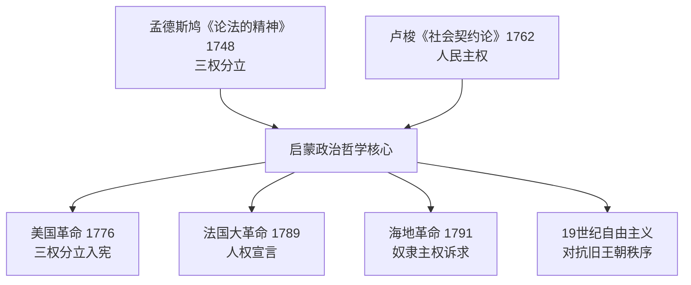

*该图展示孟德斯鸠与卢梭的启蒙思想如何分别为分权制衡与人民主权提供理论依据，并共同催生了美、法、海地三场革命及此后一个世纪的自由主义运动。*

### american_revolution_1775 (0.7s)

## American Revolution 1775

**定义**

美国革命（1775–1783）是北美十三个英属殖民地反抗英国统治、争取独立并建立共和政体的战争与政治进程。其思想根源直接来自启蒙哲学：约翰·洛克关于"天赋人权"（生命、自由、财产）与"被统治者同意"的学说，被托马斯·杰斐逊写入1776年《独立宣言》，成为"人皆生而平等"这一立场的理论依据。其历史条件则来自七年战争：英国为偿还战争债务（战后国债约1.4亿英镑），对殖民地征收《印花税法》（1765）、《汤森德法案》（1767）等新税，殖民地人以"无代表不纳税"为口号抗议，矛盾逐步升级为1775年4月列克星敦和康科德的武装冲突。

**实例分析**

战争初期，英国拥有当时世界最强的正规军和海军，殖民地民兵装备简陋、缺乏统一指挥。然而，乔治·华盛顿领导大陆军采取消耗战与游击战结合的策略，避免与英军正面决战，同时争取外部支援。1777年萨拉托加战役，大陆军俘获英军将领伯戈因所部约6000人，成为战争的转折点：法国因此确信殖民地有获胜可能，于1778年正式与美国结盟，派遣军队与舰队参战。西班牙、荷兰随后也加入对英作战或提供援助。1781年约克镇战役，华盛顿与法国将领罗尚博联手，法国海军舰队封锁切萨皮克湾，切断英军海上退路，迫使康沃利斯率约8000英军投降，实质终结了战事。1783年《巴黎条约》正式承认美国独立。

**问题解决应用**

分析这场战争，关键在于理解"军事弱势"与"政治胜利"如何并存：殖民地并非依靠传统意义上的军力优势取胜,而是通过延长战争消耗英国的财政与政治意愿，并借助国际联盟（法国的资金、舰队与陆军）弥补自身短板。这一模式此后被多次历史场合借鉴——弱势一方通过持久抵抗与外部结盟对抗强权。同时，此战对法国产生了深远的反噬效应：为支援美国，法国政府举债作战，财政进一步恶化，成为1789年法国大革命爆发的重要诱因之一。美国革命也证明启蒙思想可以转化为可操作的政治制度——1787年《联邦宪法》所确立的分权与共和框架，成为其后拉丁美洲、法国等地革命者效仿的蓝图。

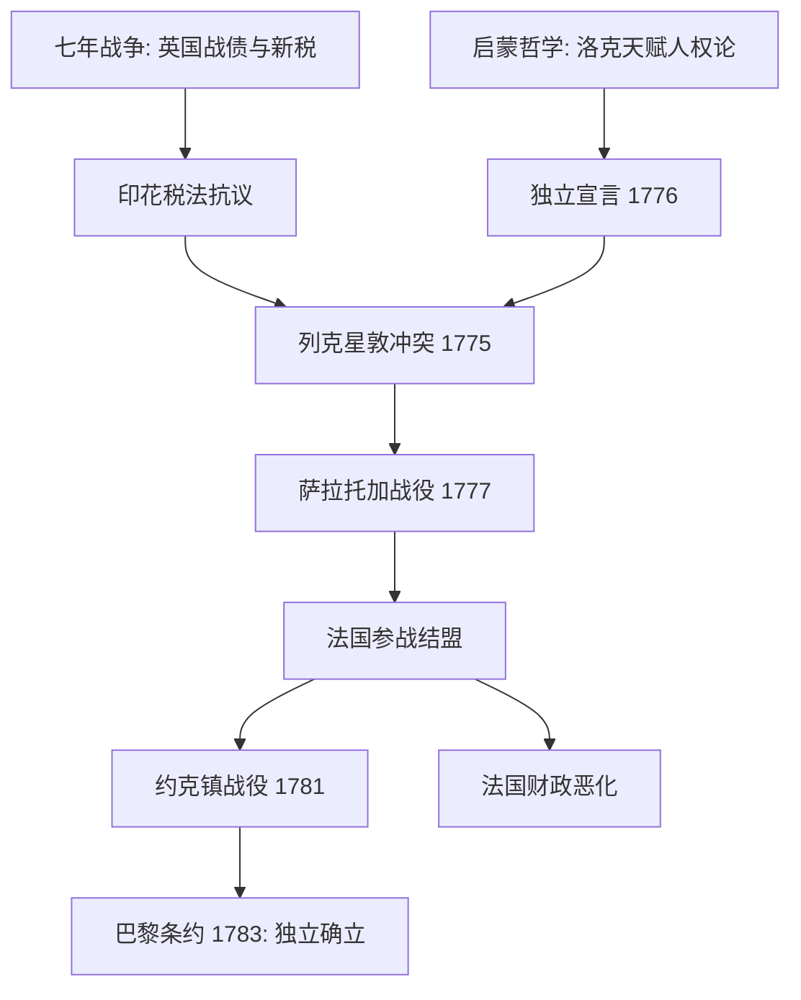
*该图展示启蒙思想与七年战争遗留问题如何共同引发美国革命，以及法国参战对约克镇胜利与自身财政危机的双重影响。*

### french_revolution_1789 (0.7s)

## French Revolution 1789

1789年,法国财政濒临破产——七年战争与援助美国独立战争耗尽国库,加之连年歉收推高面包价格,路易十六被迫召开已停摆175年的三级会议。第三等级代表自行宣布成立"国民议会",于6月20日在网球场宣誓"不制定宪法绝不解散"。7月14日,巴黎民众攻陷巴士底狱,这座象征王权专制的堡垒被摧毁,革命由体制内的政治对抗升级为街头暴力与全国动员。8月4日夜,议会废除封建特权与什一税;8月26日通过《人权和公民权宣言》,宣告"人生而自由平等""主权本质上属于国民"。这份文件后来成为全球自由主义宪法的范本,美国《权利法案》(1791年生效)与拉美各国独立宪法均可见其影响。

革命进程并非直线前进。1791年立宪君主制尝试失败后,1792年法国宣布共和,次年国王路易十六被送上断头台。1793–1794年"恐怖统治"期间,罗伯斯庇尔领导的公安委员会以"美德与恐怖"为治国手段,处决约1.7万人(含贵族、教士与政敌),旨在肃清反革命与外国干涉势力——普鲁士与奥地利已组成反法联盟出兵干预。1794年热月政变推翻罗伯斯庇尔,恐怖统治终结,但政局持续动荡,最终由拿破仑·波拿巴于1799年雾月政变夺权,革命十年画上句号。

历史应用题:比较美国革命(1775年)与法国革命(1789年)的成因与结果差异。两者均以"人生而平等""主权在民"为号召,但美国革命是十三个殖民地对抗远方宗主国的政治独立运动,战后建立联邦制共和国,社会结构未被彻底重塑;法国革命则是国内阶级对君主专制与封建等级制度的总清算,废除了整个贵族—教会特权体系,并经历了处决国王、恐怖统治与军事独裁的剧烈震荡。可从以下角度分析:(1)冲突性质——对外独立 vs. 对内社会革命;(2)暴力烈度——为何法国出现大规模处决而美国没有;(3)长期遗产——法国大革命引发的欧洲各王朝连锁动荡(1830、1848年革命浪潮)为何远超美国独立战争的国际影响。

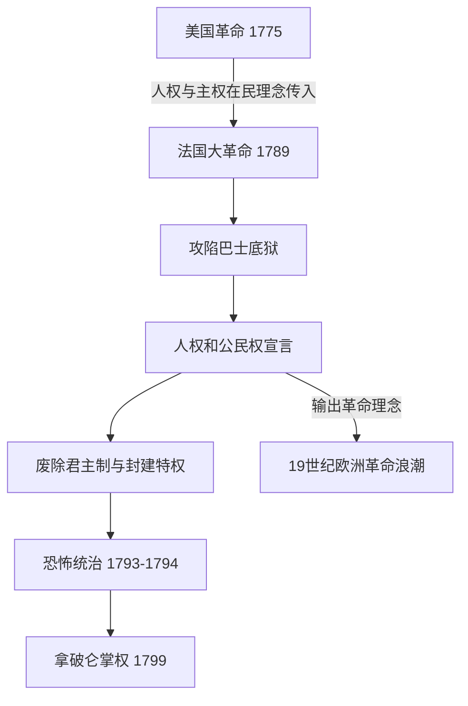
*图示:美国革命的理念如何传导至法国大革命,并进一步演化为19世纪欧洲范围的革命连锁反应。*

### agri_rev_1740s (0.7s)

## Agri Rev 1740S

农业革命指1740年代至1780年代英国农业生产方式的根本性转变,核心是圈地运动与诺福克四轮轮作制的推广。中世纪以来,英格兰乡村长期实行敞田制:农户在无篱笆分隔的公共条田上分散耕作,休耕地占比高,产量有限。18世纪中期起,议会陆续通过圈地法案,授权地主合并零散地块、用篱笆或石墙围起私有农场,取消农民在公地放牧、拾柴的传统权利。据统计,1750年至1820年间英国议会通过的圈地法案近四千项,涉及地约七百万英亩,约占英格兰可耕地的五分之一。与此同时,诺福克郡的查尔斯·汤森德(人称"萝卜汤森德")系统推广小麦、萝卜、大麦、三叶草的四作物轮种,以萝卜和三叶草取代休耕:三叶草固氮肥田,萝卜则提供冬季饲料,使牲畜得以安然越冬,粪肥又反哺土壤,形成良性循环。

莱斯特郡的育种家罗伯特·贝克韦尔进一步把这套系统推向极致。他不再让牲畜随意交配,而是有目的地挑选生长快、产肉多的个体进行选择性育种,培育出迪什利羊与朗霍恩牛。据当时伦敦史密斯菲尔德市场的记录,18世纪初到18世纪末,出售的绵羊平均体重约从28磅增至80磅,牛的平均体重也大致翻倍——同样的草场,能养出多得多的肉。

这些变革叠加的结果,是用更少的人产出更多的粮食。18世纪初,英格兰约四分之三的人口以务农为生;到1800年前后,这一比例降至三分之一左右。圈地又同时切断了贫农对公地的依赖,许多失去土地使用权的农户不得不离开乡村。于是,农业效率的提升与农村生计的瓦解共同作用,把大量原本被土地束缚的劳动力"挤"向了曼彻斯特、伯明翰等新兴工业城市。没有这一波悄无声息的农业变革,就不会有足够的、可自由流动的劳动力去填满蒸汽机驱动的工厂——这正是本章其余每一条技术与制度线索得以成立的隐藏前提。

### haitian_revolution_1791 (1.1s)

## Haitian Revolution 1791

1791年8月，法属圣多明各（今海地）北部平原的种植园奴隶在一次伏都教秘密集会（布瓦卡曼仪式）后揭竿而起，纵火焚烧数百座甘蔗种植园，拉开了海地革命的序幕。圣多明各当时是大西洋世界最富庶的殖民地：仅占地不足今日海地一半，却贡献了法国对外贸易总值的三分之一以上，出产全球近一半的蔗糖和咖啡，其财富建立在约50万名非洲奴隶的劳动之上，而这些奴隶的死亡率极高，殖民者依赖持续从非洲输入新奴隶来维持种植园人口。这场起义之所以不同于此前历次奴隶反抗（如牙买加或苏里南的马隆人起义），在于它最终推翻了整个殖民统治秩序，而非仅仅在丛林中建立自治飞地。

法国大革命提供了直接的政治契机：1789年《人权宣言》宣称"人人生而自由平等"，却对殖民地奴隶制避而不谈，这一矛盾被圣多明各的自由有色人种（如文森特·奥热）和奴隶领袖同时利用，向巴黎施压。1794年，在奴隶起义和外部战争（法国同时与英国、西班牙交战）的双重压力下，法国国民公会正式废除奴隶制——这是现代史上首次由国家立法全面废奴。杜桑·卢维杜尔随后统一各派力量，击退西班牙与英国的入侵军队，并于1801年颁布宪法自任终身总督。拿破仑执政后企图恢复奴隶制并重新征服该岛，派遣的远征军虽诱捕并囚死杜桑，却在让-雅克·德萨林领导下的抵抗、疟疾与黄热病的重创下惨败：约2.4万法军中仅数千人生还。1804年1月1日，德萨林宣布独立，建立海地——史上第一个由前奴隶建立的共和国。

这一事件的历史应用价值在于因果分析：将海地革命与同期的美国革命、法国革命对照，可见"自由"话语的普适性主张与殖民地奴隶制现实之间的张力，如何被最边缘的群体转化为最彻底的政治行动，并反过来永久动摇了跨大西洋奴隶制度在道德与经济上的正当性——法国因此丧失了其最富有的殖民地，美国与欧洲列强则长期外交孤立海地，直到1825年法国以战争赔款方式勒索承认独立，这笔债务持续拖累海地经济近一个世纪。

### franklin_electricity_1752 (0.7s)

## Franklin Electricity 1752

**定义**

1752年,本杰明·富兰克林通过费城的风筝实验证明了闪电本质上是一种放电现象,与实验室中用摩擦起电机产生的电火花是同一种物理现象。此前,闪电被普遍视为神秘甚至神圣的自然现象,教堂常常敲钟以"驱散"雷暴,结果导致敲钟人频繁遭雷击身亡。富兰克林的实验将闪电从超自然领域拉入可观察、可测量、可预测的自然规律范畴——这标志着启蒙运动"自然可知"信念在具体自然现象上的一次决定性胜利。基于这一发现,富兰克林发明了避雷针:一根接地的金属杆,安装在建筑物顶端,为闪电提供一条更容易导通的路径,从而保护建筑物本身不被击穿或引燃。

**实验过程与证据**

富兰克林的风筝顶端固定了一根尖细的金属丝,风筝线的下端系有一把铁钥匙,并用丝绸绳与富兰克林手持的部分隔离(丝绸不易导电,起绝缘作用)。当雷云经过风筝上方时,富兰克林观察到风筝线上的细丝竖起,随后当他将手指靠近铁钥匙时,钥匙迸发出火花——与摩擦起电装置产生的火花外观、声音完全一致。他随后用钥匙给莱顿瓶(当时的电容器)充电,证明收集到的确实是电荷。这一实验发表后,富兰克林进一步在费城的建筑物上安装了实际的避雷针,并统计记录了避雷针建筑物遭雷击起火的概率显著低于未安装避雷针的建筑物,为发明的实用性提供了直接的经验数据支持。

**问题解决式应用**

这一发现的意义不仅在于满足科学好奇心,更在于把一种此前无法预测、造成大量财产损失和人员伤亡的自然灾害,转化为可以通过工程手段主动管理的风险。历史学家统计,18世纪欧洲和北美因雷击引发的教堂、船只、火药库火灾屡见不鲜,避雷针推广后这类损失大幅下降。更深远的意义在于方法论:富兰克林没有停留在哲学思辨,而是设计了一个可重复、可验证的对照实验,将假设("闪电是电")转化为可观测的物理证据。这种"用受控实验检验自然假说"的路径,此后被库仑、伏打、奥斯特等人沿用,最终在1831年法拉第发现电磁感应定律时达到高潮,完成了从"驯服天电"到"人工发电"的完整科学链条。

### adam_smith_1776 (0.7s)

## Adam Smith 1776

**定义**

1776年，苏格兰经济学家亚当·斯密出版《国富论》（*An Inquiry into the Nature and Causes of the Wealth of Nations*），系统提出了三个奠定现代经济学基础的核心概念:分工（division of labor）、自由市场（free market）与"看不见的手"（invisible hand）。斯密的核心论点是:当个人在竞争性市场中追逐自身利益时,社会整体福利往往会自发提升——不需要国王或政府来指挥生产该造什么、造多少。这一思想直接挑战了当时欧洲盛行的重商主义(mercantilism),后者主张国家应通过关税、垄断和殖民地贸易限制来积累金银财富。斯密认为,真正的财富不是金银的库存量,而是一国生产商品和服务的能力——这种能力可以通过分工和贸易自由化持续增长。

**实例分析**

斯密用制针工厂的例子说明分工的力量:一名工人独自完成制针的全部18个步骤,一天可能做不出几枚针;但若将工序拆分给多名工人各自专精一两个步骤,同样的十人团队一天可生产近48000枚针,人均产量提升数百倍。这一观察建立在他此前经历的历史背景之上——18世纪40年代的英国农业革命(诺福克轮作制、圈地运动)已经证明,专业化分工与资本投入能大幅提升产出,并释放出大量农业劳动力转向手工业和贸易;而1756至1763年的七年战争则让英国政府背负巨额国债,也让人们更清楚地看到当时以关税和垄断为核心的重商主义体制的僵化与低效。斯密正是把这些具体的经济观察,归纳提炼成了一套关于市场如何自发运作的系统理论。

**问题解决应用**

《国富论》的历史意义不在于书斋里的抽象理论,而在于它此后近百年间被英国决策者反复援引,成为拆除保护主义贸易壁垒的思想武器。最典型的案例是1846年的《谷物法》废除:该法自1815年起对进口谷物征收高关税以保护英国地主利益,但斯密的自由贸易逻辑——即让市场按各国比较优势分配生产,而非用关税人为扭曲价格——被曼彻斯特学派等自由贸易派广泛引用,最终说服首相罗伯特·皮尔在爱尔兰大饥荒(1845–1849年)的压力下推动废除。这标志着英国从重商主义保护体系转向自由贸易体系,也是斯密理论从思想变为国家政策的关键转折点。

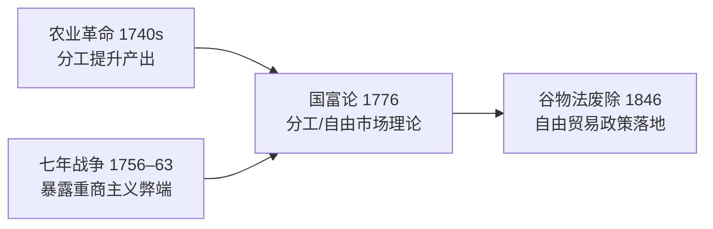

*图示:亚当·斯密理论如何汇聚农业革命与七年战争的历史经验,并在70年后转化为具体的贸易政策变革。*

### lavoisier_chemistry_1772 (0.7s)

## Lavoisier Chemistry 1772

1772年10月，法国化学家安托万-洛朗·德·拉瓦锡向法国科学院提交了一份密封文件，记录了他关于燃烧现象的初步实验——这一天后来被视为"化学革命"的起点。在此之前，化学家普遍采用"燃素说"来解释燃烧：认为可燃物中含有一种叫"燃素"的物质，燃烧时会释放出去，因此燃烧后物质应变轻。但拉瓦锡精确称重后发现，金属燃烧后生成的灰烬反而比原来的金属更重。他推断，金属燃烧不是失去了什么，而是从空气中吸收了某种气体。

1774年，约瑟夫·普利斯特里向拉瓦锡展示了他新分离出的一种气体，能使蜡烛燃烧得更旺。拉瓦锡随后系统研究了这种气体，于1777年将其命名为"氧气"（意为"成酸的元素"），并证明它正是金属燃烧、呼吸和许多化学反应中被消耗的关键气体。他还确认了另一种气体——他称之为"氢气"（意为"成水的元素"）——并通过精密的定量实验证明：水并非古希腊人认为的基本元素，而是氢与氧化合而成的化合物。

拉瓦锡最重要的贡献是提出并用实验反复验证了质量守恒定律：在一个密闭系统中进行化学反应，反应前后物质的总质量不变。他用密封的曲颈瓶做实验，精确称量反应前后的重量，证明看似"消失"的物质其实只是转变了形态，并未真正消失。这一原理可表述为：

$$
m_{\text{反应物总质量}} = m_{\text{生成物总质量}}
$$

**问题解决应用**：假设某学生在密闭容器中将12.0克碳完全燃烧，消耗了32.0克氧气，生成二氧化碳气体。根据质量守恒定律，无需知道二氧化碳的具体分子结构，即可直接计算生成物质量：$m_{\text{CO}_2} = 12.0\text{g} + 32.0\text{g} = 44.0\text{g}$。这种"守恒式推理"正是拉瓦锡留给后世化学家、乃至今日工业配方计算和环境物质核算的基本方法——任何化学过程的投入与产出都可以被精确记账。

除了实验方法，拉瓦锡还与合作者共同编写了《化学命名法》（1787年），用元素及其化合价系统地为化学物质命名（如"硫酸""氧化铁"），取代了此前混乱、随意的炼金术式术语（如"锌华""砷之黄油"）。这套命名体系与他质量守恒的定量方法结合，把化学从依靠经验配方的技艺，转变为可重复验证、可精确计算的实验科学，为19世纪道尔顿原子论和工业化学合成奠定了方法论基础。

*该图展示拉瓦锡如何继承精密测量的科学传统，通过定量实验推翻燃素说、确立质量守恒定律，并最终系统化现代化学。*

### napoleonic_wars_1799 (0.7s)

## Napoleonic Wars 1799

拿破仑战争始于1799年拿破仑发动雾月政变、自立为第一执政之后，终于1815年滑铁卢战役惨败。这十六年间，法国军队几乎征服了整个欧洲大陆：1805年奥斯特里茨战役击溃奥俄联军，1806年耶拿—奥厄施塔特战役摧毁普鲁士主力，1807年提尔西特和约后法国势力延伸至波兰与莱茵地区。拿破仑所到之处，不仅带去军队，也带去法国大革命的制度遗产——《拿破仑法典》确立了法律面前人人平等、财产权保障与世俗婚姻制度，取代了各地残存的封建领主特权与教会司法权。这种"武力输出改革"的模式，使得战争本身成为革命理念跨国传播的载体：意大利、德意志诸邦、西班牙的旧贵族特权与农奴制在法军占领期间被系统性废除。

然而，占领也催生了被占领民族的反弹。西班牙1808年爆发的游击战（"半岛战争"）、普鲁士战败后推行的军事与教育改革（如沙恩霍斯特改革）、德意志知识分子费希特发表《对德意志民族的演讲》，都表明外来统治反而激发了本地的民族认同——这是近代民族主义作为政治力量登场的关键节点之一。

拿破仑最终的失败，源于他树敌过多、战线过长。1812年入侵俄国，六十万大军因俄军坚壁清野与严冬减员至不足十万，成为转折点。此后，英国、俄国、普鲁士、奥地利结成第六次反法同盟，于1813年莱比锡"民族大会战"击败拿破仑，1814年攻入巴黎，1815年滑铁卢终结其复辟企图。

这场战争在国际关系史上具有范式意义：四个原本利益冲突、甚至互相交战过的大国，为遏制一个试图称霸欧陆的单一强权而结成持久联盟，并在战后通过维也纳会议（1814–1815）共同设计均势体系。这是历史上大国首次系统性地合作制衡一个陆权霸主，其外交逻辑——防止任何一国独大、通过多边协调维持均势——此后反复出现于十九、二十世纪的国际秩序建构之中。

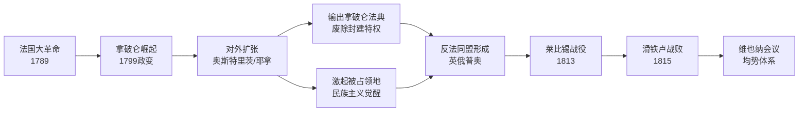
*该图展示拿破仑战争如何将法国大革命的理念向外传播，同时引发大国联合制衡，最终塑造出维也纳体系下的欧洲均势秩序。*

### abolition_slave_trade_1807 (1.4s)

## Abolition Slave Trade 1807

**定义**

1807年,英国议会通过《废除奴隶贸易法案》(Slave Trade Act),禁止英国船只从事跨大西洋奴隶贸易,并授权皇家海军在西非沿海设立"西非分舰队"(West Africa Squadron),拦截、扣押从事奴隶贩运的船只。这项立法本身并未解放大英帝国境内已被奴役的人口——那要等到1833年的《废除奴隶制法案》——但它切断了新增奴隶的跨洋供应链,并且英国凭借当时世界最强的海军力量,试图将这一禁令扩展为一项全球执法行动,拦截其他国家的贩奴船只。这是大西洋奴隶贸易体系合法性崩溃的关键转折点。

**促成因素**

推动这场立法转变的,是两股力量的汇合。其一是启蒙运动的道德论证:亚当·斯密在《国富论》(1776年)中已经从经济学角度论证奴隶劳动效率低于自由劳动——被奴役者没有改善产出的激励,而这一逻辑被威廉·威尔伯福斯(William Wilberforce)等废奴主义者转化为更广泛的政治动员,论证奴隶制既不道德也不具经济必然性。其二是海地革命(1791—1804年)提供的实证:圣多明各的被奴役者通过大规模武装起义,击败了法国、西班牙、英国的军队,建立了世界上第一个由前奴隶建立的独立共和国。这场革命打破了"被奴役者无法有组织地反抗"的种植园主假设,让英国议会中的废奴派得以论证——奴隶制度的维持成本(军事镇压、殖民地动荡)正在急剧上升,而不再是一项"稳定"的经济安排。

**问题解决应用**

这项立法的关键张力在于:法律禁令与实际执行之间存在巨大缺口。皇家海军的拦截行动虽然在19世纪中叶截获了约1600艘贩奴船、解放约15万人,但同期仍有数十万非洲人被其他国家(尤其是葡萄牙、巴西、美国国内贸易、古巴)贩运——说明单一国家的立法与武力,若缺乏多边条约配合,难以彻底终止一个跨国的经济体系。历史学家在评估类似"单边执法+多边缺口"的案例时(如后来的国际禁运、贸易制裁),都会援引1807年法案作为范例:立法意图与执行覆盖率之间的落差,决定了政策实际效果的上限。

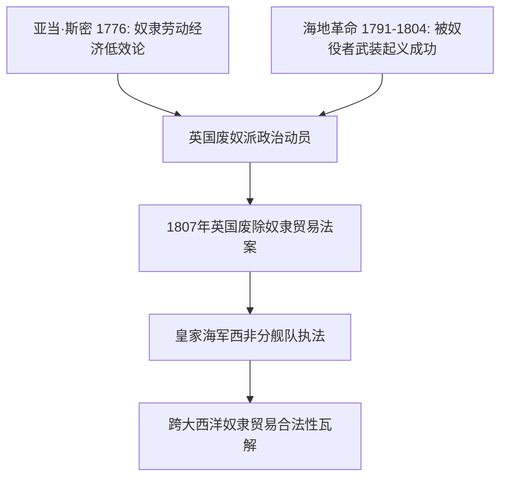
*图示:亚当·斯密的经济论证与海地革命的实证案例如何汇合,推动1807年英国立法及其后续全球执法行动。*

### congress_of_vienna_1815 (0.8s)

## Congress Of Vienna 1815

1814年至1815年间,拿破仑战争的四大战胜国——英国、俄国、普鲁士与奥地利——齐聚维也纳,召开了一场决定欧洲未来命运的外交会议。这场由奥地利外交大臣梅特涅主持的会议,其核心目标并非惩罚战败的法国,而是重建一个能够长期维持稳定的欧洲秩序。会议确立了"势力均衡"原则:任何一个国家都不应强大到足以再次称霸欧洲大陆。为此,战胜国刻意保留了法国作为一个中等强国,而不是将其肢解削弱,因为过度削弱法国反而会打破均衡,给俄国或普鲁士留下扩张空间。这种"宽容战败者以维持均衡"的做法,与一战后凡尔赛条约对德国的严厉制裁形成了鲜明对比。

会议最重要的制度创新是"欧洲协调"机制——四大国(后来加入法国成为五国)约定今后通过定期召开多边会议的方式协商解决国际争端,而非诉诸战争。这一机制在此后近一个世纪里发挥了实际作用:1815年至1914年间,欧洲列强之间没有爆发过一场全面战争,这与17、18世纪几乎每隔一代人就爆发一次大规模欧陆战争的历史形成强烈反差。当然,这一时期并非完全和平——克里米亚战争(1853–1856)、普奥战争(1866)、普法战争(1870–1871)都曾发生,但这些冲突规模有限、持续时间短,且未能演变为吞噬整个大陆的总体战。

维也纳体系的问题解决逻辑值得细究:当某一地区出现危机(如1830年比利时独立、1848年革命浪潮),列强会通过外交磋商而非单边军事行动来处理,即便协商结果并不总能令所有国家满意,这种"先协商后行动"的习惯本身,正是维也纳会议留给后世最持久的遗产。它为一个世纪后的国际联盟、以及二战后的联合国安理会常任理事国机制,提供了最初的制度模板——由少数大国共同承担维持体系稳定的责任。

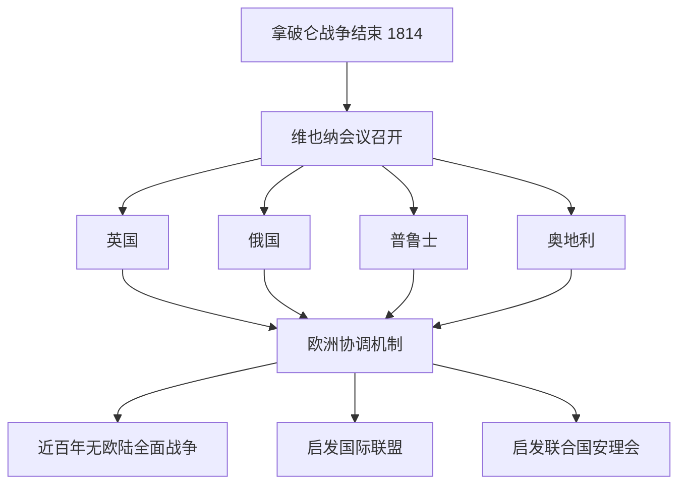
*该图展示维也纳会议如何从四大国协商演变为持续影响后世国际秩序的多边外交机制。*

维也纳体系并非完美无缺——它压制了民族主义与自由主义诉求,最终在1848年革命浪潮中受到冲击,并在1914年因缺乏应对新兴工业化强国德国崛起的弹性机制而彻底崩溃。但其存续的近百年,证明了大国协商机制本身可以成为防止战争的有效工具,这一经验被后世反复借鉴与改良。

### jenner_vaccine_and_volta_battery (0.7s)

## Jenner Vaccine And Volta Battery

**定义**：1796年，英国乡村医生爱德华·詹纳（Edward Jenner）观察到,感染过牛痘的挤奶女工很少患上致命的天花,于是他从一名感染牛痘的女工手上取脓疱物质,接种给八岁男孩詹姆斯·菲普斯,六周后再让男孩接触天花病毒,男孩安然无恙。这一实验首次以人为对照的方式证明,接种一种温和的病原体可以让人体获得对另一种致命疾病的免疫力,由此奠定了免疫学的基础,"vaccine"（疫苗）一词正来自拉丁语"vacca"（牛）。四年后的1800年,意大利物理学家亚历山德罗·伏打（Alessandro Volta）将锌片与铜片交替叠放,中间以浸透盐水的纸片隔开,制成了"伏打电堆"——人类历史上第一个能够持续稳定输出电流的装置,终结了此前只能依赖摩擦起电或莱顿瓶瞬时放电的局面。

**应用案例**：伏打电堆问世仅数周,英国化学家尼科尔森与卡莱尔就用它电解水,得到氢气与氧气,首次以实验证明水是化合物而非元素,呼应了拉瓦锡此前建立的元素—化合物分类体系。与此同时,詹纳的方法迅速传播:到1800年,英国皇家海军已要求水兵接种牛痘;拿破仑于1805年下令全军接种;到19世纪中叶,天花在多个欧洲国家的死亡率下降超过九成。

**问题解决训练**：如果你是1800年的医生或化学家,如何评判这两项发明的可靠性与推广价值?可比较其验证逻辑:詹纳的结论依赖于个案观察加对照试验的重复(样本虽小,但设计上排除了"侥幸未感染"的可能),而伏打电堆的可靠性则来自其可重复的物理构造——只要材料与接法相同,任何人在任何地点都能复现同样的电流效果。这提示我们:一项发现能否被称为"可靠的科学工具",关键不在于其原理是否被完全理解(当时无人知道免疫机制,也无人知道电子的存在),而在于其效果是否可被独立重复验证。这正是拉瓦锡定量化学方法留下的方法论遗产,在生物医学与物理学两个方向上分别开花结果。

### british_abolition_slavery_1833 (0.7s)

## British Abolition Slavery 1833

1833年8月,英国议会通过《废奴法案》(Slavery Abolition Act),规定自1834年起,英属殖民地(加勒比地区、南非、加拿大等)的奴隶制全面废止,约80万名奴隶获得自由。这一法案是1807年《废除奴隶贸易法》的延续——后者只禁止了"贩运"奴隶的行为,并未触及殖民地内部已经存在的奴隶制本身。二者合起来构成英国废奴运动的完整轨迹:先切断供给,再消灭存量。

值得注意的是,法案并非无条件的道德胜利。英国政府向奴隶主支付了2000万英镑的"补偿金"(相当于当时英国国家年度财政支出的近40%),而这笔钱赔偿的对象是失去"财产"的奴隶主,不是失去自由多年的奴隶本人。此外,法案设立了"学徒制"(apprenticeship system)作为过渡安排,要求被解放者继续为原主人无偿劳动4至6年,实质上延缓了真正自由的到来,直到1838年该制度才在殖民地民众持续抗议下被提前终止。

从经济结构看,加勒比种植园的劳动力体系被迫重组:蔗糖种植园主转向从印度、中国招募"契约劳工"(indentured labor)填补劳动力缺口,这催生了新的移民劳工体系,其条件常常与奴隶制相差无几,只是披上了"合同"的外衣。

这一事件的历史意义超出了英帝国范围。英国废奴运动积累的道德论证与组织经验——例如威尔伯福斯(William Wilberforce)等人建立的请愿、宣传、议会游说模式——被美国废奴主义者直接借鉴。19世纪30至50年代,美国北方废奴组织频繁援引英国先例,证明奴隶制的和平终结在政治上可行,这为美国国内的道德辩论注入了紧迫性,并加深了南北方在经济制度与道德立场上的分裂,成为通向1861年内战的诸多因素之一。

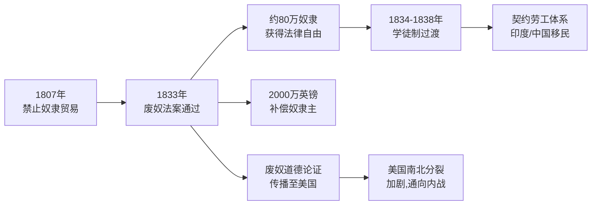
*该图展示从1807年禁止奴隶贸易到1833年废奴法案通过的演进路径,以及其在殖民地劳动经济与美国政治格局两方面产生的连锁影响。*

### dalton_atomic_theory_1803 (0.9s)

## Dalton Atomic Theory 1803

**定义**：1803年，英国化学家约翰·道尔顿（John Dalton）提出原子理论,为化学从定性描述迈向定量科学奠定了基础。他的核心主张可归纳为四点:(1)一切物质由不可再分的原子构成;(2)同一元素的原子具有相同的质量和性质,不同元素的原子质量不同;(3)化合物是由不同元素的原子按固定的简单整数比结合而成;(4)化学反应只是原子的重新组合,原子本身既不产生也不消失。这一理论第一次把"质量"变成了检验化学规律的定量工具,直接催生了后来的定比定律、倍比定律,并为门捷列夫的周期表和一个世纪后的原子核物理研究铺平了道路。

**范例**:道尔顿理论最有力的证据来自碳的两种氧化物。在一氧化碳中,每12克碳与16克氧结合;在二氧化碳中,每12克碳与32克氧结合。固定碳的质量后,两种化合物中氧的质量之比为

$$
\frac{m_{O,\ CO_2}}{m_{O,\ CO}} = \frac{32\text{ g}}{16\text{ g}} = 2:1
$$

这个简单的整数比(而不是任意小数)正是"倍比定律"的实验证据——它只有在物质由不可分割、质量固定的原子组成,并按整数个数结合时才能成立。若物质是连续可分的流体,这样的整数比毫无理由出现。

**问题解决应用**:道尔顿理论给了化学家一套可操作的定量方法——利用质量比反推化合物中原子的相对数目和元素的相对原子质量。例如,已知水中氢氧质量比约为1:8,若假设水的分子式为一个氢原子对一个氧原子(道尔顿最初的猜测),就可推出氧的相对原子质量约为16(以氢=1为基准);这一推算方法后来被贝采里乌斯等人修正、扩展为系统测定原子量的实验流程。这种"由宏观质量比推断微观原子构成"的思路,成为19世纪化学分析、化合价确定、乃至周期表元素排序的通用方法论。

### watt_steam_engine_1769 (0.7s)

## Watt Steam Engine 1769

**定义**：1769年，苏格兰工程师詹姆斯·瓦特为纽科门蒸汽机申请了一项关键专利——分离式冷凝器。纽科门机在气缸内交替注入蒸汽再喷冷水冷凝，导致气缸本身反复冷热循环，浪费了约四分之三的燃料。瓦特把冷凝过程移到一个独立的密闭容器中，使气缸始终保持高温、冷凝器始终保持低温，燃料效率因此提高了两三倍以上。这项改进随后与太阳-行星齿轮、离心调速器等专利结合，使蒸汽机从只能做往复直线运动的矿井抽水泵，变成能输出稳定旋转动力的通用动力源。

**应用实例**：改良前，纽科门机主要用于英格兰和康沃尔的煤矿、锡矿排水,笨重、耗煤、效率低,几乎无法离开矿区,因为运煤成本太高。瓦特与实业家马修·博尔顿合作,在伯明翰的索霍工厂批量生产改良蒸汽机,到1800年英国已安装约2500台瓦特式蒸汽机。这些机器被安装进曼彻斯特的棉纺厂、设菲尔德的锻造车间,不再依赖河流水力选址,工厂第一次可以建在原料和劳动力聚集的城市里。1804年,理查德·特里维西克进一步把高压蒸汽机装上轮轨,催生了早期蒸汽机车,为半个世纪后的铁路网奠定了技术基础。

**问题解决与历史推理**：把瓦特蒸汽机放进更长的因果链中分析,能帮助理解"技术突破为何在某一时刻、某一地点发生"这一历史问题。18世纪40年代的农业革命(诺福克轮作制、圈地运动)提高了单位农业劳动力的产出,释放出大量剩余劳动力涌入城镇,形成了工厂愿意雇佣的廉价劳动力池;与此同时,英国煤炭储量丰富、专利制度保护发明者收益、政府尚未对新兴产业设限,三者共同构成了蒸汽机能够迅速商业化的制度与资源条件。练习:比较同一时期法国和中国是否具备类似的剩余劳动力和资源条件,可以帮助解释为何工业革命率先发生在英国,而非当时人口更多、手工业同样发达的其他地区——这正是历史分析中"必要条件"与"充分条件"的区别所在。

### latin_american_independence_1808 (0.6s)

## Latin American Independence 1808

**定义**

拉丁美洲独立运动（1808—1826）是西班牙和葡萄牙在美洲近三个世纪殖民统治瓦解的过程。触发点是拿破仑1808年入侵伊比利亚半岛：法军废黜西班牙国王费迪南七世，扶植约瑟夫·波拿巴为傀儡君主；葡萄牙王室则被迫流亡巴西。宗主国的政治权威一旦崩溃，美洲殖民地的精英阶层（克里奥尔人，即在美洲出生的欧洲人后裔）便面临一个前所未有的问题：究竟该效忠谁？各地陆续成立"执政委员会"，起初宣称代表被囚国王统治，实则迈出了自治的第一步。这场运动并非孤立事件，而是延续了法国大革命（1789）关于人民主权的理念，也直接受到海地革命（1791—1804）的震动——海地是西半球第一个通过奴隆武装起义建立的独立黑人共和国，向西班牙殖民当局证明殖民统治可以被彻底推翻。

**实例分析**

三条主要战线几乎同时展开。1810年，墨西哥神父米格尔·伊达尔戈发出"多洛雷斯呼声"，率领农民和印第安人起义，尽管次年他本人被处决，但点燃了持续十一年的独立战争，1821年墨西哥终获独立。在南美北部，西蒙·玻利瓦尔历经多次失败与流亡，于1819年率军穿越安第斯山脉突袭波哥大，赢得博亚卡战役，随后建立大哥伦比亚；1824年阿亚库乔战役中，玻利瓦尔的副手苏克雷击溃西班牙在南美的最后主力。在南部，何塞·德·圣马丁率"安第斯军团"翻越雪山解放阿根廷与智利，1821年协助解放秘鲁。到1826年，西班牙在美洲仅剩古巴和波多黎各两地，葡萄牙则于1822年承认巴西独立（由摄政王佩德罗一世宣布，几乎未经战争）。

**问题解决应用**

理解这段历史的关键，是分析"宗主国权威真空"如何触发地方自治诉求的连锁反应：法国占领→西班牙王权空悬→殖民地执政委员会自治→独立战争。这一因果链条也解释了为何独立后的新兴共和国普遍陷入长期政治动荡——克里奥尔精英继承了权力真空，却未建立起如北美十三州那样成熟的自治传统与制度基础。

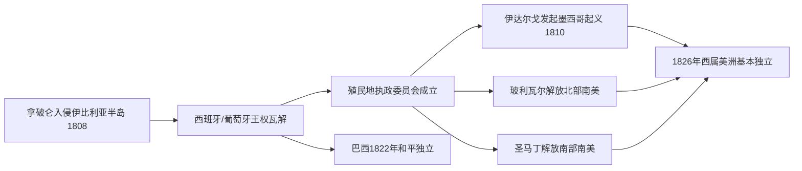

*该图展示拿破仑入侵引发的权威真空如何沿三条路线（墨西哥、南美北部、南美南部）分别演化为独立战争，最终在1826年重塑西半球的政治版图。*

### mechanized_textile_mills_1785 (0.6s)

## Mechanized Textile Mills 1785

**定义**

1785年前后，英国纺织业完成了从家庭手工生产到工厂集中生产的转变。这一转变依赖三项关键技术的组合：詹姆斯·哈格里夫斯发明的"珍妮纺纱机"（Spinning Jenny，1764年）大幅提高了单人纺纱的产量；理查德·阿克莱特的"水力纺纱机"（Water Frame，1769年）首次实现了纺纱的机械化连续作业；埃德蒙·卡特赖特于1785年获得专利的"动力织布机"（Power Loom）则把织布环节也纳入了机械动力驱动。真正使这套系统摆脱地理限制的，是瓦特改良蒸汽机（见"瓦特蒸汽机 1769"）提供的稳定动力——工厂不再需要建在河流旁边，而可以集中建在煤炭和劳动力丰富的城镇。曼彻斯特、利兹、伯明翰因此迅速崛起为工业重镇，英国也由此成为世界上第一个工业化经济体。

**具体案例**

以曼彻斯特为例：1774年，全城仅有2家棉纺工厂；到1802年，这一数字已增至52家。棉纺织品产量的爆炸式增长伴随着煤炭消费的同步激增——英国煤炭年产量从1700年的约260万吨，上升到1800年的约1000万吨，绝大部分增量来自为纺织工厂和相关蒸汽机供能。与此同时，工厂制度催生了一个全新的社会阶层：城市产业工人阶级。工人不再像手工业时代那样在自家作坊按自己的节奏劳作，而是必须服从工厂的机器运转时刻表，通常每天工作12至14小时，包括大量童工。1819年英国议会通过的《棉纺织工厂法》正是对这种劳动条件恶化的初步回应，规定禁止雇佣9岁以下童工——这本身就说明了问题的严重程度。

**问题解决应用**

理解这一概念的关键，在于分析"技术集中"如何同时决定了经济地理和社会结构。设想一道历史分析题：为什么工业革命最先在英国而非法国或荷兰发生？答案不能仅归因于某一项发明，而要看到技术、能源与资本的耦合——英国恰好同时具备可开采的浅层煤矿、活跃的专利保护制度、以及愿意为工厂建设提供信贷的商业资本市场。这种多因素同时具备的组合，正是历史比较分析的核心方法：不是寻找单一原因，而是检验哪些必要条件在某一地区恰好同时齐备。

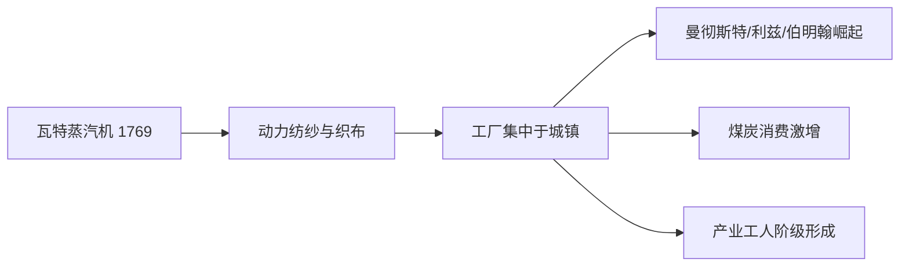
*该图展示瓦特蒸汽机如何驱动纺织业机械化，进而引发工厂选址集中、煤炭需求上升与新兴工人阶级三重连锁效应。*

### oersted_faraday_electromagnetism_1820 (0.8s)

## Oersted Faraday Electromagnetism 1820

**定义**：1820年4月,丹麦物理学家奥斯特（Hans Christian Ørsted）在哥本哈根的一次公开讲座中偶然发现:一根通电导线旁边的指南针会发生偏转。这一现象证明电流能够产生磁场——在此之前,电学与磁学被视为两种互不相关的自然力。奥斯特把结果写成一页拉丁文短文寄给欧洲各地的科学家,迅速引发安培（Ampère）等人对电磁关系的系统研究。十一年后,英国科学家法拉第（Michael Faraday）在1831年做出了互补性的发现:让磁铁在导线线圈中移动,线圈中会产生电流,这就是电磁感应。奥斯特证明"电生磁",法拉第证明"磁生电",两者合在一起,构成了将机械能与电能相互转换的完整原理。

**具体案例**：法拉第的关键实验是"法拉第圆盘发电机"（1831年10月）——一个铜盘在马蹄形磁铁两极间旋转,圆盘边缘与轴心之间就能测到持续的电流,尽管电流极其微弱。这台装置本身没有实用价值,但它证明了机械转动可以直接、连续地转化为电能,而不需要像伏打电堆那样依赖化学反应。这正是继道尔顿1803年建立原子论、把物质还原为可测量的基本单位之后,科学界进一步把"力"也还原为可测量、可控制的自然规律的又一里程碑。

**实际应用**：这一发现的经济价值在半个世纪后才充分显现。德国工程师西门子（Werner von Siemens）在1866年造出自激式发电机（dynamo）,输出功率远超早期实验室装置,使工厂第一次能够用蒸汽机驱动的发电机取代分散的水车和畜力。到1880年代,爱迪生与威斯汀豪斯围绕直流电与交流电展开的"电流之战",本质上就是在把奥斯特与法拉第的原理规模化、商业化。可以说,1820—1831年这十一年间的两次实验室观察,直接奠定了第二次工业革命中电动机、发电机、电力照明与电报系统的科学基础——这也是本章科学线索承前启后的关键一环。

### first_opium_war_1839 (0.8s)

## First Opium War 1839

**定义。** 第一次鸦片战争（1839—1842）是英国与清朝之间因鸦片贸易冲突而爆发的战争，也是中国近代史的转折点。18世纪末起，英国东印度公司通过在印度种植鸦片、走私入华，扭转了中英贸易中长期的白银逆差——中国出口茶叶、丝绸、瓷器换取白银，而鸦片贸易则让白银大量流向英国商人手中。1839年，钦差大臣林则徐奉命在广州禁烟，缴获并销毁英国商人约2万箱鸦片（合计1400余吨），这就是著名的"虎门销烟"。英国政府以保护"自由贸易"和商人财产为由,于1840年派出远征军,战争由此爆发。清军装备陈旧、指挥体系落后,而英军拥有蒸汽动力炮舰和先进火炮,战争过程中清军几乎无一胜绩。1842年,战败的清政府被迫签订《南京条约》:割让香港岛给英国;开放广州、厦门、福州、宁波、上海五处为通商口岸;并给予英国商人治外法权(即英国公民在华犯罪由英国领事裁判,不受中国司法管辖)。这是中国近代史上第一份不平等条约,标志着"百年国耻"的开端。

**关键机制分析。** 这场战争的实质并非单纯的"鸦片问题",而是两种秩序的碰撞:清朝仍以朝贡体系看待对外关系,认为外国商人应服从中国法律与礼制;英国则以条约体系和治外法权为核心,要求对等的国家间关系与商业保障。林则徐销烟本是主权范围内的合法禁毒行动,却被英国议会以一票之差(271票对262票)通过为开战理由,反映出当时英国国内工业资本与商业利益集团对海外市场扩张的强烈诉求。

**历史应用与比较。** 治外法权和五口通商这两项条款,此后成为列强强加于中国的标准模板——日本、美国、法国等国在随后数十年里陆续援引"最惠国待遇"条款,复制同样的特权。这一先例直接开启了此后一系列不平等条约链条,是理解清朝衰落全过程的起点。

### lyell_darwin_1830 (0.7s)

## Lyell Darwin 1830

1830年,英国地质学家查尔斯·莱伊尔（Charles Lyell）出版《地质学原理》（Principles of Geology）第一卷,系统提出"均变论"（uniformitarianism）：地球表面的高山、峡谷与岩层,并非由《圣经》记载的大洪水等剧变在几千年内一次性塑造而成,而是由风化、沉积、地震、火山等极其缓慢的自然过程,在极其漫长的时间尺度上持续作用的结果。莱伊尔的核心论据来自可观测的证据——例如意大利那不勒斯附近塞拉皮斯神庙（Temple of Serapis）三根石柱上,清晰保留着被海洋蛀贝虫（date mussel）在数米高处蛀蚀的痕迹,证明该地曾经历长期、缓慢的地面沉降与抬升,而非一次性的灾变。这一论证直接挑战了当时以詹姆斯·乌雪主教（Archbishop Ussher）"地球创造于公元前4004年"为代表的《圣经》纪年体系,将地球年龄的想象空间从几千年扩展到难以计数的漫长岁月。

1831年12月,22岁的达尔文以博物学家身份登上英国皇家海军"贝格尔号"（HMS Beagle）,随身携带的正是莱伊尔这部著作的第一卷。在长达五年的环球航行中——途经巴西雨林、阿根廷巴塔哥尼亚高原、南美安第斯山脉,直至加拉帕戈斯群岛（Galápagos Islands）——达尔文亲眼验证了莱伊尔的均变论：他在安第斯山脉海拔近4000米处发现了海洋贝壳化石,推断该地曾是海底,后经缓慢的地壳抬升才形成高山;他也在智利亲历地震后海岸线的实际抬升。

这次航行留下的关键问题是：如果地质变化需要极其漫长的时间,那么生物物种是否也在这样的时间尺度上,经历了同样缓慢而持续的演变?达尔文在加拉帕戈斯群岛观察到,不同岛屿上的雀鸟喙形存在细微但系统性的差异,这一现象促使他在返航后用二十余年时间反复求证、积累证据,最终于1859年出版《物种起源》（On the Origin of Species）,提出自然选择学说。可以说,没有莱伊尔提供的"深时间"（deep time）框架,达尔文的演化论便缺少足够的时间跨度来解释物种的渐进分化——地质学的时间革命,为生物学的演化革命奠定了必要前提。

### revolutions_of_1830 (0.8s)

## Revolutions Of 1830

**定义**

1830年革命是指同一年内席卷欧洲的一系列自由主义与民族主义起义,核心事件发生在法国、比利时和波兰。这些运动共同挑战了1815年维也纳会议所建立的保守秩序——该秩序原本试图通过王朝复辟与均势外交,压制大革命与拿破仑时代释放出的民族与宪政诉求。1830年的浪潮证明,维也纳体系虽然稳固,却已不再无可争议。

**实例分析**

法国的危机最先爆发。国王查理十世试图恢复贵族特权,并于1830年7月发布"七月法令",解散议会、限制出版自由、缩小选举权。巴黎民众在7月27日至29日发动武装起义(史称"光荣三日"),查理十世被迫逃亡英国。资产阶级议会随后选择路易·菲利普为"公民国王",建立更倾向宪政与金融资产阶级利益的七月王朝——这是一次有限的、由中产阶级主导的政治更替,而非彻底的社会革命。

法国的成功刺激了其他地区。比利时原属维也纳会议划归荷兰统治,但荷兰新教精英与比利时天主教、法语居民之间的宗教、语言和经济矛盾长期积累。1830年8月,布鲁塞尔爆发起义,比利时宣布独立;1831年伦敦会议列强承认比利时为永久中立国,这是维也纳体系首次被大国集体承认的正式突破。

波兰的起义则遭遇镇压。1830年11月,华沙军官发动起义,反抗沙皇俄国统治,一度建立临时政府并试图夺回1795年被瓜分前的独立地位。但俄军最终于1831年攻陷华沙,起义失败,俄国随即取消波兰的宪法自治,加强直接统治——证明在东欧,维也纳体系背后的大国军事力量仍足以压制民族运动。

**问题解决应用**

比较三国结果可以训练历史因果分析:法国革命成功,因为王室与巴黎民众、资产阶级议会之间力量失衡,且列强因彼此利益分歧未联合干涉;比利时独立成功,因为列强(尤其英法)出于自身战略考量(制衡荷兰、防止法国吞并)而承认既成事实;波兰失败,因为俄国拥有压倒性军事优势且西欧列强不愿为波兰开战。由此可见,一场革命能否成功,取决于国内力量对比与列强是否愿意军事干预两个因素的结合,而非仅凭起义者的意愿或正当性。这一分析框架同样适用于评估1848年革命的成败模式。

### stockton_darlington_railway_1825 (0.8s)

## Stockton Darlington Railway 1825

**定义**

1825年9月27日，英国工程师乔治·斯蒂芬森（George Stephenson）设计的"旅行号"（Locomotion No. 1）机车牵引一列载有乘客与货物的列车，从达灵顿驶向斯托克顿，全程约40公里。这是世界上第一条使用蒸汽机车牵引、向公众开放运营的铁路——斯托克顿至达灵顿铁路。它的历史意义不在于"第一条铁路"（此前已有马拉轨道运煤），而在于首次证明：蒸汽机车牵引的公共运输在商业上是可行的，能够稳定、经济地运送煤炭、货物乃至旅客。

**具体案例**

这条铁路最初的设计目的很朴素——把达灵顿附近矿区的煤炭更高效地运到蒂斯河畔的斯托克顿港口装船外运。此前依靠马车运煤，成本高、速度慢、运量有限。斯蒂芬森说服投资人，用蒸汽机车替代马匹牵引，是一次巨大的技术冒险，因为此前蒸汽机车主要用于矿场内部短距离拖运，从未在如此长的公共线路上运营过。通车当天，机车牵引的列车载重超过80吨，时速约15公里，远超马车运输效率，证明了铁路运输在成本和速度上的双重优势。

**问题解决/应用**

斯托克顿至达灵顿铁路的成功，直接刺激了后续更具雄心的工程——1830年通车的利物浦至曼彻斯特铁路，进一步证明铁路不仅能运煤，也能高速运送工业原料、成品与旅客，从而把分散的工业城镇整合进统一的国家经济网络。这一效应可以用真实数据衡量：从1825年这一条约40公里的实验线路开始，到1845年，英国铁路总里程已达到约2000英里（约3200公里），铁路建设进入被称为"铁路热"（Railway Mania）的爆发期，大量资本涌入铁路股票和新线路建设。铁路网络的扩张与曼彻斯特棉纺织工业（见"机械化纺织厂1785"）形成了紧密的因果链条：机械化生产提高了原料与成品的运输需求，而铁路则大幅压缩了运输时间与成本，使原料供应、生产、销售能够在更大地理范围内高效协同，最终把英国从若干相对独立的工业区，编织成一个高度联动的全国性工业经济体。

### payoff_british_industrial_supremacy (0.7s)

## Payoff British Industrial Supremacy

到1845年，英国已成为无可争议的"世界工厂"：它是全球工业化程度最高的经济体，拥有最强大的海军与殖民体系，并率先举起自由贸易的旗帜。这一结果并非孤立事件，而是三条脉络汇流的产物——1825年斯托克顿至达灵顿铁路开通带来的运输革命、亚当·斯密1776年提出的自由市场理论所奠定的思想基础，以及1833年英国废除奴隶制后经济结构向工业资本主义的彻底转型。三者共同作用，使英国在19世纪中叶实现了对其他大国的全面领先。

用具体数字衡量这一优势：到1840年代，英国的生铁产量约占全世界的一半；其棉纺织业消耗的原棉量是同期整个欧洲大陆总和的数倍；铁路网从1825年的一条实验线路扩展到1850年超过一万公里的运营里程，大幅降低了国内货物流通成本。与此同时，英国海军拥有的战舰吨位远超法国和俄国海军的总和，确保了海上贸易航线的安全，也使殖民地原材料能够稳定、廉价地运往本土工厂。

这种工业与军事的双重优势，直接决定了英国国内的政治议程走向。当一个国家的制造业已经强大到可以在国际市场上以更低价格击败对手时，继续用《谷物法》保护国内地主的粮食价格，反而成为工业资本家眼中的负担——因为高粮价意味着工人要求更高工资，从而推高工业生产成本。这正是理解下一环节的关键：1846年罗伯特·皮尔推动废除《谷物法》，并非偶然的政策转向,而是亚当·斯密自由贸易理论在英国工业已具备全球竞争力这一现实条件下的必然结晶。换言之，工业霸权是因，自由贸易政策是果。

从问题解决的角度看，历史学习者应当练习识别这种"经济基础决定政策选择"的因果链条：先确认一个国家在某一时期的相对经济实力（用产量、贸易额、军力等硬指标衡量），再追问这种实力如何改变了国内不同利益集团的政策偏好，最终解释具体立法或外交行为为何在那个时间点发生，而不是更早或更晚。

### payoff_liberal_nationalism (0.7s)

## Payoff Liberal Nationalism

1815年，维也纳会议的缔造者们——梅特涅、塔列朗、卡斯尔雷——试图将拿破仑战争之前的欧洲政治秩序原样恢复：正统君主复位，边界重新划定以维持大国均势，任何可能挑战世袭王权的思潮都被视为需要扑灭的火种。然而，会议能够重画地图、复辟王室，却无法消除拿破仑时代已经播下的两颗种子：其一是"民族"作为政治正当性来源的观念——即一个民族应当拥有与其文化、语言边界相符的国家；其二是"主权在民"的观念——即政府的权力应来自被统治者的同意与成文宪法，而非血统与神授。这两股思潮合流，构成了这一时期的"自由民族主义"，它此后三十余年间不断冲击维也纳体系所维护的旧秩序。

历史证据分两条线展开。第一条在大西洋彼岸：1808年拿破仑入侵伊比利亚半岛、废黜西班牙波旁王室后，西属美洲殖民地的克里奥尔精英趁宗主国权力真空发动独立运动；到1826年，玻利瓦尔、圣马丁等人领导下，从墨西哥到阿根廷的绝大部分西属美洲已建立起共和国。这证明了君主帝国并非唯一可行的政治形式——共和宪政可以在广袤领土上取代帝国统治，且欧洲列强（尤其英国，出于贸易利益）默许甚至暗中支持了这一进程。第二条证据在欧洲本土：1830年，法国七月革命推翻复辟的波旁王朝，代之以更受议会节制的"七月王朝"；同年比利时脱离荷兰联合王国独立成为君主立宪国；波兰、意大利、部分德意志邦国也爆发起义（虽多遭镇压）。1830年革命证明，即便在欧洲本土，梅特涅所维护的正统君主制也并非坚不可摧。

这两组事件共同构成了一种历史模式的确认：自由民族主义的诉求——立宪政府、民族自决——一旦被激发，便会以周期性爆发的形式重现，且镇压只能延缓而不能根除它。1848年，这一模式将以远超1830年规模的"民族之春"席卷几乎整个欧洲大陆，法国与德意志两条历史线索（详见第八章）正是由此开启。1830与1808—1826两组事件，正是这场更大风暴前的确定性伏笔。

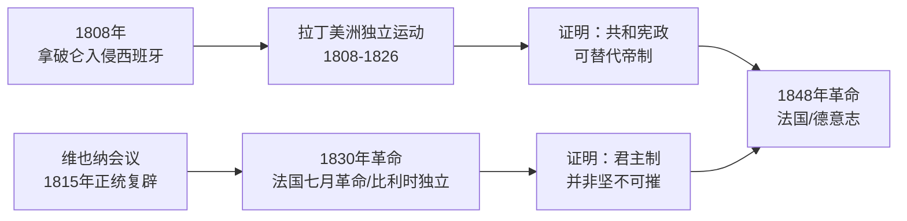
*该图展示拉丁美洲独立与1830年欧洲革命如何分别削弱帝制与君主制的正当性，共同为1848年革命铺垫历史必然性。*

### payoff_opium_war_and_china (0.7s)

## Payoff Opium War And China

**定义**

"鸦片战争的后果与清朝"指1842年《南京条约》签订之后，清帝国陷入一条长达半个多世纪的衰落链条：条约本身撕开了主权与经济的缺口，随后的"自强运动"试图弥补却未能奏效，而这一失败又直接催生了太平天国运动、第二次鸦片战争与甲午中日战争。理解这一概念的关键在于：《南京条约》不是一次孤立的失败，而是此后一系列危机的共同起点——每一次后续危机都在放大条约暴露出的同一个弱点：清朝的军事技术、财政能力和统治合法性已经落后于工业化列强。

**案例分析**

《南京条约》割让香港、开放五口通商、赔款2100万银元，并首次确立"协定关税"——清朝从此无法自主决定关税税率。表面上这只是外交与贸易条款，实质上却动摇了清政府"天朝上国"的统治叙事：普通百姓和地方士绅第一次看到朝廷在军事上无力抵抗"蛮夷"。这种合法性的动摇为1851年爆发、造成约2000万至3000万人死亡的太平天国运动埋下伏笔——洪秀全的意识形态之所以能迅速动员数百万人，正是因为清政府的权威已被鸦片战争严重削弱。清政府在镇压太平天国的同时，于1856—1860年又输掉第二次鸦片战争，被迫签订《天津条约》与《北京条约》，进一步开放通商口岸、割让九龙。这促使恭亲王奕訢等人推动"自强运动"（1861—1895），引进西式兵工厂与新式海军。然而，改革仅停留在技术层面，未触及科举制度与官僚体制，结果1894—1895年甲午战争中，号称亚洲最强的北洋水师全军覆没，暴露出自强运动的根本局限。

**解决问题的应用**

评估这条衰落链时，应区分"触发事件"与"结构性弱点"：《南京条约》是触发事件，而财政收入不足、军工技术依赖进口、地方与中央权力失衡则是结构性弱点——触发事件只是让这些弱点第一次被列强和民众同时看见。判断任何后续危机（太平天国、第二次鸦片战争、甲午战争）时，可追问：这次危机是否源于同一结构性弱点尚未解决？若答案是肯定的，就说明改革未能触及根本问题，这正是解读晚清历史的核心分析方法。

### payoff_scientific_foundations (1.6s)

## Payoff Scientific Foundations

本节考察科学发现如何在数十年后转化为工业实力与意识形态工具——这正是"科学基础的回报"这一概念的核心：突破性研究本身不创造国力转移,是后续几代工程师与企业家将其转化为可规模化的技术与产业,才真正改写大国格局。

以电磁学为例:1820年奥斯特发现电流可使磁针偏转，1831年法拉第证实变化的磁场能在导体中感应出电流——即电磁感应定律。这一发现在三十余年后由麦克斯韦于1865年整合为统一的电磁场方程组,奠定了现代电气工程的理论基础。但真正的"回报"发生在应用层面:1882年爱迪生在纽约珍珠街建成首座直流发电站,1880至90年代特斯拉与西屋公司力推交流电网,使电力得以远距离低损耗输送。德国西门子、AEG等企业迅速将电磁理论转化为重型电机与化工产业,美国则依托庞大市场规模实现电气化工业的批量复制。英国虽是电磁学诞生地,却因资本更倾向殖民贸易、国内产业转型迟缓,未能同等速度将科学优势转化为工业优势——到1900年前后,德美两国的电气与化工产量已双双超越英国。

达尔文的案例展现了科学回报的另一面:1830年莱伊尔的《地质学原理》确立"均变论",促使达尔文在1831至1836年的贝格尔号航行中重新解读物种分布证据,最终于1859年出版《物种起源》。这一理论直接推动了现代生物学、遗传学与医学的发展;但同一时期,赫伯特·斯宾塞等人将"适者生存"曲解移植到种族与国家竞争领域,即"社会达尔文主义",为1880至1914年欧洲列强瓜分非洲、亚洲的殖民扩张提供了伪科学的正当性修辞。

问题应用练习:请对比英国与德国在1830—1900年间将电磁学发现转化为工业产出的路径差异,指出至少两个体制性因素(如资本配置、专利制度、工程教育)解释为何科学发源地未必是工业受益的最大赢家。

### bridge_to_1845 (24.1s)

## Bridge To 1845

到1845年，本章追溯的五条线索已经交汇成一幅统一的世界图景。英国凭借工业革命的先发优势，成为唯一完成机械化生产的国家，并以自由贸易原则重塑全球商业规则——1846年《谷物法》的废除即将证明这一立场；法国和德意志地区则在大革命的余波与民族主义的重新点燃中寻找各自的道路：法国历经共和、帝制、复辟的反复震荡，德意志三十九个邦国在关税同盟的经济纽带下悄然酝酿统一的政治可能；俄国和美国作为地理意义上的大陆型强权正在崛起——俄国凭借广袤领土和农奴制军队维持欧洲大国地位，美国则通过西进运动和不断扩张的疆域积累着未来的工业与人口基础；日本仍在德川幕府的锁国体制下与外部世界隔绝，距离1868年的明治维新还有一代人的时间；而中国，在1842年《南京条约》之后，已经跨过了从"天朝上国"滑向被迫开放、主权受损的长期衰落的门槛。

这五条线索并非各自孤立地演化，而是彼此塑造：英国的工业实力为其炮舰外交提供了物质基础，鸦片战争的胜利又反过来确认并强化了英国在全球贸易体系中的支配地位；法国大革命释放的民族主义观念传播到德意志和意大利，成为日后统一运动的思想火种；俄美两国的扩张则尚未与英国的海上霸权发生直接碰撞，但克里米亚战争（1853–1856）已在数年后到来，将首次检验俄国相对于西方工业强权的真实实力。到本世纪末，这五条线索中将走出七个主导未来两百年国际格局的大国：英国、法国、德国、俄国、美国、日本，以及重新崛起的中国。1845年的世界，正是这场漫长博弈的起跑线。

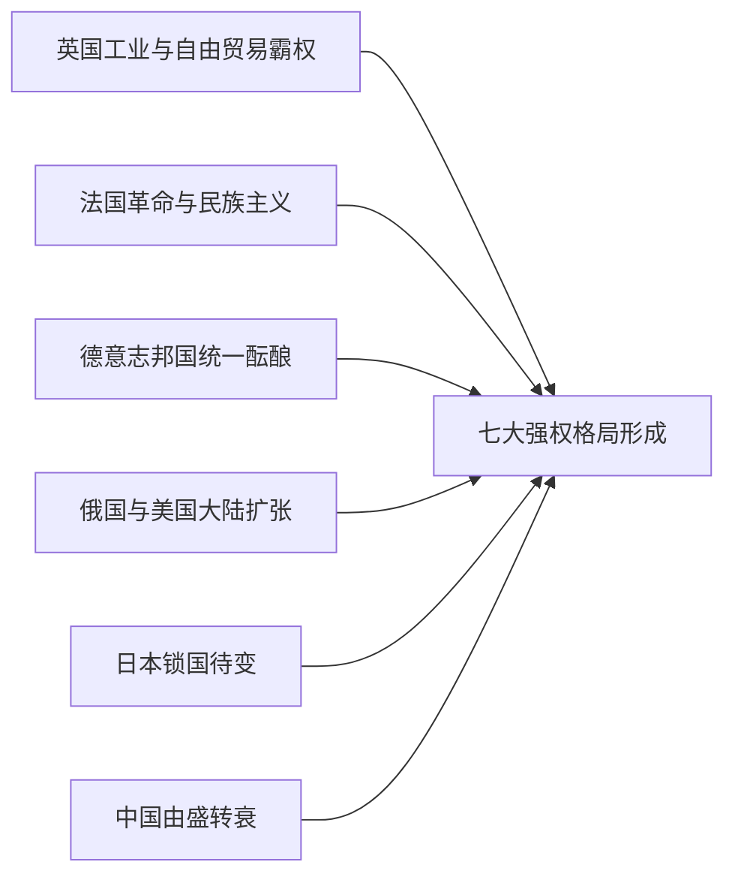

*该图展示了到1845年，五条历史线索如何交汇，共同塑造此后两百年将主导世界的七个大国格局。*

1845年之所以成为一个关键的历史节点，在于此时各国的相对实力尚未固化：英国的工业优势看似不可撼动，但美国和德国的工业化才刚刚起步，其增长速度终将在半个世纪内改写全球经济格局；俄国的军事声望尚未经受工业化战争的考验；中国的衰落也远未触底。理解1845年的世界，关键不在于记住某个国家当时"有多强"，而在于识别每条线索中已经埋下的、将决定未来走向的结构性因素——工业化速度、政治整合程度、与全球贸易体系的连接方式。这也是贯穿本书后续十六章的核心分析框架：追踪这些结构性因素如何在不同国家以不同节奏展开，并最终决定谁将崛起、谁将衰落。

## Run complete

total: 63.9s
