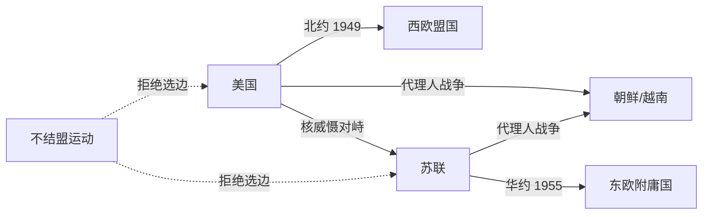
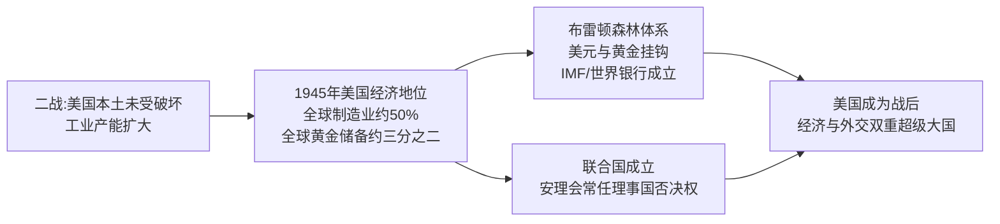
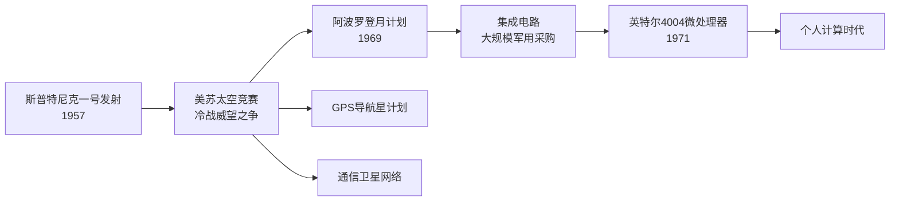

# Concept-Book Run

domain: /home/papagame/projects/digital-duck/conceptbook-app/public/domains/Users/200years_7powers_ch16/input/graph.yaml
target: science_space_race_as_cold_war_proxy
started: 2026-09-28T03:04:47

## Teaching order (9 concepts)

- cold_war_bipolar_order
- science_atomic_age_and_computing_dawn
- russia_soviet_superpower_1945
- science_dna_and_transistor
- usa_postwar_superpower_1945
- russia_cold_war_buildup
- science_space_race_and_microprocessor
- usa_cold_war_containment
- science_space_race_as_cold_war_proxy

### cold_war_bipolar_order (0.9s)

## Cold War Bipolar Order

**定义**

冷战两极格局，指1945年后国际体系围绕两个对立的超级大国集团重组：以美国为首的西方阵营与以苏联为首的东方阵营。两者各自建立军事同盟、扶植附庸国，并竞相扩充核武库，形成一种既非战争亦非和平的长期对抗状态。1949年，美国与西欧十国等共同缔结《北大西洋公约》，成立北约（NATO）；作为回应，苏联于1955年与七个东欧国家签订《华沙条约》，成立华约组织。两大集团在军事、经济、意识形态上全面对峙，全球绝大多数国家被迫或主动选边站队，仅有少数国家（如南斯拉夫、印度）尝试组建不结盟运动。

**实例分析**

1949年8月，苏联成功试爆第一颗原子弹，打破了美国自1945年以来的核垄断，两极格局由此从政治对抗升级为核军备竞赛。到1962年古巴导弹危机爆发时，美国已部署约27000枚核弹头，苏联约3300枚；尽管数量悬殊，苏联在古巴部署中程导弹的举动仍将美国本土置于直接打击范围内，使双方在13天内逼近核战边缘。危机最终以苏联撤走导弹、美国秘密撤出土耳其的朱庇特导弹并承诺不入侵古巴而化解，这一结果表明：两极体系下，双方都清楚全面核战争意味着"相互确保摧毁"，因此存在克制的动机——但这种克制是通过代理人战争（如朝鲜战争、越南战争）而非直接冲突表现出来的。

**问题解决应用**

分析冷战两极格局时，历史学习者应当掌握一套判断方法：面对任一具体历史事件（如1948年柏林封锁、1956年匈牙利事件、1979年苏联入侵阿富汗），先确认涉事双方是否分属两大阵营或其附庸国；再考察该事件是否服从"避免直接军事对抗、通过代理或威慑手段竞争"的两极逻辑。以柏林封锁为例：苏联封锁西柏林陆路交通，美英并未选择武装护送车队（可能引发直接冲突），而是采用空运物资的方式维持西柏林生存，长达十一个月投送逾200万吨物资，最终迫使苏联于1949年5月解除封锁。这一案例说明，两极格局下的危机应对模式，往往体现为在避免直接军事碰撞前提下的资源与意志较量。

*该图展示冷战两极格局中美苏两大集团的同盟结构、核对峙关系及代理人战争路径，虚线表示不结盟国家与两大阵营的疏离关系。*

### science_atomic_age_and_computing_dawn (0.8s)

## Science Atomic Age And Computing Dawn

1945年是科学史上的一个分水岭。这一年，三种此前互不相关的技术能力几乎同时成熟，共同定义了战后时代的起点：核物理、数字计算与生物医学。

**核物理**：1945年7月16日，美国在新墨西哥州阿拉莫戈多试爆首枚原子弹（"三位一体"试验），随后8月分别投于广岛与长崎，两地合计造成约21万人在当年年底前死亡。这一事件的历史意义不仅在于武器本身，而在于它证明了纯理论物理研究——从爱因斯坦1905年的质能关系到费米、奥本海默等人主持的曼哈顿计划——能够在短短几年内转化为决定战争胜负、进而重塑国际秩序的力量。核物理从此从学院象牙塔进入国家战略核心。

**数字计算**：同年，宾夕法尼亚大学建成的ENIAC（电子数字积分计算机）投入使用，它每秒可完成约5000次加法运算，用于计算炮弹弹道和氢弹相关的数值模拟。ENIAC证明了"可编程"计算机——通过重新设置线路和开关执行不同任务——在实用规模上是可行的，为此后数十年计算机产业的爆发奠定了工程基础。

**生物医学**：与此同时，青霉素在二战期间由英美两国实现工业化量产，年产量从1943年的约2100万剂跃升至1945年的超过65亿剂，感染性疾病的死亡率因此大幅下降，外科手术与战场救治的安全边际被彻底改写。

这三项突破的共同之处在于：它们都始于基础研究，却在国家动员（尤其是战争压力）下被迅速工程化、规模化。历史应用问题在于——理解这一"研究到应用"的加速机制为何在1945年前后集中爆发：答案是二战创造了前所未有的政府资金投入与跨学科协作（如曼哈顿计划汇聚了物理学家、化学家、工程师）,这种模式此后延续为冷战时期美苏两国的科技竞赛范式，直接影响了后续几十年各国科技政策的走向。

### russia_soviet_superpower_1945 (0.8s)

## Russia Soviet Superpower 1945

1945年,苏联以战胜国身份走出第二次世界大战,成为与美国并列的两大全球超级大国之一。这一地位的取得,建立在极其惨烈的代价之上:苏联在战争中损失约2600万至2700万人口,是所有参战国中伤亡最惨重的国家,超过美、英、法三国伤亡总和的十倍以上。然而正是这场"卫国战争"的胜利,使苏联红军得以一路推进至柏林,并在中欧、东欧留下了庞大的驻军和政治控制网络。到1945年5月战争结束时,苏军实际占领了波兰、罗马尼亚、保加利亚、匈牙利、捷克斯洛伐克东部以及德国东部——这片区域后来被称为"东方阵营"。

军事占领迅速转化为政治重塑。1945年2月的雅尔塔会议上,美、英、苏三国领导人罗斯福、丘吉尔、斯大林原则上同意战后欧洲划分"势力范围",并承诺东欧国家将举行自由选举。但战争结束后,斯大林并未兑现这一承诺:苏联通过扶植本国共产党、操纵选举、镇压反对派等手段,在1945年至1948年间陆续将波兰、匈牙利、罗马尼亚、保加利亚、捷克斯洛伐克转变为苏联主导的一党制政权。1946年3月,英国前首相丘吉尔在美国富尔顿发表演说,称"一幅铁幕已经从波罗的海的斯德丁降落到亚得里亚海的里雅斯特",这一说法后来成为冷战东西方对峙的标志性描述。

这一转变的核心逻辑,是苏联将战时盟友关系视为暂时的策略联合,而非长期的价值共识。西方国家原本期待战后与苏联共同治理欧洲秩序,但苏联的安全观建立在"缓冲地带"之上——鉴于历史上两次遭受西方(拿破仑、纳粹德国)经陆路入侵的教训,斯大林认定唯有直接控制东欧政权,才能确保苏联本土安全。这种安全考量与西方民主国家所主张的"自由选举权利"直接冲突,双方分歧在1945年后迅速由外交摩擦升级为系统性对抗,为1947年杜鲁门主义、马歇尔计划以及冷战格局的正式形成埋下伏笔。

*该图展示苏联如何将1945年的军事占领逐步转化为对东欧的长期政治控制,并最终引发冷战对峙。*

### science_dna_and_transistor (0.9s)

## Science Dna And Transistor

1947年到1953年的六年间，两项奠基性发现分别开启了信息技术与生命科学的时代。1947年12月，贝尔实验室的巴丁、布拉顿与肖克利发明了晶体管——一种用半导体材料（锗，后来是硅）制成的固态开关与放大器。晶体管的体积仅有真空管的几十分之一，几乎不发热、几乎不耗电，且几乎不会像真空管那样烧毁。这一发明为随后数十年的集成电路、个人计算机乃至今天的智能手机奠定了物理基础——没有晶体管，就没有可大规模量产、可持续微型化的电子计算。三位发明者因此获得1956年诺贝尔物理学奖。

几乎同时，1953年2月，剑桥大学的沃森与克里克在《自然》杂志上发表了脱氧核糖核酸（DNA）的双螺旋结构模型。他们利用富兰克林拍摄的X射线衍射照片（著名的"照片51号"），推断出DNA由两条反向平行的核苷酸链缠绕而成，通过碱基对（腺嘌呤与胸腺嘧啶、鸟嘌呤与胞嘧啶）互补配对连接。这一结构立刻解释了遗传信息如何被稳定复制与传递——双链解开后，每条单链都可作为模板合成新的互补链，这正是细胞分裂时遗传物质得以精确复制的物理机制。

将这两项发现并列，能看清一个历史规律：技术突破往往先于产业爆发数十年发生，且常常出现在同一历史窗口内、彼此独立的领域中。晶体管在发明后用了近二十年才催生个人电脑产业；DNA结构解析后又过了近三十年，基因测序与生物技术产业才真正成形（1990年代人类基因组计划启动）。对历史分析而言，这提示我们判断一项技术发明的长期影响时，不能只看发明当年的直接应用，而要追踪其后续数十年在产业链、教育体系与国家科研投入中的扩散路径——正是这种滞后的、多代人的扩散，而非发明本身的瞬间冲击，塑造了二十世纪下半叶美国在信息产业与生物医药产业的双重领先地位。

### usa_postwar_superpower_1945 (1.0s)

## Usa Postwar Superpower 1945

1945年，美国是二战唯一一个在战争中变得更强而非被摧毁的主要大国。战争期间，美国本土从未遭受轰炸或地面作战，工业产能反而在战时动员中翻倍增长。1945年，美国工业产值占全球制造业总产出的近一半；黄金储备占世界已知黄金储备的约三分之二；美国还是当时唯一拥有核武器的国家。相比之下，战败国德国、日本满目疮痍,战胜国英国、法国、苏联也都是人员伤亡惨重、基础设施严重损毁、财政濒临破产。美国由此获得了历史上罕见的双重优势：既是军事最强国，又是经济唯一净受益者。这种独特地位使美国得以主导战后国际秩序的设计，而非仅仅参与其中。

美国将这种经济与军事优势转化为制度性权力的典型案例，是1944年的布雷顿森林会议。44个同盟国代表在美国新罕布什尔州布雷顿森林召开会议，确立以美元为中心、与黄金挂钩（每盎司黄金35美元）的固定汇率体系，并创立国际货币基金组织（IMF）与世界银行两大机构。由于当时只有美元具备黄金的可兑换信誉，美元事实上取代英镑成为全球储备货币。与此同时，美国主导筹建联合国，并在1945年旧金山会议上确立安理会五个常任理事国拥有否决权的机制——美国由此在军事、金融、外交三条轨道上同时锁定了战后领导地位。

将这一历史现象应用于分析问题时，可以提出这样的设问：为什么1945年的美国选择建立多边机构（如联合国、IMF），而不是像历史上其他崛起大国那样直接谋求领土扩张？答案在于成本收益的历史比较：一战后，美国选择孤立主义、拒绝加入国际联盟，结果未能阻止二战爆发，反而使自身安全受到威胁（如1941年珍珠港事件）。政策制定者由此吸取教训，认为通过制度化的国际合作来固化美国利益，比单纯的军事扩张更具持久性和低成本——布雷顿森林体系与联合国机制正是这种"以规则代替征服"战略选择的产物。

*该图展示美国如何将二战期间积累的经济优势，转化为布雷顿森林体系与联合国两大战后国际制度，从而确立超级大国地位。*

### russia_cold_war_buildup (0.7s)

## Russia Cold War Buildup

第二次世界大战结束后，苏联迅速将战时积累的工业与科研能力转化为与美国抗衡的军事技术实力，这一进程集中体现在三个标志性事件上：1949年8月29日苏联在哈萨克斯坦塞米巴拉金斯克试验场成功试爆第一颗原子弹（代号"RDS-1"，仿制美国"胖子"弹设计），打破了美国自1945年以来对核武器的独家垄断；1955年5月14日苏联联合七个东欧社会主义国家签署《华沙条约》，组建统一军事指挥体系的华沙条约组织，与1949年成立的北约正式形成两大军事集团对峙的格局；1957年10月4日苏联用R-7洲际弹道导弹改装的火箭将人类第一颗人造卫星"斯普特尼克一号"送入近地轨道，证明其已具备将核弹头投送至美国本土的运载能力。这三件事并非孤立的科技或外交成就，而是苏联为回应美国"遏制政策"与马歇尔计划所构筑的经济政治联盟，系统性建立起与之匹敌的军事技术地位的连续步骤。

以斯普特尼克危机为例可以说明这种"技术突破转化为地缘政治冲击"的连锁效应：卫星发射成功后，美国国内舆论一片震惊，认为苏联在导弹与航天技术上已超越美国，直接推动美国国会在1958年通过《国防教育法》，大幅增加科学教育经费，同年成立国家航空航天局（NASA），并加速"民兵"洲际导弹项目研发。这表明一项技术成果可以迅速改变对手对力量对比的认知，进而引发对方在教育、科研、军备领域的连锁反应——这正是冷战"技术竞赛"逻辑的核心机制。

在分析类似历史情境时，一种有效的问题解决方法是：先识别触发事件（原子弹试爆、卫星发射），再追溯其对既有联盟体系的冲击（北约与华沙条约的对峙定型），最后考察对手在教育、财政、军事预算上的具体反应指标（如国防教育法拨款额、导弹试验次数），用可核实的数据串联"行动—认知—反应"这一历史链条，而非停留在笼统的"苏联变强大了"的印象式判断。

### science_space_race_and_microprocessor (24.6s)

## Science Space Race And Microprocessor

**定义**

1957年10月4日，苏联发射了世界上第一颗人造卫星"斯普特尼克一号"（Sputnik 1），一枚仅重83.6公斤的金属球，绕地球轨道运行。这一事件震惊了美国社会——苏联竟在航天技术上抢先一步，由此引发了持续十余年的美苏太空竞赛。这场竞赛表面上是科学探索，实质上是冷战期间两大阵营争夺技术优势与意识形态威望的延伸战场。美国随即成立国家航空航天局（NASA，1958年），并投入巨额联邦预算追赶苏联。竞赛的高潮是1969年7月20日，阿波罗11号任务的宇航员尼尔·阿姆斯特朗成为首位踏上月球表面的人类，实现了肯尼迪总统1961年立下的"十年内送人上月球"的承诺。与此同时，太空竞赛对军用与民用电子工业提出了前所未有的计算与微型化需求，直接推动了另一项划时代突破：1971年，英特尔公司发布4004微处理器，首次将一台可编程计算机的运算核心集成到一枚单一芯片上。

**实例分析**

阿波罗登月计划的制导计算机（Apollo Guidance Computer）是理解这场技术竞赛如何转化为民用科技的关键案例。为了让飞船在太空中实时导航，NASA需要一台重量轻、可靠性极高的计算机，这一需求几乎全部消耗了美国当时集成电路的产能：据统计，阿波罗计划在1962至1965年间采购的集成电路约占全美产量的60%。这种由国家预算驱动的大规模采购，压低了集成电路的单位成本，加速了商业化进程。到1971年，英特尔工程师特德·霍夫（Ted Hoff）等人将原本分散在多块电路板上的运算单元、控制单元和存储器接口整合进一枚4004芯片，内含2300个晶体管，运算速度约每秒6万次操作。这枚芯片最初是为日本计算器公司Busicom设计，但其架构迅速被推广至个人计算机领域，成为后来PC产业的技术起点。

**问题解决应用**

分析太空竞赛的历史后果时，学生应识别三条并行的技术溢出路径：军事拨款如何转化为民用基础设施。太空竞赛催生的全球定位系统（GPS，始于1970年代美国国防部的"导航星"计划）如今支撑着全球物流、导航与金融交易的时间同步；通信卫星技术（如1962年的电星一号）奠定了跨洲电视转播与互联网骨干网络的基础；而阿波罗计划对微型化、高可靠性电子元件的迫切需求，则与英特尔4004芯片的诞生形成因果链条，共同开启了个人计算时代。理解这段历史的关键在于认识到：冷战对抗产生的政治压力与国家预算，往往比单纯的市场需求更能加速某些高风险、高成本技术的早期投资与规模化。

*该图展示太空竞赛如何通过国家预算与技术需求，同时催生微处理器革命与GPS、卫星通信等民用基础设施。*

### usa_cold_war_containment (21.7s)

## Usa Cold War Containment

第二次世界大战结束仅两年，美国便完成了从"孤立主义"到"全球干预"的战略转向。1947年3月，杜鲁门在国会演说中宣布：凡是抵抗"武装的少数人或外部压力"的自由人民，美国都将给予支持——这就是"杜鲁门主义"，其直接诱因是英国宣布无力继续援助希腊和土耳其，防止两国被共产主义势力渗透。同年6月，国务卿马歇尔提出"欧洲复兴计划"（马歇尔计划），四年间向西欧16国注入约130亿美元（相当于当时美国GDP的5%左右），帮助重建工业与基础设施，同时将西欧经济体系牢固地绑定在美国主导的资本主义阵营。1949年4月，美国联合西欧十一国签署《北大西洋公约》，成立北约，确立"集体防御"原则——对任何一个成员国的攻击视为对全体成员的攻击。这三项举措共同构成了"遏制政策"的骨架：用经济援助防止贫困催生共产主义，用军事同盟防止苏联武力扩张。

遏制政策的第一次实战检验发生在朝鲜半岛。1950年6月，朝鲜人民军越过北纬38度线南下，美国迅速促成联合国安理会通过决议（当时苏联缺席抵制，未能行使否决权），组织"联合国军"介入。战争在三年间反复拉锯：联合国军曾一度推进至中朝边境鸭绿江畔，随后中国"人民志愿军"大规模介入，将战线重新推回38度线附近。战争造成美军阵亡约3.6万人，朝鲜半岛南北双方军民伤亡合计估计超过300万人。1953年7月签署的《朝鲜停战协定》并未产生和平条约，而只是划定了一条军事分界线，双方在法律上至今仍处于战争状态。

这场战争的历史意义在于：它证明了遏制政策不再只是经济与外交手段，而首次转化为美国在海外的直接军事介入，也确立了"有限战争"模式——即避免与苏联或中国爆发全面核战争，转而在局部地区以常规武力实现遏制目标。这一模式此后深刻影响了美国在越南等地区的军事决策。

*图示：从杜鲁门主义到马歇尔计划、北约成立，再到朝鲜战争爆发与停战的政策演进链条。*

问题演练：假设你是1950年的美国决策者，联合国军已推进至鸭绿江畔，请依据"遏制"而非"解放"或"击败"的政策定位，判断此时是否应继续北上、越过边境，并说明理由——答案应指出：继续北上违背了遏制政策"划定界线、避免全面战争"的核心逻辑，而这一误判正是导致中国介入、战争陷入僵局的关键转折点。

### science_space_race_as_cold_war_proxy (16.6s)

## Science Space Race As Cold War Proxy

太空竞赛是冷战时期美苏对抗中最典型的案例：一场表面上的科学竞赛，实质上是两个超级大国争夺意识形态和军事威望的代理战场。1957年10月4日，苏联发射人类第一颗人造卫星"斯普特尼克一号"(Sputnik 1)，其技术核心——能将卫星送入轨道的洲际弹道导弹——同时证明了苏联具备打击美国本土的能力。这一事件在美国引发被称为"斯普特尼克危机"的举国震动，直接催生了1958年美国国家航空航天局(NASA)的成立，以及同年《国防教育法》对科学与工程教育的大规模拨款。科学突破与军事威慑、公众心理在此完全重合，无法分离。

这场竞赛的转折点是1961年4月12日苏联宇航员尤里·加加林成为首位进入太空的人类，再次令美国陷入落后的舆论危机。肯尼迪总统随即在1961年5月向国会提出"十年内送人登月"的目标，这并非单纯的科学规划，而是一次公开的政治承诺——用一个可验证、可计时的科学成就来重新确立美国的全球领导地位。到1969年7月20日，阿波罗11号宇航员尼尔·阿姆斯特朗踏上月球表面，美国以一次性的、不可逆的技术优势结束了这场竞赛：苏联始终未能实现载人登月。

将两国投入的资源加以对比，可以看出这场竞赛的国家战略性质：NASA的阿波罗计划总耗资约254亿美元(以1960年代币值计算)，占当时美国联邦预算的显著比例，在1966年一度达到NASA历史最高的联邦预算占比4.4%。如此规模的持续投入，若不是出于对国家安全与国际声望的迫切考量，很难在民主体制下获得国会长期支持。

在分析冷战格局时，太空竞赛提供了一个可直接检验的分析框架：判断某项"科学成就"是否具有地缘政治意义，可以追问三个问题——它是否被两国同时、公开地追求？它的技术能力是否可转化为军事能力？其结果是否被双方政府用于国内外的宣传叙事？斯普特尼克与阿波罗计划在这三项检验中全部成立，这正是它们被同时记录进"科学史"与"美苏对抗史"两条叙事线索的根本原因。

## Run complete

total: 96.4s
