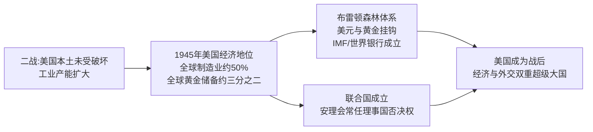
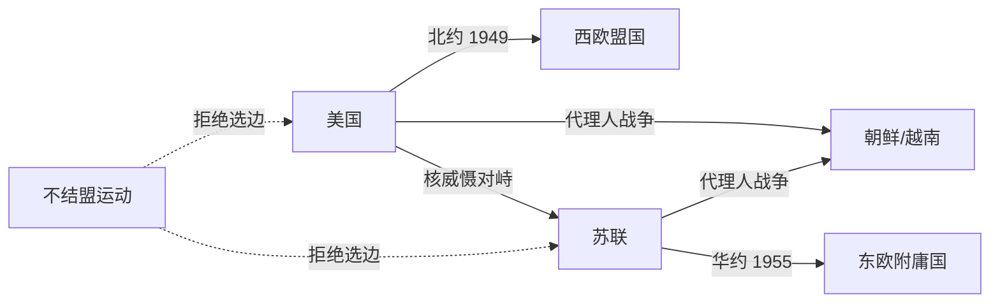
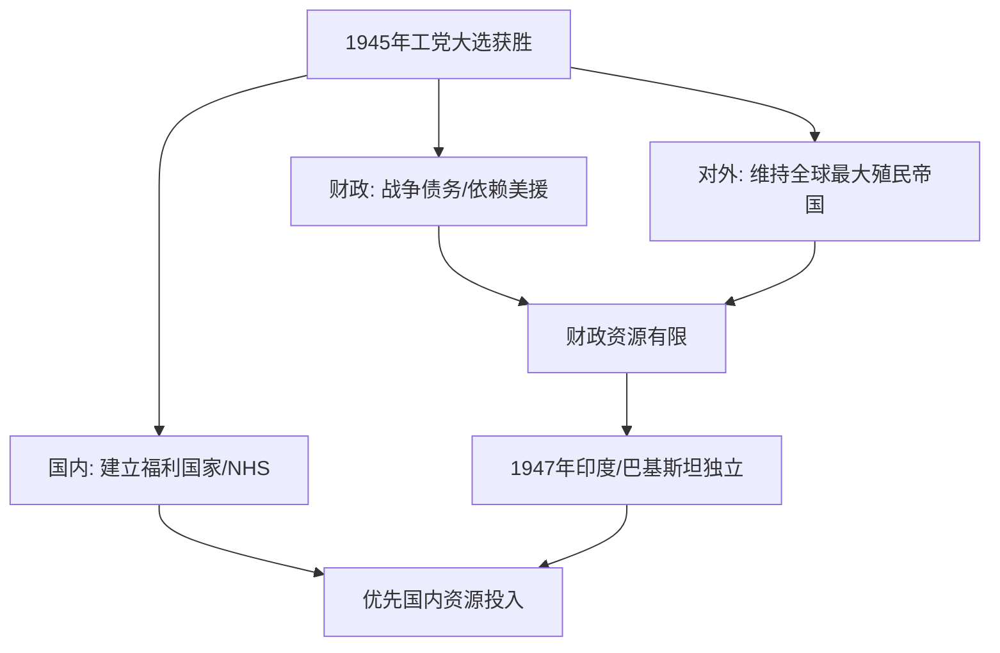
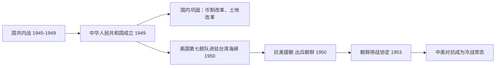
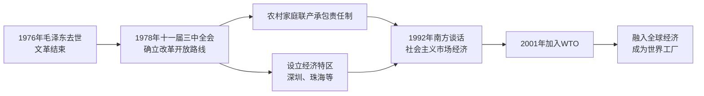
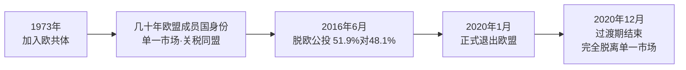
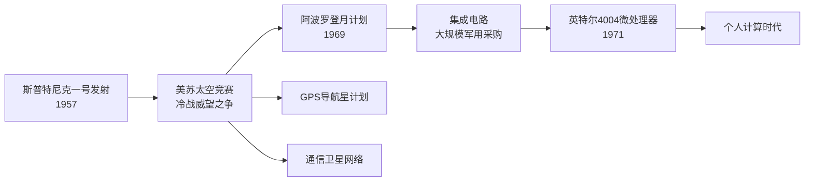
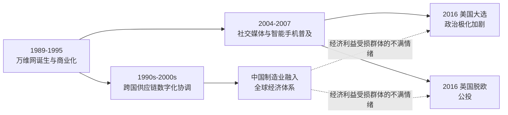

# Concept-Book Run

domain: /home/papagame/projects/digital-duck/conceptbook-app/public/domains/Users/200years_7powers_ch16/input/graph.yaml
target: science_internet_and_globalization_backlash
started: 2026-09-28T03:06:10

## Teaching order (24 concepts)

- usa_postwar_superpower_1945
- china_civil_war_resumption_1945
- cold_war_bipolar_order
- uk_postwar_settlement_1945
- china_communist_consolidation
- uk_decolonization_wave
- usa_cold_war_containment
- china_maoist_upheaval
- uk_suez_humiliation
- usa_civil_rights_and_vietnam
- china_reform_and_opening
- uk_eec_membership
- usa_cold_war_endgame
- science_atomic_age_and_computing_dawn
- china_rise_as_power
- uk_thatcher_restructuring
- usa_war_on_terror
- science_dna_and_transistor
- uk_brexit_realignment
- usa_polarization_era
- science_space_race_and_microprocessor
- globalization_backlash_pattern
- science_personal_computer_and_internet
- science_internet_and_globalization_backlash

### usa_postwar_superpower_1945 (0.8s)

## Usa Postwar Superpower 1945

1945年，美国是二战唯一一个在战争中变得更强而非被摧毁的主要大国。战争期间，美国本土从未遭受轰炸或地面作战，工业产能反而在战时动员中翻倍增长。1945年，美国工业产值占全球制造业总产出的近一半；黄金储备占世界已知黄金储备的约三分之二；美国还是当时唯一拥有核武器的国家。相比之下，战败国德国、日本满目疮痍,战胜国英国、法国、苏联也都是人员伤亡惨重、基础设施严重损毁、财政濒临破产。美国由此获得了历史上罕见的双重优势：既是军事最强国，又是经济唯一净受益者。这种独特地位使美国得以主导战后国际秩序的设计，而非仅仅参与其中。

美国将这种经济与军事优势转化为制度性权力的典型案例，是1944年的布雷顿森林会议。44个同盟国代表在美国新罕布什尔州布雷顿森林召开会议，确立以美元为中心、与黄金挂钩（每盎司黄金35美元）的固定汇率体系，并创立国际货币基金组织（IMF）与世界银行两大机构。由于当时只有美元具备黄金的可兑换信誉，美元事实上取代英镑成为全球储备货币。与此同时，美国主导筹建联合国，并在1945年旧金山会议上确立安理会五个常任理事国拥有否决权的机制——美国由此在军事、金融、外交三条轨道上同时锁定了战后领导地位。

将这一历史现象应用于分析问题时，可以提出这样的设问：为什么1945年的美国选择建立多边机构（如联合国、IMF），而不是像历史上其他崛起大国那样直接谋求领土扩张？答案在于成本收益的历史比较：一战后，美国选择孤立主义、拒绝加入国际联盟，结果未能阻止二战爆发，反而使自身安全受到威胁（如1941年珍珠港事件）。政策制定者由此吸取教训，认为通过制度化的国际合作来固化美国利益，比单纯的军事扩张更具持久性和低成本——布雷顿森林体系与联合国机制正是这种"以规则代替征服"战略选择的产物。

*该图展示美国如何将二战期间积累的经济优势，转化为布雷顿森林体系与联合国两大战后国际制度，从而确立超级大国地位。*

### china_civil_war_resumption_1945 (21.2s)

## China Civil War Resumption 1945

**定义**：1945年8月日本投降后，中国国内两大武装政治力量——蒋介石领导的国民党政府与毛泽东领导的中国共产党——之间维持了八年的抗日统一战线随即�声破裂，双方在受降权、军队整编、地方政权归属等问题上迅速爆发新一轮内战。这并非简单的旧怨重燃，而是因为共同的外部威胁（日本）消失后，双方对"谁来主导战后中国"这一核心问题从未达成过真正共识——1937年的合作本质上是权宜性的，而非制度性的融合。

**具体经过**：日本宣布投降后，双方立即抢占受降权和战略要地。国民党凭借美国的空运与海运支持，迅速将中央军调往华北、华东和东北的主要城市与交通线；共产党领导的八路军、新四军则依托抗战期间已经建立的敌后根据地，就近接收日伪武器和地方政权，尤其在华北农村和部分东北地区扩大控制。1945年8月至10月，蒋介石三次电邀毛泽东赴重庆谈判，10月10日双方签署《双十协定》，原则上同意召开政治协商会议、实现"军队国家化"，但对军队整编比例和解放区政权地位等关键问题并未真正解决。1946年1月虽由美国特使乔治·马歇尔促成短暂停火与政治协商会议召开，但停火协议屡遭破坏，东北地区的军事冲突尤为激烈——苏联撤军后，国共双方竞相接收原日本关东军的装备与东北工业基地，成为内战全面爆发的导火索。1946年6月，国民党军队大举进攻中原解放区，全面内战正式爆发。

**分析应用**：理解此次内战复燃的关键在于识别"外部约束消失即引发内部权力重构"这一历史规律——类似逻辑也出现在其他多方联盟因共同敌人消亡而瓦解的案例中（如二战后同盟国内部美苏关系的恶化）。分析时应关注三个具体变量：受降权与地盘控制的实际分布、外部大国（美国、苏联）的军事与物资介入程度、以及双方谈判协议中未被真正执行的条款。将这三者与1945–1946年间的具体事件逐一对照，才能准确解释停火为何屡次破裂，以及内战为何在东北地区率先全面升级。

### cold_war_bipolar_order (0.7s)

## Cold War Bipolar Order

**定义**

冷战两极格局，指1945年后国际体系围绕两个对立的超级大国集团重组：以美国为首的西方阵营与以苏联为首的东方阵营。两者各自建立军事同盟、扶植附庸国，并竞相扩充核武库，形成一种既非战争亦非和平的长期对抗状态。1949年，美国与西欧十国等共同缔结《北大西洋公约》，成立北约（NATO）；作为回应，苏联于1955年与七个东欧国家签订《华沙条约》，成立华约组织。两大集团在军事、经济、意识形态上全面对峙，全球绝大多数国家被迫或主动选边站队，仅有少数国家（如南斯拉夫、印度）尝试组建不结盟运动。

**实例分析**

1949年8月，苏联成功试爆第一颗原子弹，打破了美国自1945年以来的核垄断，两极格局由此从政治对抗升级为核军备竞赛。到1962年古巴导弹危机爆发时，美国已部署约27000枚核弹头，苏联约3300枚；尽管数量悬殊，苏联在古巴部署中程导弹的举动仍将美国本土置于直接打击范围内，使双方在13天内逼近核战边缘。危机最终以苏联撤走导弹、美国秘密撤出土耳其的朱庇特导弹并承诺不入侵古巴而化解，这一结果表明：两极体系下，双方都清楚全面核战争意味着"相互确保摧毁"，因此存在克制的动机——但这种克制是通过代理人战争（如朝鲜战争、越南战争）而非直接冲突表现出来的。

**问题解决应用**

分析冷战两极格局时，历史学习者应当掌握一套判断方法：面对任一具体历史事件（如1948年柏林封锁、1956年匈牙利事件、1979年苏联入侵阿富汗），先确认涉事双方是否分属两大阵营或其附庸国；再考察该事件是否服从"避免直接军事对抗、通过代理或威慑手段竞争"的两极逻辑。以柏林封锁为例：苏联封锁西柏林陆路交通，美英并未选择武装护送车队（可能引发直接冲突），而是采用空运物资的方式维持西柏林生存，长达十一个月投送逾200万吨物资，最终迫使苏联于1949年5月解除封锁。这一案例说明，两极格局下的危机应对模式，往往体现为在避免直接军事碰撞前提下的资源与意志较量。

*该图展示冷战两极格局中美苏两大集团的同盟结构、核对峙关系及代理人战争路径，虚线表示不结盟国家与两大阵营的疏离关系。*

### uk_postwar_settlement_1945 (25.3s)

## Uk Postwar Settlement 1945

**定义**

1945年7月,英国举行大选,尽管温斯顿·丘吉尔领导英国赢得了第二次世界大战,保守党却在选举中惨败,工党领袖克莱门特·艾德礼以393席对213席的压倒性优势组建新政府。这一结果表面上令人意外,实则反映了英国社会的深层诉求:六年战争造成的牺牲让选民不再满足于"打赢战争"本身,而要求一个能够保障就业、医疗与住房的和平红利。艾德礼政府随即启动了英国历史上最深远的社会改革——建立"从摇篮到坟墓"的福利国家体系,其核心是1948年成立的国民医疗服务体系(NHS),向全体公民提供免费医疗。与此同时,英国财政状况却极为脆弱:战争耗费了英国四分之一以上的国民财富,对美负债高达约37亿美元,只能依靠1946年美国提供的贷款和1948年启动的马歇尔计划援助维持运转。更具讽刺意味的是,这个财政濒临破产的国家,仍然统治着面积和人口均居世界第一的殖民帝国——印度、非洲大片地区、东南亚诸多属地皆在其治下。

**具体案例**

1947年的印度独立进程集中体现了这种矛盾。英国在国内推行免费医疗、扩大养老金和失业救济的同时,却已无力继续统治拥有近4亿人口的印度次大陆。财政部测算表明,维持印度驻军和行政管理的成本,与国内福利支出形成直接的资源竞争。艾德礼政府于1947年2月宣布将在次年6月前撤离印度,末代总督蒙巴顿勋爵将撤离时间表提前至1947年8月,仓促的"蒙巴顿方案"导致印巴分治时爆发大规模教派冲突,估计造成一百万人死亡、逾1400万人流离失所。这一案例说明:福利国家的建立与帝国的维系,在实际财政资源分配上是相互竞争的两项事业,而非并行不悖的两条战线。

**问题解决应用**

学习本节后,应能据此分析历史情境:面对1945至1947年间同时增长的国内福利承诺与殖民维持成本,英国决策者必须在两者间做出取舍。可尝试对比同期法国的选择——法国在印度支那和阿尔及利亚选择武力维持殖民统治,导致长期战争消耗,而英国在印度、缅甸等地相对较快地完成撤离,将有限资源优先投入国内重建。比较两国路径及其后果(法国的第四共和国政治危机 vs. 英国相对平稳的去殖民化与福利国家扎根),可以训练分析"资源有限条件下国家优先次序调整"这一历史因果关系的能力,这一分析框架同样适用于理解其他帝国衰落案例。

*该图展示1945年工党政府同时面对国内福利建设与海外帝国维持的资源竞争关系,最终导致对殖民地的优先级让位。*

### china_communist_consolidation (34.0s)

## China Communist Consolidation

**定义**

1949年10月1日，中国共产党领导的人民解放军在国共内战中取得决定性胜利，毛泽东在北京宣布中华人民共和国成立。国民党政权撤退至台湾，中国大陆随即建立起以中国共产党为唯一执政党的政治体制。新政权面临的首要任务是"巩固"：即在广袤领土上消灭残余武装抵抗、重建财政货币体系、进行土地改革以及将新政权嵌入国际冷战格局。1950年10月，新生的中华人民共和国即以"抗美援朝"名义出兵朝鲜半岛，与美国主导的联合国军直接交战，这是中国与美国战后主导的国际秩序的首次正面对抗。

**具体案例**

内战期间，通货膨胀已使国民党统治区经济近乎崩溃——1948年法币发行量较战前增长逾百万倍，民众对纸币彻底丧失信心。中共建政后迅速推行"银元之战"和统一发行人民币，到1950年底基本遏制了恶性通胀，这一财政稳定措施为新政权赢得了城市民众的初步认可。与此同时，1950年6月朝鲜战争爆发，美国第七舰队随即进驻台湾海峡，阻止解放军跨海统一台湾；中国将此视为美国对其国家安全和主权完整的直接威胁。同年10月，中国人民志愿军跨过鸭绿江，与以美国为首的联合国军在朝鲜半岛展开长达三年的拉锋，最终在1953年签署《朝鲜停战协定》，战线大致回到战前的三十八度线附近，双方均未能实现军事目标上的决定性胜利。

**问题解决应用**

理解"巩固"与"抗美援朝"之间的联系，关键在于把握新政权的双重逻辑：对内需要通过战争动员来强化统治合法性和民族凝聚力，对外则借此确立在冷战两极格局中不可忽视的地位。试分析：为何一个刚刚结束二十余年内战、财政极度困难的政权，会选择在朝鲜与世界最强大的军事强国直接交战？答案需要结合三方面证据——美国第七舰队进驻台海对中国主权构成的直接威胁、苏联对中国出兵的军事物资支持（如米格战机与火炮）、以及毛泽东对"唇亡齿寒"战略逻辑的公开表述（若朝鲜被美军占领，东北工业基地将直接暴露于威胁之下）。这提示读者：历史事件的因果分析应综合国内政治需求与国际安全环境两个层面，而非单一归因。

*该图展示中华人民共和国成立后，国内政权巩固与朝鲜战争之间的因果链条，以及其如何确立中美长期对抗的冷战格局。*

### uk_decolonization_wave (21.2s)

## Uk Decolonization Wave

第二次世界大战结束后，英国已无力继续维持一个横跨五大洲的殖民帝国。战争使英国背负了相当于其国民生产总值两倍以上的债务，1947年更遭遇严重的煤炭短缺和货币危机，国内财政已捉襟见肘，无法支撑殖民地的军事与行政开支。与此同时，印度国大党在甘地和尼赫鲁领导下的不合作运动持续多年，加上1946年印度皇家海军哗变等事件，让伦敦意识到继续以武力维持统治的代价过高。1947年8月，英国议会通过《印度独立法案》，次大陆被分割为印度与巴基斯坦两个自治领，实现独立——但分治伴随的教派冲突造成约一百万人死亡、逾一千四百万人流离失所，成为英国仓促撤离所付出的惨痛代价。

印度独立开启了连锁反应。1957年，加纳成为首个获得独立的英属非洲殖民地；随后十年间，尼日利亚（1960年）、肯尼亚（1963年）、赞比亚（1964年）等相继脱离英国统治。加勒比地区的牙买加与特立尼达和多巴哥也于1962年独立。到1968年，英国已从非洲和亚洲大部分领土撤出，殖民地数量从战前的数十个锐减至个位数。

这一进程可以用一个具体的因果链条来理解：财政枯竭削弱了英国维持驻军和行政机构的能力，殖民地民族主义运动（如印度国大党、肯尼亚的茅茅起义）提高了统治成本，而美苏两个超级大国出于冷战考量普遍反对殖民主义，进一步削弱了英国维持帝国的国际合法性。三者叠加，使得"体面撤退"而非"武力镇压"成为伦敦的理性选择。

从问题解决的角度看，历史学家常用的分析框架是：面对一场撤退，先确认触发撤退的具体成本（军事开支、国内政治压力、国际舆论），再考察撤退的方式（协商移交权力，如印度；还是仓促划界，如巴勒斯坦和印度分治）如何决定了后续冲突的烈度。英国的非洲殖民地大多采取相对有序的权力移交，但边界划定沿用殖民地时期的行政线而非民族分布，这为后来尼日利亚内战、卢旺达等地区冲突埋下了隐患——这提醒我们，撤退速度与撤退质量是两个独立变量，不能混为一谈。

### usa_cold_war_containment (0.7s)

## Usa Cold War Containment

第二次世界大战结束仅两年，美国便完成了从"孤立主义"到"全球干预"的战略转向。1947年3月，杜鲁门在国会演说中宣布：凡是抵抗"武装的少数人或外部压力"的自由人民，美国都将给予支持——这就是"杜鲁门主义"，其直接诱因是英国宣布无力继续援助希腊和土耳其，防止两国被共产主义势力渗透。同年6月，国务卿马歇尔提出"欧洲复兴计划"（马歇尔计划），四年间向西欧16国注入约130亿美元（相当于当时美国GDP的5%左右），帮助重建工业与基础设施，同时将西欧经济体系牢固地绑定在美国主导的资本主义阵营。1949年4月，美国联合西欧十一国签署《北大西洋公约》，成立北约，确立"集体防御"原则——对任何一个成员国的攻击视为对全体成员的攻击。这三项举措共同构成了"遏制政策"的骨架：用经济援助防止贫困催生共产主义，用军事同盟防止苏联武力扩张。

遏制政策的第一次实战检验发生在朝鲜半岛。1950年6月，朝鲜人民军越过北纬38度线南下，美国迅速促成联合国安理会通过决议（当时苏联缺席抵制，未能行使否决权），组织"联合国军"介入。战争在三年间反复拉锯：联合国军曾一度推进至中朝边境鸭绿江畔，随后中国"人民志愿军"大规模介入，将战线重新推回38度线附近。战争造成美军阵亡约3.6万人，朝鲜半岛南北双方军民伤亡合计估计超过300万人。1953年7月签署的《朝鲜停战协定》并未产生和平条约，而只是划定了一条军事分界线，双方在法律上至今仍处于战争状态。

这场战争的历史意义在于：它证明了遏制政策不再只是经济与外交手段，而首次转化为美国在海外的直接军事介入，也确立了"有限战争"模式——即避免与苏联或中国爆发全面核战争，转而在局部地区以常规武力实现遏制目标。这一模式此后深刻影响了美国在越南等地区的军事决策。

*图示：从杜鲁门主义到马歇尔计划、北约成立，再到朝鲜战争爆发与停战的政策演进链条。*

问题演练：假设你是1950年的美国决策者，联合国军已推进至鸭绿江畔，请依据"遏制"而非"解放"或"击败"的政策定位，判断此时是否应继续北上、越过边境，并说明理由——答案应指出：继续北上违背了遏制政策"划定界线、避免全面战争"的核心逻辑，而这一误判正是导致中国介入、战争陷入僵局的关键转折点。

### china_maoist_upheaval (20.9s)

## China Maoist Upheaval

**定义**：1949年中国共产党建立政权后,毛泽东在1950年代末至1970年代中期发动了两场后果极其严重、且完全由内部决策引发的运动——"大跃进"(1958—1962)与"文化大革命"(1966—1976)。这两场运动没有外敌入侵或国际冲突作为诱因,而是源于毛泽东本人对经济发展路径和意识形态纯洁性的判断,最终酿成人类历史上罕见的自我造成的灾难。

**案例分析**:大跃进的核心政策是"以钢为纲",要求农村建立土法炼钢炉,同时将农业生产集体化推向极端("人民公社"),并按照严重脱离实际的高指标虚报粮食产量。地方官员为迎合上级、避免被打成"右倾",层层虚报产量,而中央却依据虚报数字征收公粮,导致农村实际口粮被抽空。与此同时,大量劳动力被抽调去炼制毫无实用价值的劣质生铁,农业生产遭到荒废。三年间(1959—1961,史称"三年困难时期"),中国出现大规模饥荒,人口统计学研究(如美国学者裘蒂丝·班尼斯特及中国官方事后调查)估计非正常死亡人数在1500万至4500万之间,是20世纪死亡人数最多的饥荒。

十年后,毛泽东为重新夺回被认为旁落的党内路线主导权,于1966年发动"文化大革命",号召"造反有理",鼓动青年学生组成"红卫兵",冲击党政机关、教育系统与传统文化。刘少奇、邓小平等党内领导人被打倒,数以百万计的知识分子、干部及"黑五类"家庭成员遭受批斗、监禁乃至迫害致死,大学停课,教育体系近乎瘫痪长达十年。1981年中共中央《关于建国以来党的若干历史问题的决议》正式将文革定性为"由领导者错误发动、被反革命集团利用,给党、国家和人民带来严重灾难的内乱"。

**问题解决应用**:分析这两场运动可用一个共同框架——权力高度集中的决策体制缺乏纠错机制。当政治正确性压倒事实汇报(大跃进中的浮夸风)、或运动式动员取代制度化治理(文革中的群众专政)时,灾难规模会因缺乏监督与反馈而不断放大。理解这一机制,有助于解释为何后来的中国改革(1978年后)将"实事求是"与集体领导制度化,作为防止历史重演的核心原则。

### uk_suez_humiliation (16.5s)

## Uk Suez Humiliation

1956年的苏伊士运河危机，是检验二战后英国究竟还能不能算作独立大国的一次关键考验，而结果是彻底否定的。1956年7月，埃及总统纳赛尔宣布将苏伊士运河公司收归国有，此前该运河由英法共同控股运营，是英国通往亚洲殖民地和中东石油航线的生命线。英国首相安东尼·艾登将此事视为对英国全球利益的直接挑战，随即与法国、以色列秘密策划军事行动：以色列先行入侵西奈半岛，英法随后以"维和"为名出兵占领运河区。10月29日以色列开战，11月5日英法伞兵在塞得港登陆，行动在军事上迅速得手。

然而，行动的政治后果与军事结果完全相反。美国总统艾森豪威尔对英法未经协商即擅自开战极为不满，担心此举将苏联拉入中东、破坏西方阵营团结，遂动用金融手段施压：美国拒绝支持国际货币基金组织对英国的贷款申请，同时英镑在市场上遭到抛售，储备迅速流失。面对英镑危机和国内外舆论压力，英国被迫于11月6日宣布停火，随后与法国一起撤军，任务未能达成推翻纳赛尔、夺回运河控制权的目标。艾登本人因此下台，成为这场外交惨败的政治代价。

这一事件之所以被后世视为英国"独立大国地位终结"的标志性时刻，关键在于它清楚暴露了一个事实：英国已不再拥有不依赖美国支持而独立采取重大军事行动的能力。此前英国在国际事务中仍以传统列强身份自居，苏伊士危机之后，英国外交政策逐渐转向紧密追随美国、通过"英美特殊关系"维系影响力，同时加速推进对非洲、亚洲殖民地的撤离进程，这正是英国"非殖民化浪潮"的重要组成部分。可以说，苏伊士运河危机不是英国实力的转折点，而是其实力已经改变这一现实被公开、被迫承认的时刻。

### usa_civil_rights_and_vietnam (22.8s)

## Usa Civil Rights And Vietnam

**定义**：1955年至1968年间，民权运动通过非暴力抗争、司法诉讼和立法游说，逐步瓦解了美国南方“隔离但平等”的种族隔离体系；与此同时，1961年至1975年,越南战争从有限的军事顾问介入演变为一场耗时漫长、代价高昂的冷战热战，并在国内引发深刻分裂。这两场看似独立的历史进程实际上相互交织：越战消耗的联邦资源与政治资本,直接削弱了约翰逊政府“伟大社会”改革的推进力度,而民权运动培养出的抗议策略与道德语言,又被反战运动直接借用。

**具体例证**：1954年布朗诉托皮卡教育局案推翻“隔离但平等”原则后,马丁·路德·金于1955-56年领导蒙哥马利公交抵制运动,持续381天,最终迫使公交系统废除隔离座位。此后运动持续施压,促成1964年《民权法案》(禁止公共设施与就业中的种族歧视)与1965年《选举权法案》(废除人头税、识字测试等投票壁垒)相继通过。与此同时,越战规模从1961年约3000名顾问,升至1968年逾50万美军;same一年,春节攻势(Tet Offensive)造成美军逾1400人阵亡,并击碎了政府“即将取胜”的公开说辞,国内反战情绪随之激化,直接冲击约翰逊的连任前景,促使其于1968年3月宣布不再寻求连任。

**综合分析应用**：理解这两场运动的关键在于识别财政与政治资源的此消彼长关系——约翰逊1964年提出“对贫困宣战”与民权立法本可获得更充裕的联邦拨款,但1965年后越战军费急剧攀升(至1968年度军费逾800亿美元),挤压了国内福利与教育项目的预算空间,这一取舍是理解1960年代末期社会矛盾激化(如1968年金遇刺后爆发的多城骚乱)的核心线索。在分析类似的历史情境时,应追问:一国对外军事承诺的规模变化,如何通过预算分配、征兵制度(越战征兵尤其冲击少数族裔与低收入青年,加深了种族与阶级不满)、以及政治领导人的注意力转移,反过来影响国内改革议程的推进速度与深度。

### china_reform_and_opening (24.3s)

## China Reform And Opening

1976年毛泽东去世，四人帮随即被逮捕，结束了长达十年的"文化大革命"。经过两年的权力过渡，邓小平在1978年12月的中共十一届三中全会上确立了实际领导地位，正式提出把工作重心从"以阶级斗争为纲"转向"以经济建设为中心"，中国由此进入改革开放时代。这场转折并非推翻社会主义制度，而是保留中国共产党的政治领导，同时在经济领域引入市场机制——邓小平称之为"建设有中国特色的社会主义"，其实用主义口号"不管黑猫白猫，抓到老鼠就是好猫"概括了这一路线：政策的评判标准是效果，而非意识形态的纯粹性。

改革首先从农村开始。1978年安徽凤阳县小岗村的农民私下签订协议，将集体土地分包到户耕种，收获后除上缴国家和集体的部分外，剩余归农民自己支配，这就是"家庭联产承包责任制"。这一做法迅速被中央认可并在全国推广，粮食产量在随后几年大幅提升。与此同时，1980年，深圳、珠海、汕头、厦门被设立为"经济特区"，允许外资进入、实行税收优惠和更灵活的经营政策，作为对外开放的试验田。深圳从一个边陲渔村在二十年内成长为人口超千万的现代化城市，成为改革成效最直观的例证。

1992年邓小平"南方谈话"进一步扫清了姓"社"姓"资"的思想障碍，确立了建立"社会主义市场经济体制"的目标，改革从沿海试点扩展到全国性的国有企业改革、外贸体制改革与资本市场建设（1990年上海、深圳证券交易所相继成立）。经过近十年的谈判，中国于2001年12月正式加入世界贸易组织（WTO），承诺大幅降低关税、开放市场准入、遵守国际贸易规则，以换取稳定进入全球市场的机会。入世后，中国迅速成为"世界工厂"：GDP从2001年约1.3万亿美元增长到2010年前后超过6万亿美元，对外贸易总额跻身世界前列，数亿农村人口通过进城务工和产业转移脱离贫困，联合国数据显示中国是过去四十年全球减贫贡献最大的单一国家。

*该图展示从文革结束到中国加入WTO、深度融入全球经济的改革开放关键节点。*

将改革开放置于问题解决的视角来看，其核心在于邓小平团队如何在保持政治稳定的前提下重启经济增长：他们没有采取苏联式的一次性"休克疗法"，而是选择"摸着石头过河"的渐进策略——先在小岗村、深圳等局部区域试验，验证有效后再逐步推广至全国，把制度变革的风险控制在可承受范围内，这也是理解此后中国历次经济改革路径的关键线索。

### uk_eec_membership (21.9s)

## Uk Eec Membership

1973年1月1日，英国正式加入欧洲经济共同体（European Economic Community，简称EEC），结束了长达十余年的反复申请与被拒历程，也标志着大英帝国解体后英国对自身经济与战略定位的一次根本性调整。这一决定与十多年前的苏伊士危机屈辱一脉相承：1956年苏伊士运河事件已经证明，英国无法再以传统帝国方式单独行动，其全球影响力必须依附于更大的联盟框架。EEC成员资格正是这种依附关系在经济领域的延续。

英国并非一开始就选择欧洲。二战后，英国首相哈罗德·麦克米伦一度更看重英联邦贸易体系和与美国的"特殊关系"，对欧洲大陆的经济一体化持观望态度。但英联邦贸易份额持续萎缩、英国经济增长率长期落后于法国和联邦德国的现实，迫使伦敦重新评估。1961年和1967年，英国两次正式申请加入EEC，却均被法国总统戴高乐否决。戴高乐的理由直白而尖锐：他认为英国经济结构与欧洲大陆格格不入，且英国与美国的紧密关系会使EEC沦为"美国的特洛伊木马"，稀释欧洲的独立战略自主性。这两次否决本身就是历史证据——它们说明战后欧洲一体化从一开始就是政治权力博弈，而非单纯的经济技术安排。

转折点出现在1969年戴高乐辞职后。继任的乔治·蓬皮杜对英国态度趋于温和，加上英国经济持续疲软（1970年代初通胀高企、"英国病"论调盛行），双方利益出现交汇。1971年，英国首相爱德华·希思与蓬皮杜达成协议，英国于1973年与丹麦、爱尔兰一同加入EEC，形成"入盟三国"。

这一决定的历史后果具有长期性：它使英国经济与欧洲大陆市场深度捆绑，但也埋下了国内政治分歧的种子——工党内部长期存在疑欧派，1975年英国即举行全民公投以确认是否留在共同体（结果以67%支持留欧）。这场公投本身证明，加入EEC从未获得英国社会的完全共识，这种张力最终在四十多年后的英国脱欧公投（2016年）中再次爆发。

*该图展示英国从苏伊士危机到最终加入欧洲经济共同体的历史脉络，凸显两次被否决与最终入盟之间的因果链条。*

### usa_cold_war_endgame (26.4s)

## Usa Cold War Endgame

冷战的终局始于一场刻意升级的军备竞赛,并在意想不到的谈判桌上迅速收场。1981年上任的里根总统提出"星球大战"计划——正式名称为战略防御倡议(Strategic Defense Initiative),意图用天基反导系统抵消苏联的核威慑力。与此同时,美国国防预算在1981至1985年间增长约35%,苏联为维持军事对等被迫将占国民生产总值近15-17%的资源投入军工复合体,而其民用经济已陷入长期停滞,年增长率跌至1%左右。1985年戈尔巴乔夫就任苏共总书记后推行"公开性"(glasnost)与"改革"(perestroika),试图挽救体制却加速了其瓦解。里根与戈尔巴乔夫先后在日内瓦(1985)、雷克雅未克(1986)和华盛顿(1987)举行峰会,促成《中导条约》签署,首次实现美苏核武器类别的实质性削减。

这一进程的历史转折点是1989年11月9日柏林墙的倒塌。东欧各国在同年相继发生政权更迭——波兰的团结工会、匈牙利开放边境、捷克斯洛伐克的"天鹅绒革命"——形成连锁反应,苏联未按以往方式军事干预,标志着莫斯科对东欧的控制已名存实亡。两年后,1991年12月25日,戈尔巴乔夫辞去苏联总统职务,苏联正式解体为15个独立国家,持续逾40年的两极对抗宣告终结。

在问题解决应用层面,历史学家常用"内部因素—外部因素"框架分析苏联解体:内部因素包括计划经济效率低下、民族矛盾积累、意识形态合法性流失;外部因素则是美国军备竞赛施加的经济压力与冷战阵营的信息渗透。练习性思考题可以是:如果没有里根的军备升级,戈尔巴乔夫的改革是否仍会导致同样的结局?通过比较东欧各国转型路径的差异(如波兰的渐进谈判与罗马尼亚的暴力政变),学生可以练习区分结构性原因(体制性经济危机)与偶然性因素(个别事件的触发)在历史因果链中的不同作用。

*该图展示从里根军备竞赛到苏联解体、美国成为唯一超级大国的因果链条。*

这一终局也重塑了美国的全球角色:从冷战时期的两极对抗领导者,转变为"单极时刻"下唯一具备全球军事与经济投射能力的国家,为其在1990年代海湾战争、北约东扩等一系列决策奠定了历史前提。

### science_atomic_age_and_computing_dawn (0.8s)

## Science Atomic Age And Computing Dawn

1945年是科学史上的一个分水岭。这一年，三种此前互不相关的技术能力几乎同时成熟，共同定义了战后时代的起点：核物理、数字计算与生物医学。

**核物理**：1945年7月16日，美国在新墨西哥州阿拉莫戈多试爆首枚原子弹（"三位一体"试验），随后8月分别投于广岛与长崎，两地合计造成约21万人在当年年底前死亡。这一事件的历史意义不仅在于武器本身，而在于它证明了纯理论物理研究——从爱因斯坦1905年的质能关系到费米、奥本海默等人主持的曼哈顿计划——能够在短短几年内转化为决定战争胜负、进而重塑国际秩序的力量。核物理从此从学院象牙塔进入国家战略核心。

**数字计算**：同年，宾夕法尼亚大学建成的ENIAC（电子数字积分计算机）投入使用，它每秒可完成约5000次加法运算，用于计算炮弹弹道和氢弹相关的数值模拟。ENIAC证明了"可编程"计算机——通过重新设置线路和开关执行不同任务——在实用规模上是可行的，为此后数十年计算机产业的爆发奠定了工程基础。

**生物医学**：与此同时，青霉素在二战期间由英美两国实现工业化量产，年产量从1943年的约2100万剂跃升至1945年的超过65亿剂，感染性疾病的死亡率因此大幅下降，外科手术与战场救治的安全边际被彻底改写。

这三项突破的共同之处在于：它们都始于基础研究，却在国家动员（尤其是战争压力）下被迅速工程化、规模化。历史应用问题在于——理解这一"研究到应用"的加速机制为何在1945年前后集中爆发：答案是二战创造了前所未有的政府资金投入与跨学科协作（如曼哈顿计划汇聚了物理学家、化学家、工程师）,这种模式此后延续为冷战时期美苏两国的科技竞赛范式，直接影响了后续几十年各国科技政策的走向。

### china_rise_as_power (17.2s)

## China Rise As Power

**定义**：中国崛起为大国，指中国自二十一世纪初以来，凭借持续的经济增长、日益扩大的对外投资网络与集中化的政治领导体制，从地区性经济体转变为具有全球影响力的大国这一进程。三个标志性事件勾勒出这一轨迹：2008年北京奥运会向世界展示了改革开放三十年积累的建设能力与国家组织能力；2013年启动的"一带一路"倡议，通过基础设施贷款与建设，将中国的经济影响力延伸至亚洲、非洲、拉丁美洲上百个国家；2012年习近平就任中共中央总书记后，通过反腐运动、党内机构改革以及2018年修宪废除国家主席任期限制，实现了权力的进一步集中。这一进程与此前的改革开放阶段构成因果链条：正是市场化改革积累的经济实力，才为对外投资与国际影响力的扩张提供了物质基础。

**具体案例**：以"一带一路"为例，截至2019年,中国已与超过130个国家签署合作协议，对外提供的相关贷款与投资规模累计超过一万亿美元，涵盖巴基斯坦瓜达尔港、肯尼亚蒙内铁路、希腊比雷埃夫斯港等项目。这些项目一方面帮助受援国改善了长期缺乏的基础设施，另一方面也使部分国家（如斯里兰卡，因无力偿还港口贷款于2017年将汉班托塔港租让给中国99年）陷入所谓"债务陷阱"争议，成为中国崛起过程中软实力与地缘政治风险并存的典型例证。

**问题解决应用**：分析一国崛起需要区分"能力积累"与"能力转化"两个环节——奥运会展示的是国内建设能力，一带一路检验的是能否将资本与工业产能转化为跨国影响力，而修宪则反映决策层试图以政治稳定性保障长期战略的连续性。练习：请对比一带一路项目与二战后美国"马歇尔计划"在资金来源、附加条件（如民主化要求与否）及受援国主权让渡程度上的异同，并说明这些差异如何影响两国崛起过程中他国的接受度与警惕程度。

### uk_thatcher_restructuring (22.9s)

## Uk Thatcher Restructuring

1979年5月,玛格丽特·撒切尔当选英国首相,面对的是一个深陷"英国病"的经济体:1970年代通货膨胀率一度突破20%,国有企业连年亏损靠财政补贴维持,工会力量强大到能通过罢工瘫痪全国供电与运输。撒切尔政府的核心政策是打破二战后建立的"混合经济"共识——国家不再是主要生产者和雇主,而应退回到制定规则、维护竞争的角色。她的手段有三条主线:大规模私有化国有企业(电信、燃气、水务、英国航空、英国钢铁等陆续出售给私人股东)、放松金融和劳动力市场管制,以及正面削弱工会的谈判权力。

私有化的逻辑并不复杂:国有企业缺乏竞争压力和破产风险,管理层没有动力控制成本或提升服务;把所有权转移给私人股东、引入市场竞争或至少引入价格管制下的准市场机制,理论上能倒逼效率提升。以英国电信为例,1984年政府出售51%股份,是当时全球规模最大的股票发行之一,吸引了超过200万普通投资者认购,这也开创了"人民资本主义"的政治叙事——把持股范围从机构投资者扩展到普通民众。

真正的对抗发生在煤炭行业。1984年3月,全国煤炭局宣布关闭20座亏损矿井、裁员2万人,全国矿工工会在阿瑟·斯卡吉尔带领下发起大罢工,但没有举行全体成员投票,这一程序瑕疵后来成为政府和部分矿工分裂的关键点。撒切尔政府此前已通过大量囤煤、改造发电厂使用石油、并动用全国统一调度的警力来应对罢工引发的纠察冲突,做了远比1970年代政府更周密的准备。罢工持续近一年,到1985年3月工会在未达成任何让步的情况下宣告结束,煤矿工人数量此后从近20万锐减至不足1万(至1994年私有化完成时)。

这场胜利让撒切尔得以推动更广泛的劳动立法,包括限制同情罢工、要求罢工前进行无记名投票,英国工会会员总数从1979年的1330万降至1990年代初的约1000万以下。私有化收入连同北海石油税收为政府提供了减税空间,基本所得税率从33%降至25%,但代价是传统工业地区(威尔士、英格兰北部、苏格兰)长期高失业率,社会不平等程度显著上升——基尼系数在1980年代经历了战后最快的上升。

*(本节聚焦国内经济结构转型;英国此前已通过加入欧洲经济共同体获得欧洲市场准入,为出口型服务业和外资流入创造了外部条件。)*

### usa_war_on_terror (20.8s)

## Usa War On Terror

**定义**：2001年9月11日，基地组织劫持四架民航客机,分别撞击纽约世贸中心双塔与华盛顿五角大楼,造成近3000人死亡,是美国本土遭受的最严重恐怖袭击。乔治·W·布什政府随即宣布发动"反恐战争",其法律基础是国会几乎全票通过的《使用军事力量授权法》(2001年9月18日,参议院98票、众议院420票赞成)。这场战争分为两条主线:2001年10月开始的阿富汗战争,目标是推翻庇护基地组织的塔利班政权;2003年3月开始的伊拉克战争,以萨达姆·侯赛因政权拥有大规模杀伤性武器为由(该情报后被证实有误)发动入侵。两场战争合计延续二十年,成为美国历史上耗时最长的军事冲突。

**具体案例分析**:阿富汗战争初期进展迅速——塔利班政权在两个月内(2001年11月)即告瓦解,但美军随后陷入长期治安战与反叛乱作战,直至2021年8月仓促撤军、喀布尔政权一夕崩溃,塔利班重新掌权,战争才画上句号。伊拉克战争则在2003年5月宣布"主要战斗结束"后爆发大规模逊尼派叛乱与教派冲突,美军于2007年增兵("surge")约3万人以稳定局势,最终于2011年12月完成撤军。据布朗大学"战争成本项目"估算,两场战争合计造成超过90万人直接死亡(含平民、军人及反叛武装),美国联邦财政直接及后续医疗、退伍军人支出总计逾8万亿美元。

**问题解决应用**:分析"反恐战争"应聚焦三个层面的因果关系——法律授权如何使总统在缺乏国会正式宣战的情况下发动长期战争;军事上"斩首行动"式的政权更迭为何难以转化为稳定的政治秩序(阿富汗与伊拉克均在推翻政权后陷入权力真空与叛乱);以及财政与人力成本的持续累积如何反过来限制美国后续的对外政策选择,包括奥巴马政府的"撤军疲劳"与后续对中东政策的收缩。将这三条线索并置比较,才能理解2021年阿富汗撤军的仓促决策并非孤立事件,而是二十年战争成本积累后的必然结果。

### science_dna_and_transistor (0.7s)

## Science Dna And Transistor

1947年到1953年的六年间，两项奠基性发现分别开启了信息技术与生命科学的时代。1947年12月，贝尔实验室的巴丁、布拉顿与肖克利发明了晶体管——一种用半导体材料（锗，后来是硅）制成的固态开关与放大器。晶体管的体积仅有真空管的几十分之一，几乎不发热、几乎不耗电，且几乎不会像真空管那样烧毁。这一发明为随后数十年的集成电路、个人计算机乃至今天的智能手机奠定了物理基础——没有晶体管，就没有可大规模量产、可持续微型化的电子计算。三位发明者因此获得1956年诺贝尔物理学奖。

几乎同时，1953年2月，剑桥大学的沃森与克里克在《自然》杂志上发表了脱氧核糖核酸（DNA）的双螺旋结构模型。他们利用富兰克林拍摄的X射线衍射照片（著名的"照片51号"），推断出DNA由两条反向平行的核苷酸链缠绕而成，通过碱基对（腺嘌呤与胸腺嘧啶、鸟嘌呤与胞嘧啶）互补配对连接。这一结构立刻解释了遗传信息如何被稳定复制与传递——双链解开后，每条单链都可作为模板合成新的互补链，这正是细胞分裂时遗传物质得以精确复制的物理机制。

将这两项发现并列，能看清一个历史规律：技术突破往往先于产业爆发数十年发生，且常常出现在同一历史窗口内、彼此独立的领域中。晶体管在发明后用了近二十年才催生个人电脑产业；DNA结构解析后又过了近三十年，基因测序与生物技术产业才真正成形（1990年代人类基因组计划启动）。对历史分析而言，这提示我们判断一项技术发明的长期影响时，不能只看发明当年的直接应用，而要追踪其后续数十年在产业链、教育体系与国家科研投入中的扩散路径——正是这种滞后的、多代人的扩散，而非发明本身的瞬间冲击，塑造了二十世纪下半叶美国在信息产业与生物医药产业的双重领先地位。

### uk_brexit_realignment (24.4s)

## Uk Brexit Realignment

1973年，英国加入欧洲经济共同体（欧共体，后演变为欧盟），结束了自身在战后长期游离于欧洲一体化进程之外的姿态。这一决定的前提，是撒切尔式改革之前英国经济持续相对衰退——制造业竞争力下滑、"英国病"式的劳资冲突频发，让加入欧洲统一市场被视为提振贸易与投资的出路。半个世纪后，2016年6月23日，英国举行"是否留在欧盟"的全民公投，结果以51.9%对48.1%的些微多数支持"脱欧"（Leave）。经过近四年的谈判与国内政治拉锯，英国于2020年1月31日正式退出欧盟，2020年12月31日过渡期结束，彻底脱离欧盟单一市场与关税同盟。这标志着一次罕见的历史逆转：一个曾主动选择融入区域一体化的大国，又主动选择退出。

脱欧公投的地域与阶层分裂极具说明性。伦敦、苏格兰、北爱尔兰整体投票支持"留欧"，而英格兰中部与北部的老工业地区、威尔士则多数支持"脱欧"。这种分裂与撒切尔改革遗留的经济地理格局高度重合：那些在1980年代因煤矿、钢铁、造船业关闭而遭受长期冲击的地区，正是"脱欧"票仓的核心。换言之，脱欧公投在很大程度上是对全球化与自由市场改革所造成的地区不平等的一次迟到的政治清算——许多选民将"脱欧"视为夺回对移民政策、贸易规则与国家主权的控制权（"Take Back Control"是官方脱欧阵营的核心口号）。

脱欧的经济代价是可衡量的。英国预算责任办公室（OBR）估计，脱欧将使英国长期生产率较留在欧盟的情形低约4%；英镑在公投结果公布当夜重挫超过8%，创下1985年以来最大单日跌幅；与欧盟的贸易因新增关税壁垒与通关手续大幅增加而放缓，2021至2022年英国对欧盟出口增速显著落后于同期对非欧盟国家的出口。北爱尔兰问题尤为棘手：为避免在爱尔兰岛上重设硬边界，英国被迫接受"北爱尔兰协议"，使北爱尔兰事实上仍留在欧盟单一市场规则之下，造成英国本土与北爱尔兰之间的贸易摩擦，这一安排至今仍是英国—欧盟关系中最具争议的遗留问题。

*该图展示英国从1973年加入欧洲一体化，到2016年公投逆转，最终于2020年完成脱欧的时间脉络。*

从问题解决的角度看，脱欧案例训练学生识别"逆转型历史事件"的分析框架：先确认最初决定的动因（撒切尔时代前的经济衰退推动融入欧洲），再考察融入后的实际收益分配（地区与阶层不均），最后解释逆转决定的触发条件（长期不满积累+短期政治动员）。这一框架同样适用于分析其他"加入—退出"型国际关系决策。

### usa_polarization_era (19.3s)

## Usa Polarization Era

**定义**：美国政治极化时代指2008年金融危机之后，美国社会在经济、文化与政治认同上日益分裂、两党对立不断加深的历史阶段。这一进程由多重因素交织而成：2008年金融危机使中产阶级财富大幅缩水（危机高峰期美国家庭净资产蒸发约19.2万亿美元），社会对"体制是否公平"产生深刻怀疑；与此同时，中国经济持续崛起，2010年超越日本成为世界第二大经济体，制造业外流冲击美国"铁锈地带"就业，加剧了民众对全球化的不满；2019年末暴发的新冠疫情进一步撕裂社会，围绕封锁、疫苗与防疫政策的分歧沿党派界线迅速固化；这一系列张力最终在2021年1月6日的国会大厦骚乱事件中集中爆发——时任总统特朗普的支持者冲击国会，试图阻止总统选举结果的认证，导致五人死亡，成为美国内战以来国会最严重的一次暴力冲击。

**具体案例**：民调机构皮尤研究中心的数据显示，2004年时两党选民在政策立场上的重叠区间还相当可观，但到2017年，民主党与共和党选民在几乎所有议题上的立场分布已几乎不再重叠，形成两条几乎不相交的分布曲线。这种"情感极化"（对另一党选民本身产生反感，而不仅是政策分歧）成为该时期最显著的特征，直接体现在2020年大选后近三分之一共和党选民仍相信"选举被窃取"的调查结果中。

**分析应用**：理解这一时期的关键在于区分"政策极化"与"情感极化"——前者指两党在具体议题（如税收、移民）上的立场分化，后者指选民将政治身份等同于道德阵营归属，从而拒绝与对立阵营妥协。运用这一区分可以解释为何金融危机、中国崛起、疫情与国会骚乱表面上互不相关，却能共同强化同一趋势：每一次冲击都进一步侵蚀了民众对政府机构、主流媒体与选举制度的共同信任基础，使得基于共享事实的两党协商变得日益困难。

### science_space_race_and_microprocessor (0.8s)

## Science Space Race And Microprocessor

**定义**

1957年10月4日，苏联发射了世界上第一颗人造卫星"斯普特尼克一号"（Sputnik 1），一枚仅重83.6公斤的金属球，绕地球轨道运行。这一事件震惊了美国社会——苏联竟在航天技术上抢先一步，由此引发了持续十余年的美苏太空竞赛。这场竞赛表面上是科学探索，实质上是冷战期间两大阵营争夺技术优势与意识形态威望的延伸战场。美国随即成立国家航空航天局（NASA，1958年），并投入巨额联邦预算追赶苏联。竞赛的高潮是1969年7月20日，阿波罗11号任务的宇航员尼尔·阿姆斯特朗成为首位踏上月球表面的人类，实现了肯尼迪总统1961年立下的"十年内送人上月球"的承诺。与此同时，太空竞赛对军用与民用电子工业提出了前所未有的计算与微型化需求，直接推动了另一项划时代突破：1971年，英特尔公司发布4004微处理器，首次将一台可编程计算机的运算核心集成到一枚单一芯片上。

**实例分析**

阿波罗登月计划的制导计算机（Apollo Guidance Computer）是理解这场技术竞赛如何转化为民用科技的关键案例。为了让飞船在太空中实时导航，NASA需要一台重量轻、可靠性极高的计算机，这一需求几乎全部消耗了美国当时集成电路的产能：据统计，阿波罗计划在1962至1965年间采购的集成电路约占全美产量的60%。这种由国家预算驱动的大规模采购，压低了集成电路的单位成本，加速了商业化进程。到1971年，英特尔工程师特德·霍夫（Ted Hoff）等人将原本分散在多块电路板上的运算单元、控制单元和存储器接口整合进一枚4004芯片，内含2300个晶体管，运算速度约每秒6万次操作。这枚芯片最初是为日本计算器公司Busicom设计，但其架构迅速被推广至个人计算机领域，成为后来PC产业的技术起点。

**问题解决应用**

分析太空竞赛的历史后果时，学生应识别三条并行的技术溢出路径：军事拨款如何转化为民用基础设施。太空竞赛催生的全球定位系统（GPS，始于1970年代美国国防部的"导航星"计划）如今支撑着全球物流、导航与金融交易的时间同步；通信卫星技术（如1962年的电星一号）奠定了跨洲电视转播与互联网骨干网络的基础；而阿波罗计划对微型化、高可靠性电子元件的迫切需求，则与英特尔4004芯片的诞生形成因果链条，共同开启了个人计算时代。理解这段历史的关键在于认识到：冷战对抗产生的政治压力与国家预算，往往比单纯的市场需求更能加速某些高风险、高成本技术的早期投资与规模化。

*该图展示太空竞赛如何通过国家预算与技术需求，同时催生微处理器革命与GPS、卫星通信等民用基础设施。*

### globalization_backlash_pattern (20.0s)

## Globalization Backlash Pattern

**定义**：全球化反弹模式指的是，在同一段历史时期内，不同国家各自因不同的直接原因，出现了针对全球化——自由贸易、跨境资本流动、外包生产——的政治和社会反弹。这并非某一单一事件引发了所有反弹，而是几条独立的历史链条在大致相同的时间窗口（约2008至2020年）内相继显现，值得放在一起观察其共时性。

**具体案例**：2008年,美国次贷危机引发全球金融危机，雷曼兄弟破产，全球贸易量在2009年萎缩约12%，多国失业率飙升——英国失业率在2011年达到8.4%的高位。这场危机动摇了公众对金融自由化和全球资本流动的信任。几年后，2016年6月,英国举行脱欧公投,以51.9%对48.1%的结果通过,其中一个重要论述是"夺回控制权"，针对欧盟内部的人员与资本自由流动。与此同时，美国国内出现了另一条独立的链条：自2001年中国加入世界贸易组织后,美国制造业岗位持续外流,经济学界称为"中国冲击"（China Shock）——据经济学家戴维·奥托等人研究，1999至2011年间，美国因对华贸易竞争直接损失约98万个制造业岗位，波及社区连带损失可能超过200万个岗位。这一进程与2008年危机后的经济焦虑相叠加，成为2016年美国大选中贸易保护主义议题升温、政治极化加剧的背景因素之一。

**应用与辨析**：面对这类跨国、跨领域的共时现象，历史分析的关键练习是区分"相关"与"因果"。金融危机、脱欧公投、美国政治极化三者发生在重叠的时间窗口内，且都与全球化议题相关，但它们各自有独立的触发机制——金融监管缺陷、英国国内政治博弈、中美贸易结构变化——不能简单地把其中一件事当作另外两件事的原因。正确的做法是：先分别追溯每条链条的具体证据（数据、事件、政策文本），再检验它们之间是否存在实际的传导路径（例如，是否有证据显示金融危机直接改变了英国选民的脱欧倾向），而不是仅凭时间上的巧合就断言单一因果关系。这种"先分链条、后查关联"的方法，是处理复杂历史现象时避免过度简化的核心技能。

### science_personal_computer_and_internet (20.0s)

## Science Personal Computer And Internet

1976年，史蒂夫·乔布斯与史蒂夫·沃兹尼亚克在车库里组装出第一台苹果电脑，1977年推出的Apple II成为首批面向普通家庭和学校的量产个人电脑；1981年IBM推出IBM PC，凭借开放式架构和第三方软件生态，迅速把"个人电脑"从爱好者玩具变成办公室标准设备。到1980年代末，个人电脑的价格已降至普通中产家庭可以承受的区间，计算能力第一次从政府实验室和大公司的机房，扩散到千百万个人的书桌上。

如果说个人电脑解决了"计算"的普及问题，那么下一步要解决的是"连接"问题。1989年，供职于欧洲核子研究中心（CERN）的英国计算机科学家蒂姆·伯纳斯-李提出了万维网的构想，用超文本链接把分散在不同电脑上的文件连成一张可以自由跳转的信息网络；1991年，他将这套系统免费公开发布，任何人都可以在此基础上架设网站、共享内容，而无需支付专利费用。这一"开源公开"的决定是历史的关键转折点：万维网因此没有被某一家公司或国家垄断，而是像电力或公路一样成为全球共享的基础设施。

个人电脑与万维网的结合，产生了历史书里常被忽略却极为关键的经济效应：信息、通信与交易的成本被大幅压低。以往需要邮寄数周的文件，现在几秒钟就能传输；以往只有大公司才能负担的数据库和排版系统，现在个人也能使用。这为2000年代之后的经济全球化提供了技术前提——企业可以把生产环节分散到世界各地并实时协调，个人可以远程完成原本必须坐在办公室里才能做的工作。

在具体应用层面，理解这段历史有助于分析后续现象：例如，1990年代末的"网络泡沫"（dot-com bubble）正是资本市场对万维网商业潜力的过度反应和随后修正；而2000年代之后制造业外包、离岸客服中心的兴起，也直接建立在"信息传输接近零成本"这一新现实之上。学生在分析全球化或产业外移案例时，应当把"个人电脑+互联网"视为使这些经济现象在技术上成为可能的先决条件，而不仅仅是同时期的巧合。

### science_internet_and_globalization_backlash (23.6s)

## Science Internet And Globalization Backlash

**定义**　1989年蒂姆·伯纳斯-李在CERN提出万维网协议，1991年NSFNET解除商业使用限制，1995年网景公司上市引爆互联网商业化浪潮，2007年iPhone发布则将网络接入从桌面延伸到口袋。这一连串技术突破的核心是：将信息传输成本降至近乎为零，并把计算能力嵌入到普通人的日常设备中。这不是一次孤立的技术事件，而是一套跨越近二十年的基础设施演化——它同时具备两种截然不同的社会功能：一是让跨国供应链的实时协调成为可能，二是让个人在全球范围内即时发布和接收信息成为可能。

**具体例证**　1990年代末，戴尔、耐克等美国公司依靠互联网和企业资源规划系统，将设计留在本土、把生产外包到中国东南沿海，这是中国2001年加入世界贸易组织后制造业出口从2000年的2492亿美元跃升至2010年的1.58万亿美元的技术前提。与此同时，同一套基础设施在2010年代催生了脸书、推特等社交媒体平台，把原本分散、迟缓的政治情绪聚合成实时、可病毒式传播的舆论洪流。2016年英国脱欧公投期间，"脱欧"阵营通过社交媒体精准投放的政治广告触达超过400万选民；同年美国大选中，脸书内部研究显示虚假新闻的分享量一度超过主流媒体报道。

**问题解决应用**　把这条科学链条与国家链条对照分析，可以避免把2010年代的民粹主义浪潮误判为孤立的政治事件：同一套1989–2007年建成的网络基础设施，前二十年主要服务于全球化的经济整合（外包、离岸生产、跨国资本流动），后十年则被重新用于放大国内的身份政治与经济焦虑——尤其是那些在制造业外流中利益受损、却在传统媒体时代缺乏发声渠道的群体。理解这一因果链条，有助于回答一个常见问题："为什么全球化红利与全球化反弹几乎发生在同一批国家、同一代人身上？"答案不在于互联网本身变了，而在于承载全球化的基础设施，被同一批用户以不同方式重新利用。

*该图展示同一套互联网基础设施如何在1990年代推动全球化经济整合，又在2010年代反过来加剧美国政治极化与英国脱欧等全球化反弹现象。*

## Run complete

total: 442.3s
