# Concept-Book Run

domain: /home/papagame/projects/digital-duck/conceptbook-app/public/domains/Users/200years_7powers_ch16/input/graph.yaml
target: science_internet_and_globalization_backlash
started: 2026-09-28T03:06:25

## Teaching order (24 concepts)

- usa_postwar_superpower_1945
- china_civil_war_resumption_1945
- cold_war_bipolar_order
- uk_postwar_settlement_1945
- china_communist_consolidation
- uk_decolonization_wave
- usa_cold_war_containment
- china_maoist_upheaval
- uk_suez_humiliation
- usa_civil_rights_and_vietnam
- china_reform_and_opening
- uk_eec_membership
- usa_cold_war_endgame
- science_atomic_age_and_computing_dawn
- china_rise_as_power
- uk_thatcher_restructuring
- usa_war_on_terror
- science_dna_and_transistor
- uk_brexit_realignment
- usa_polarization_era
- science_space_race_and_microprocessor
- globalization_backlash_pattern
- science_personal_computer_and_internet
- science_internet_and_globalization_backlash

### usa_postwar_superpower_1945 (0.7s)

## Usa Postwar Superpower 1945

1945年，美国是二战唯一一个在战争中变得更强而非被摧毁的主要大国。战争期间，美国本土从未遭受轰炸或地面作战，工业产能反而在战时动员中翻倍增长。1945年，美国工业产值占全球制造业总产出的近一半；黄金储备占世界已知黄金储备的约三分之二；美国还是当时唯一拥有核武器的国家。相比之下，战败国德国、日本满目疮痍,战胜国英国、法国、苏联也都是人员伤亡惨重、基础设施严重损毁、财政濒临破产。美国由此获得了历史上罕见的双重优势：既是军事最强国，又是经济唯一净受益者。这种独特地位使美国得以主导战后国际秩序的设计，而非仅仅参与其中。

美国将这种经济与军事优势转化为制度性权力的典型案例，是1944年的布雷顿森林会议。44个同盟国代表在美国新罕布什尔州布雷顿森林召开会议，确立以美元为中心、与黄金挂钩（每盎司黄金35美元）的固定汇率体系，并创立国际货币基金组织（IMF）与世界银行两大机构。由于当时只有美元具备黄金的可兑换信誉，美元事实上取代英镑成为全球储备货币。与此同时，美国主导筹建联合国，并在1945年旧金山会议上确立安理会五个常任理事国拥有否决权的机制——美国由此在军事、金融、外交三条轨道上同时锁定了战后领导地位。

将这一历史现象应用于分析问题时，可以提出这样的设问：为什么1945年的美国选择建立多边机构（如联合国、IMF），而不是像历史上其他崛起大国那样直接谋求领土扩张？答案在于成本收益的历史比较：一战后，美国选择孤立主义、拒绝加入国际联盟，结果未能阻止二战爆发，反而使自身安全受到威胁（如1941年珍珠港事件）。政策制定者由此吸取教训，认为通过制度化的国际合作来固化美国利益，比单纯的军事扩张更具持久性和低成本——布雷顿森林体系与联合国机制正是这种"以规则代替征服"战略选择的产物。

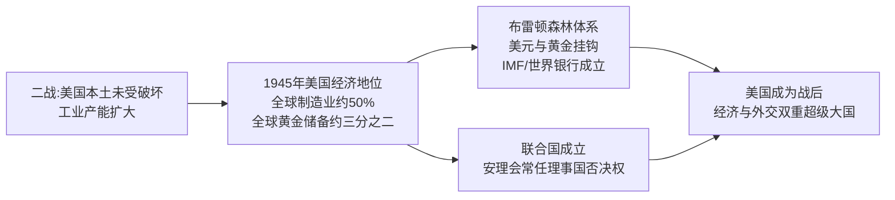
*该图展示美国如何将二战期间积累的经济优势，转化为布雷顿森林体系与联合国两大战后国际制度，从而确立超级大国地位。*

### china_civil_war_resumption_1945 (29.3s)

## China Civil War Resumption 1945

1945年8月15日，日本宣布无条件投降，八年抗战结束，中国摆脱了外国占领的直接威胁。然而，国民党与共产党在抗战期间维持的"统一战线"随即破裂，双方对日本投降后的政治版图与军事真空展开争夺，内战在数月内重新点燃。表面的和解姿态与实际的备战行动同步进行：1945年10月10日，蒋介石与毛泽东在重庆签署《双十协定》，承诺"和平建国"、召开政治协商会议；但协定墨迹未干，双方军队已在华北、东北加速调动。

一个具体案例最能说明这种"谈判与备战并行"的局面：东北（满洲）的争夺战。苏联红军在对日作战末期占领东北，随后将缴获的日本关东军约70万人的装备（包括大量步枪、火炮乃至部分坦克）移交或默许中共军队接收，使东北的中共部队迅速由约十万人扩充至近百万，并组建了日后决定内战走向的东北野战军。与此同时，美国以空运和海运方式，将超过50万国民党军队从西南大后方运往华北、东北和沿海城市，抢占日军受降区。到1946年初，国民党名义上拥有约430万军队（含美械装备的精锐部队），中共则约有120万正规军，但中共在东北获得的苏制与日制装备极大缩小了火力差距。美国特使乔治·马歇尔于1945年12月至1947年1月主持调停，促成短暂停火，但双方均未真正放弃军事解决的意图，1946年6月国民党大举进攻中原解放区，标志着全面内战正式爆发。

从这一案例可以练习历史分析的基本方法：不要孤立地看"协定签署"这一事件，而要同时追踪谈判文本、兵力调动数据与外部大国（苏、美）的资源投入这三条线索。当学生分析类似的"战后权力真空"案例（如二战后朝鲜半岛的分治、印度独立时期的教派冲突）时，应当同样地问：谁控制了投降方的武器与领土？外部势力提供了哪些实质性的军事或经济支持？和平协议是否伴随着对等的兵力监督机制？只有把这些具体证据放在一起比较，才能理解为什么1945年的表面和解会在不到一年内彻底崩溃。

### cold_war_bipolar_order (1.0s)

## Cold War Bipolar Order

**定义**

冷战两极格局，指1945年后国际体系围绕两个对立的超级大国集团重组：以美国为首的西方阵营与以苏联为首的东方阵营。两者各自建立军事同盟、扶植附庸国，并竞相扩充核武库，形成一种既非战争亦非和平的长期对抗状态。1949年，美国与西欧十国等共同缔结《北大西洋公约》，成立北约（NATO）；作为回应，苏联于1955年与七个东欧国家签订《华沙条约》，成立华约组织。两大集团在军事、经济、意识形态上全面对峙，全球绝大多数国家被迫或主动选边站队，仅有少数国家（如南斯拉夫、印度）尝试组建不结盟运动。

**实例分析**

1949年8月，苏联成功试爆第一颗原子弹，打破了美国自1945年以来的核垄断，两极格局由此从政治对抗升级为核军备竞赛。到1962年古巴导弹危机爆发时，美国已部署约27000枚核弹头，苏联约3300枚；尽管数量悬殊，苏联在古巴部署中程导弹的举动仍将美国本土置于直接打击范围内，使双方在13天内逼近核战边缘。危机最终以苏联撤走导弹、美国秘密撤出土耳其的朱庇特导弹并承诺不入侵古巴而化解，这一结果表明：两极体系下，双方都清楚全面核战争意味着"相互确保摧毁"，因此存在克制的动机——但这种克制是通过代理人战争（如朝鲜战争、越南战争）而非直接冲突表现出来的。

**问题解决应用**

分析冷战两极格局时，历史学习者应当掌握一套判断方法：面对任一具体历史事件（如1948年柏林封锁、1956年匈牙利事件、1979年苏联入侵阿富汗），先确认涉事双方是否分属两大阵营或其附庸国；再考察该事件是否服从"避免直接军事对抗、通过代理或威慑手段竞争"的两极逻辑。以柏林封锁为例：苏联封锁西柏林陆路交通，美英并未选择武装护送车队（可能引发直接冲突），而是采用空运物资的方式维持西柏林生存，长达十一个月投送逾200万吨物资，最终迫使苏联于1949年5月解除封锁。这一案例说明，两极格局下的危机应对模式，往往体现为在避免直接军事碰撞前提下的资源与意志较量。

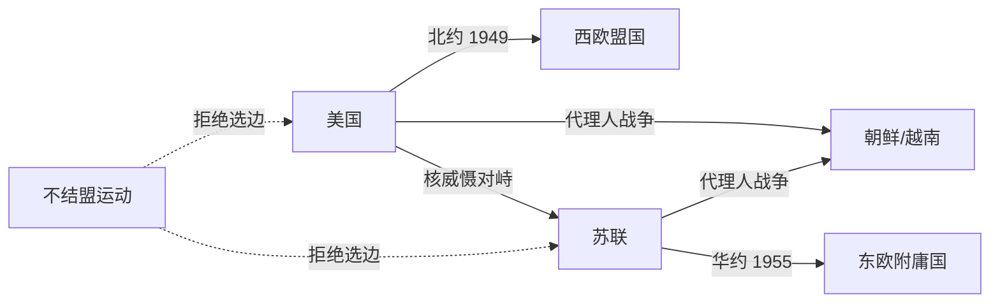
*该图展示冷战两极格局中美苏两大集团的同盟结构、核对峙关系及代理人战争路径，虚线表示不结盟国家与两大阵营的疏离关系。*

### uk_postwar_settlement_1945 (22.6s)

## Uk Postwar Settlement 1945

1945年7月,英国大选结果震惊了许多观察者:率领英国打赢战争的丘吉尔及其保守党遭遇惨败,工党在艾德礼(Clement Attlee)领导下以393席对213席的压倒性优势上台执政。选民的逻辑并不矛盾——他们感激丘吉尔的战时领导,但认为重建和平时期的英国需要不同的政策取向。这一转折的核心矛盾是:英国在军事上是战胜国,但在财政上几乎破产。战争使英国对外负债从1939年的约7.6亿英镑膨胀至1945年的33亿英镑,黄金与外汇储备几近枯竭,出口贸易萎缩到战前的三分之一。与此同时,英国仍统治着地球上人口最多、面积最广的殖民帝国,从印度、马来亚到非洲的大片领土。

工党政府的应对方式,是在财政拮据的条件下推行大规模社会立法。1942年贝弗里奇报告(Beveridge Report)提出"从摇篮到坟墓"的社会保障构想,工党在1945-1948年间将其逐步落地:1946年《国民保险法》建立失业、疾病、养老保险体系;1946年《国民卫生服务法》创立国家医疗服务体系(NHS),1948年7月正式启动,向全体国民提供免费医疗;同时推动煤矿、铁路、电力、钢铁等基础产业国有化。这套福利国家框架之所以能在经济困境中推进,关键在于美国1946年提供的37.5亿美元贷款,以及1948年起马歇尔计划注入的援助资金,为重建提供了外部资本支持。

这一时期的深层张力在于:福利国家的建设成本与殖民帝国的维持成本相互挤压同一笔紧缩的国库。1947年印度独立,标志着"日不落帝国"开始收缩——伦敦已无力像战前那样同时支撑本土福利承诺与全球殖民统治网络。历史学家常将这一矛盾视为战后二十年英国"帝国终结"与"福利国家建立"两条线索交织并行的起点:前者是被迫的收缩,后者是主动的选择,但两者共享同一个原因——战争耗尽了英国充当全球帝国中心所需的财政资本。

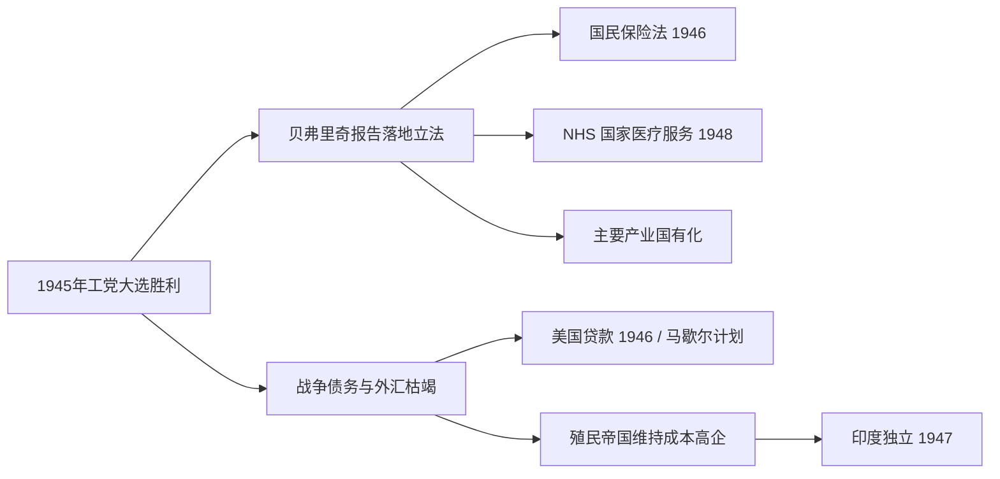
*该图展示1945年工党执政后,财政困境如何同时推动福利国家立法与殖民帝国收缩这两条并行的历史线索。*

### china_communist_consolidation (22.6s)

## China Communist Consolidation

**定义**

1945年日本投降后，国共两党争夺中国统治权的内战全面爆发。中国共产党在毛泽东领导下，凭借土地改革赢得农村广大贫农支持、解放军（原八路军、新四军改编）灵活的运动战战术，以及国民党政府因恶性通货膨胀、官僚腐败而丧失民心，逐步扭转战局。1948-49年的辽沈、淮海、平津三大战役中，国民党军队几乎全军覆没。1949年10月1日，毛泽东在北京天安门宣布中华人民共和国成立；蒋介石率残部退守台湾，两岸分治格局自此形成，延续至今。新政权随即推行土地改革、镇压反革命运动，并与苏联结盟，建立起高度集中的政治经济体制，完成对大陆的统一巩固。

**实例分析**

1950年6月朝鲜战争爆发，美国迅速介入并使第七舰队进驻台湾海峡，同时联合国军越过三八线逼近中朝边境。中国将此视为对新生政权及东北工业基地的直接威胁，于同年10月以"抗美援朝、保家卫国"名义出兵，彭德怀指挥的中国人民志愿军与以美国为首的联合国军血战两年半。战争造成中方伤亡约36万人（一说更高），美方伤亡约3.6万人阵亡、逾10万人受伤，双方最终于1953年7月在板门店签署停战协定，边界大致恢复至战前的三八线。这场战争是中华人民共和国成立后与美国主导的战后国际秩序的首次正面较量，其结果证明新政权具备与头号军事强国正面抗衡的能力。

**问题解决应用**

理解这一段历史，关键在于把内战胜负原因与朝鲜战争决策动机联系起来分析：国民党的失败并非单纯军事技术劣势，而是经济崩溃（1948年金圆券改革失败、恶性通胀使城市中产阶层破产）与政治失信共同作用的结果；而中国出兵朝鲜，则是新政权基于安全边界考量（唯恐东北工业区及新生政权本身受到威胁）与巩固国内政治合法性（通过对外胜利凝聚民族主义情绪）的双重决策。分析类似历史情境时，应同时考察物质基础（经济、军事资源）与政治合法性（民心向背、意识形态动员）两条线索，而非孤立看待战场胜负。

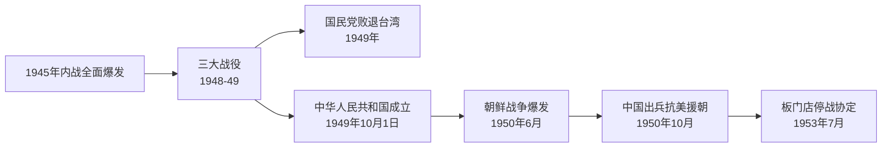
*该图展示了从国共内战结束、新中国成立，到朝鲜战争爆发及停战的关键历史节点顺序。*

### uk_decolonization_wave (23.2s)

## Uk Decolonization Wave

第二次世界大战使英国从债权国变为负债国,战争耗费了英国四分之一的国民财富,1945年英国对美国及英联邦国家的外债高达33.5亿英镑。这种财政重压,加上殖民地民族独立运动的高涨,使得维持"日不落帝国"在军事和经济上都难以为继。1947年8月,英国将其在南亚最大、最重要的殖民地——印度——分割为印度与巴基斯坦两个独立国家,结束了近两百年的殖民统治。这一进程仓促且代价惨重:英国最后一任印度总督蒙巴顿勋爵将撤离时间表从原定的1948年6月提前到1947年8月,划界委员会仅用五周时间划定边界,随后爆发的教派冲突与人口迁徙造成约100万至200万人死亡,1400多万人流离失所,成为20世纪规模最大的强制迁徙事件之一。

印度独立开启了此后二十年的连锁反应。1957年,加纳成为首个获得独立的英属非洲殖民地,随后尼日利亚(1960年)、肯尼亚(1963年)、赞比亚(1964年)等国相继脱离英国统治。加勒比地区同样加速:牙买加与特立尼达和多巴哥于1962年独立。到1960年,英国首相哈罗德·麦克米伦在南非议会发表著名的"变革之风"演说,公开承认非洲民族意识觉醒是不可逆转的历史潮流,标志着英国政府正式接受帝国收缩的既定政策,而非被动应付零星危机。仅从1945年到1965年这二十年间,英国治下约七亿人口的殖民地人口中,超过五亿人获得了independence地位,英联邦成员国数量从战前的个位数增长到二十余个。

**问题解决应用**:分析英国选择"有序撤退"而非武力维持帝国的原因,需要权衡三类证据——军费负担(如1956年苏伊士运河危机后,英国被迫在美国压力下从埃及撤军,暴露出其已无力单独维持海外军事存在)、殖民地本土精英的谈判筹码(如印度国大党长期的非暴力不合作运动积累的政治合法性)、以及国际格局变化(冷战期间美苏均反对旧式殖民主义,新独立的联合国成员国投票权也向反殖民方向倾斜)。这提示我们评估历史决策时,应同时考察国内经济约束、殖民地反抗力量的组织程度、以及国际体系的结构性压力,而非归因于单一因素。

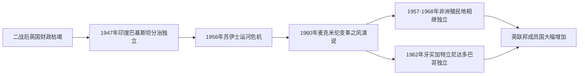

*该图展示英国从1945年财政危机到1960年代非洲、加勒比殖民地大规模独立的关键节点链条。*

### usa_cold_war_containment (0.9s)

## Usa Cold War Containment

第二次世界大战结束仅两年，美国便完成了从"孤立主义"到"全球干预"的战略转向。1947年3月，杜鲁门在国会演说中宣布：凡是抵抗"武装的少数人或外部压力"的自由人民，美国都将给予支持——这就是"杜鲁门主义"，其直接诱因是英国宣布无力继续援助希腊和土耳其，防止两国被共产主义势力渗透。同年6月，国务卿马歇尔提出"欧洲复兴计划"（马歇尔计划），四年间向西欧16国注入约130亿美元（相当于当时美国GDP的5%左右），帮助重建工业与基础设施，同时将西欧经济体系牢固地绑定在美国主导的资本主义阵营。1949年4月，美国联合西欧十一国签署《北大西洋公约》，成立北约，确立"集体防御"原则——对任何一个成员国的攻击视为对全体成员的攻击。这三项举措共同构成了"遏制政策"的骨架：用经济援助防止贫困催生共产主义，用军事同盟防止苏联武力扩张。

遏制政策的第一次实战检验发生在朝鲜半岛。1950年6月，朝鲜人民军越过北纬38度线南下，美国迅速促成联合国安理会通过决议（当时苏联缺席抵制，未能行使否决权），组织"联合国军"介入。战争在三年间反复拉锯：联合国军曾一度推进至中朝边境鸭绿江畔，随后中国"人民志愿军"大规模介入，将战线重新推回38度线附近。战争造成美军阵亡约3.6万人，朝鲜半岛南北双方军民伤亡合计估计超过300万人。1953年7月签署的《朝鲜停战协定》并未产生和平条约，而只是划定了一条军事分界线，双方在法律上至今仍处于战争状态。

这场战争的历史意义在于：它证明了遏制政策不再只是经济与外交手段，而首次转化为美国在海外的直接军事介入，也确立了"有限战争"模式——即避免与苏联或中国爆发全面核战争，转而在局部地区以常规武力实现遏制目标。这一模式此后深刻影响了美国在越南等地区的军事决策。

*图示：从杜鲁门主义到马歇尔计划、北约成立，再到朝鲜战争爆发与停战的政策演进链条。*

问题演练：假设你是1950年的美国决策者，联合国军已推进至鸭绿江畔，请依据"遏制"而非"解放"或"击败"的政策定位，判断此时是否应继续北上、越过边境，并说明理由——答案应指出：继续北上违背了遏制政策"划定界线、避免全面战争"的核心逻辑，而这一误判正是导致中国介入、战争陷入僵局的关键转折点。

### china_maoist_upheaval (20.5s)

## China Maoist Upheaval

1949年中华人民共和国建立后，毛泽东领导下的中国共产党在完成土地改革与社会主义改造之后，试图通过两场自上而下发动的群众运动，加速实现"超英赶美"的现代化目标并巩固自己的政治权威。这两场运动——1958年至1962年的"大跃进"与1966年至1976年的"文化大革命"——均为内部政策决策所致，并未受到外敌入侵或国际战争的直接触发，却给中国社会造成了极为惨重的代价。

大跃进的核心政策是"人民公社"与"土法炼钢"：农村被要求在缺乏专业设备与技术的条件下建造简易高炉炼钢，同时农业统计数字被层层浮夸虚报，中央据此征收远超实际产量的粮食。结果是农村存粮被抽空，加之1959至1961年部分地区遭遇自然灾害，导致了人类历史上死亡人数最多的饥荒之一。据人口统计学者及中国官方事后披露的数据估算，非正常死亡人数在1500万至4500万之间，具体数字因统计口径不同而存在争议，但学界普遍认同这是一场规模空前的人祸。

大跃进失败后，毛泽东在党内威望受损，刘少奇、邓小平等人转向务实的经济调整政策。为重新夺回政治主导权，毛泽东于1966年发动文化大革命，号召红卫兵"破四旧"、批斗"走资派"与知识分子。此后十年间，全国教育系统一度瘫痪，大学停止招生长达数年；知识分子、干部与普通民众遭受批斗、下放或迫害，官方后来承认因此非正常死亡人数达数十万至逾百万，社会秩序与传统文化遗产也遭到严重破坏。

从问题分析的角度看，这两场运动揭示了一个关键的历史因果链：当决策权高度集中且缺乏独立的信息反馈与制度制衡时，地方官员为迎合上级意志而虚报政绩，中央又依据失真信息作出进一步的激进决策，二者相互强化，最终酿成大规模灾难。这一机制的破坏程度，可通过之后邓小平在1978年推行改革开放时反复引用的教训——"实事求是"——来理解：正是大跃进与文革中信息失真与个人崇拜的双重代价，促使中共此后转向集体领导与经济优先的路线。

### uk_suez_humiliation (27.2s)

## Uk Suez Humiliation

1956年的苏伊士运河危机，是英国从"独立大国"降格为"依附美国的地区强国"的分水岭事件。1956年7月26日，埃及总统纳赛尔宣布将苏伊士运河公司收归国有，理由是英美撤回了资助阿斯旺大坝建设的贷款承诺。运河由英法资本共同持股，且是英国通往中东石油产区与远东殖民地的战略生命线——当时英国进口石油的三分之二经此运河运输。伦敦与巴黎认为，纳赛尔的举动不仅是经济挑战，更是对欧洲殖民秩序的公然挑衅，于是与以色列秘密达成《色佛尔协议》：以色列先出兵西奈半岛，英法随后以"隔离交战双方"为名出兵占领运河区。

1956年10月29日，以色列军队入侵西奈；10月31日，英法战机开始轰炸埃及机场；11月5日，英法伞兵在塞得港登陆。军事行动本身进展顺利，埃及军队溃败。但政治后果却是灾难性的。美国总统艾森豪威尔对未经磋商的行动极为愤怒，认为这将把阿拉伯世界推向苏联怀抱，并担心殃及美国在中东的石油利益与冷战布局。华盛顿采取了两项决定性施压手段：一是拒绝国际货币基金组织向英镑提供紧急贷款支持，任由英镑在国际外汇市场遭受抛售压力；二是在联合国安理会（因英法行使否决权而受阻后转至联大）联合苏联共同谴责这次入侵，形成美苏罕见的共同阵线。英国财政大臣麦克米伦警告首相艾登，若不停火，英镑储备将迅速耗尽。11月6日，在开战仅一周后，英国单方面宣布停火，法国被迫跟随，联合国紧急部队随后进驻运河区监督撤军。

这次事件的核心教训在于：军事上的胜利与政治外交上的失败可以同时发生，而后者足以否决前者。英国拥有远征埃及并取胜的兵力，却没有独立于美国货币体系而维持这场行动的财政能力——这暴露出"大国地位"实际上早已让位于对美元与IMF体系的依赖。艾登首相于1957年1月因健康及政治压力辞职，成为危机的直接政治牺牲品。此后，英国外交政策转向明确接受"美国优先"的现实：既不再谋求独立于华盛顿的中东干预，也开始加速从苏伊士以东的殖民存在中收缩，为随后十年的[[uk_decolonization_wave]]（非殖民化浪潮）提供了心理与战略上的转折点。正如时任观察家所言，苏伊士危机让英国人第一次真切意识到，二战后头衔上的"三大国"之一，实际权力已不复当年。

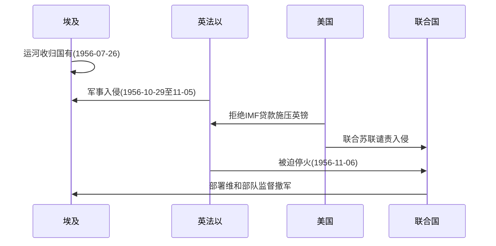
*该图展示苏伊士危机中军事行动与美国财政外交施压如何共同促成英法仓促撤军的过程。*

### usa_civil_rights_and_vietnam (1.7s)

## Usa Civil Rights And Vietnam

**定义**：1955年至1968年间，民权运动通过非暴力抗争、司法诉讼和立法游说，逐步瓦解了美国南方“隔离但平等”的种族隔离体系；与此同时，1961年至1975年,越南战争从有限的军事顾问介入演变为一场耗时漫长、代价高昂的冷战热战，并在国内引发深刻分裂。这两场看似独立的历史进程实际上相互交织：越战消耗的联邦资源与政治资本,直接削弱了约翰逊政府“伟大社会”改革的推进力度,而民权运动培养出的抗议策略与道德语言,又被反战运动直接借用。

**具体例证**：1954年布朗诉托皮卡教育局案推翻“隔离但平等”原则后,马丁·路德·金于1955-56年领导蒙哥马利公交抵制运动,持续381天,最终迫使公交系统废除隔离座位。此后运动持续施压,促成1964年《民权法案》(禁止公共设施与就业中的种族歧视)与1965年《选举权法案》(废除人头税、识字测试等投票壁垒)相继通过。与此同时,越战规模从1961年约3000名顾问,升至1968年逾50万美军;same一年,春节攻势(Tet Offensive)造成美军逾1400人阵亡,并击碎了政府“即将取胜”的公开说辞,国内反战情绪随之激化,直接冲击约翰逊的连任前景,促使其于1968年3月宣布不再寻求连任。

**综合分析应用**：理解这两场运动的关键在于识别财政与政治资源的此消彼长关系——约翰逊1964年提出“对贫困宣战”与民权立法本可获得更充裕的联邦拨款,但1965年后越战军费急剧攀升(至1968年度军费逾800亿美元),挤压了国内福利与教育项目的预算空间,这一取舍是理解1960年代末期社会矛盾激化(如1968年金遇刺后爆发的多城骚乱)的核心线索。在分析类似的历史情境时,应追问:一国对外军事承诺的规模变化,如何通过预算分配、征兵制度(越战征兵尤其冲击少数族裔与低收入青年,加深了种族与阶级不满)、以及政治领导人的注意力转移,反过来影响国内改革议程的推进速度与深度。

### china_reform_and_opening (22.7s)

## China Reform And Opening

**定义**

1976年毛泽东去世，1978年12月中共十一届三中全会召开，邓小平确立"改革开放"路线，取代了毛时代的阶级斗争纲领。改革分两条主线展开：对内改革以家庭联产承包责任制取代人民公社的集体劳动，允许农民在完成国家定额后自主处置剩余产出；对外开放则始于1980年设立深圳、珠海、汕头、厦门四个经济特区，以低税率和外资优惠吸引港资台资，再逐步扩展到14个沿海城市、长三角与珠三角。这一转型的核心逻辑被邓小平概括为"不管黑猫白猫，捉到老鼠就是好猫"——即以经济实效而非意识形态纯度作为政策取舍标准。

**实例分析**

数据最能说明转型的规模。1978年中国国内生产总值约1495亿美元，人均不足200美元，仍是典型的低收入农业国；到2001年加入世界贸易组织时，GDP已增长至约1.34万亿美元。加入世贸组织本身是一场长达15年的谈判：中国自1986年申请恢复关税与贸易总协定缔约国地位，历经与美国、欧盟等主要贸易伙伴的双边谈判，最终于2001年12月11日正式成为世贸组织第143个成员。入世要求中国大幅下调关税（平均关税从1992年的约40%降至2001年前后的15%左右），开放金融、电信、零售等此前受保护的服务业，并接受知识产权保护等国际规则约束。作为交换，中国出口获得了稳定、可预期的市场准入——外资制造业尤其是电子、纺织和玩具行业迅速向珠三角、长三角集聚，"世界工厂"的角色由此确立。

**问题与应用**

理解这一转型的关键在于识别其分阶段、试点先行的策略：特区先行先试，成功经验（如外资优惠、土地批租）再向内地推广，避免了苏联式激进私有化可能引发的社会动荡，也让中共得以在保持政治体制不变的前提下推进经济市场化。这解释了为何中国经济改革没有伴随类似东欧那样的政权更迭——分析类似转型案例时，应关注"渐进试点"与"整体休克疗法"两种路径各自付出的代价：前者可能延缓效率提升，后者常伴随短期内的失业与通胀冲击。

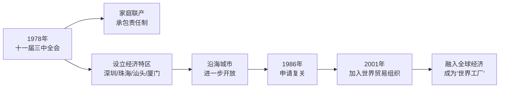

*图示：从1978年农村改革与特区试点，到2001年加入世界贸易组织，中国分阶段融入全球经济的路径。*

### uk_eec_membership (23.0s)

## Uk Eec Membership

1973年1月1日，英国正式加入欧洲经济共同体（European Economic Community，简称EEC），从此将其后帝国时代的经济命运与欧洲一体化进程绑定在一起。这一步棋走得并不轻松：英国此前曾两次申请加入，分别在1963年和1967年被法国总统戴高乐否决。戴高乐的理由很直白——他认为英国经济结构与欧陆不同、与美国关系过近，加入后会成为"美国在欧洲的特洛伊木马"，稀释欧共体的独立性。直到戴高乐1969年辞职、继任者蓬皮杜转向更务实的立场，英国的第三次申请才在1973年获得通过。

英国转向欧洲一体化，根源正是苏伊士危机所暴露的现实：一个曾经的全球帝国，其独立行动能力已经无法匹配其自我认知。1956年苏伊士运河危机中，英法联合埃及行动因美国的强硬反对而被迫仓皇撤军，这一幕清楚地证明，英国已无法再单靠自身的军事与外交实力维持世界大国地位。此后近二十年，英国的战略精英逐渐达成共识：与其继续依赖日渐萎缩的英联邦贸易体系和"特殊关系"下的美国庇护，不如将经济前途系于正在快速增长、内部市场统一的欧洲大陆。数据也印证了这种紧迫感——1950年代英国对欧共体六国的出口占比不到15%，而同期西德、法国的经济增速已是英国的两倍以上；英国经济学家将这种相对停滞称为"英国病"。加入欧共体被视为获得规模市场、刺激产业竞争力、扭转相对衰落趋势的关键途径。

从问题解决的角度看，这一历史案例提供了一个分析国家战略转型的范式：判断一次外交政策转向是否属于"结构性调整"而非"权宜之计"，关键在于考察三点——触发事件是否暴露了根本性的能力落差（苏伊士危机之于英国的全球投射能力）、既有替代方案是否已被证明不可持续（英联邦特惠贸易体系相对萎缩、"特殊关系"未能在苏伊士危机中提供实际支持）、以及新选择是否得到国内政治与经济精英的持续共识支持（英国用近二十年、三次申请才完成转向，说明这是深思熟虑后的路径依赖调整，而非一时冲动）。这一框架同样适用于分析其他大国在实力相对衰落后重新定位自身国际角色的历史情境。

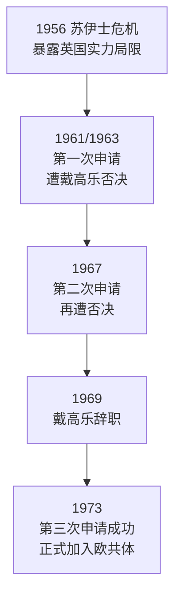

*图示：从苏伊士危机到英国正式加入欧洲经济共同体的战略转向路径，历经近二十年与三次申请。*

### usa_cold_war_endgame (24.3s)

## Usa Cold War Endgame

冷战的终局并非一次军事对抗的胜负,而是一场长达十余年的经济、意识形态与外交博弈的累积结果。1981年就任的里根总统推行了美国历史上和平时期规模最大的军备扩张:国防预算从1980年的约1340亿美元增至1985年的近2530亿美元,并于1983年提出"战略防御倡议"(俗称"星球大战计划"),意图部署天基反导系统。这一系列举措迫使苏联在经济已显疲态的情况下继续加码军费——苏联当时用于军事的支出占国民生产总值的比例估计高达15%至17%,远超美国的6%左右,而其民用经济尤其是消费品与农业部门长期短缺、效率低下。

1985年戈尔巴乔夫就任苏共总书记后,推行"改革"与"公开性"政策,试图在不放弃社会主义体制的前提下挽救经济。里根政府则从对抗转向有限接触:1985年至1988年间,里根与戈尔巴乔夫举行了四次首脑会晤(日内瓦、雷克雅未克、华盛顿、莫斯科),并于1987年签署《中导条约》,首次实现两国核武库的实质性削减,销毁了全部射程500至5500公里的陆基导弹。这标志着冷战对抗逻辑开始让位于谈判解决。

苏联经济与政治体制的内部矛盾在东欧率先引爆。1989年,波兰团结工会通过协商实现政权更迭,匈牙利开放与奥地利的边境,东德民众大规模出走与示威导致政府失控,最终于1989年11月9日柏林墙倒塌——这一事件成为冷战终结最具象征意义的时刻。此后东欧各国相继完成"天鹅绒革命"式的政权转型,苏联对东欧的控制体系随之瓦解。1991年8月,苏联爆发未遂政变,加速了加盟共和国的离心趋势;同年12月25日,戈尔巴乔夫辞职,苏联正式解体,分裂为十五个独立国家。

这一系列事件的直接后果,是持续近半个世纪的两极格局终结,美国成为唯一的全球超级大国,其军事同盟体系(如北约)得以保留并扩展,而俄罗斯则继承了苏联的核武库与安理会席位,但经济实力与国际影响力大幅收缩。

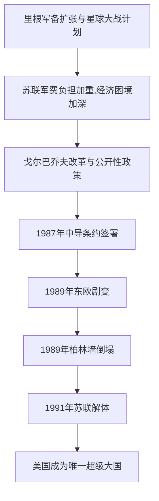
*该图展示了从里根军备竞赛到苏联解体、美国成为唯一超级大国的因果链条。*

### science_atomic_age_and_computing_dawn (0.9s)

## Science Atomic Age And Computing Dawn

1945年是科学史上的一个分水岭。这一年，三种此前互不相关的技术能力几乎同时成熟，共同定义了战后时代的起点：核物理、数字计算与生物医学。

**核物理**：1945年7月16日，美国在新墨西哥州阿拉莫戈多试爆首枚原子弹（"三位一体"试验），随后8月分别投于广岛与长崎，两地合计造成约21万人在当年年底前死亡。这一事件的历史意义不仅在于武器本身，而在于它证明了纯理论物理研究——从爱因斯坦1905年的质能关系到费米、奥本海默等人主持的曼哈顿计划——能够在短短几年内转化为决定战争胜负、进而重塑国际秩序的力量。核物理从此从学院象牙塔进入国家战略核心。

**数字计算**：同年，宾夕法尼亚大学建成的ENIAC（电子数字积分计算机）投入使用，它每秒可完成约5000次加法运算，用于计算炮弹弹道和氢弹相关的数值模拟。ENIAC证明了"可编程"计算机——通过重新设置线路和开关执行不同任务——在实用规模上是可行的，为此后数十年计算机产业的爆发奠定了工程基础。

**生物医学**：与此同时，青霉素在二战期间由英美两国实现工业化量产，年产量从1943年的约2100万剂跃升至1945年的超过65亿剂，感染性疾病的死亡率因此大幅下降，外科手术与战场救治的安全边际被彻底改写。

这三项突破的共同之处在于：它们都始于基础研究，却在国家动员（尤其是战争压力）下被迅速工程化、规模化。历史应用问题在于——理解这一"研究到应用"的加速机制为何在1945年前后集中爆发：答案是二战创造了前所未有的政府资金投入与跨学科协作（如曼哈顿计划汇聚了物理学家、化学家、工程师）,这种模式此后延续为冷战时期美苏两国的科技竞赛范式，直接影响了后续几十年各国科技政策的走向。

### china_rise_as_power (16.8s)

## China Rise As Power

**定义**：中国崛起为世界大国，指中国在改革开放积累的经济基础上，于21世纪进一步将经济实力转化为国际话语权、军事现代化与全球治理影响力的过程。三个标志性节点勾勒出这一轨迹：2008年北京奥运会作为"亮相仪式"，向世界展示改革开放三十年的建设成果；2013年启动的"一带一路"倡议，通过基础设施投资和贸易网络将中国经济影响力延伸至亚非欧六十余国；以及2012年习近平就任中共中央总书记后权力的持续集中，包括2018年全国人大表决通过修宪，取消国家主席"连续任职不得超过两届"的限制。

**实例分析**：一带一路倡议提供了理解"经济实力转化为地缘政治影响力"的清晰案例。截至2020年代中期，中国已与超过150个国家和30多个国际组织签署合作文件，中国进出口银行和国家开发银行向沿线国家提供的贷款规模累计超过一万亿美元，用于港口（如斯里兰卡汉班托塔港、巴基斯坦瓜达尔港）、铁路（如印尼雅万高铁）、电网等大型项目。这类项目一方面填补了发展中国家的基础设施缺口，另一方面也引发"债务陷阱外交"的争议——斯里兰卡因无力偿还汉班托塔港贷款，于2017年将该港99年经营权租让给中国企业，成为批评者常引用的案例。

**问题解决应用**：分析一国崛起是否具有可持续性，需要区分"物质能力的积累"与"制度权威的巩固"两个维度，二者未必同步。请思考：2018年修宪取消任期限制，短期内强化了政策连续性和执行效率（例如便于长期推进一带一路这类跨越十年以上的战略工程），但同一决策也可能削弱权力交接的制度化程度，增加长期政治不确定性的风险。这正是评估任何大国崛起模式时的核心问题——集中权力带来的执行力优势，与其对制度稳健性的潜在侵蚀，二者之间如何权衡，答案往往要在数十年后才能验证。

### uk_thatcher_restructuring (21.4s)

## Uk Thatcher Restructuring

1979年5月,玛格丽特·撒切尔就任英国首相,面对的是一个深陷"英国病"的经济体:1970年代通货膨胀一度超过20%,国有企业(煤炭、钢铁、铁路、电信、汽车制造等)普遍亏损却依赖财政补贴维持运转,工会力量强大到足以通过罢工瘫痪全国供电与运输。撒切尔政府的核心政策是"私有化"——将国有企业出售给私人投资者与公众股东,同时通过立法削弱工会的罷工权与谈判力量,试图以市场竞争取代国家计划来重振生产效率。这一转向发生在英国于1973年加入欧洲经济共同体之后,意味着英国经济不仅要对内改革,还要在欧洲统一市场中重新定位其竞争力。

私有化的典型案例是英国电信(1984年)与英国煤气公司(1986年)的股票出售:政府将国家持有的股权分批向公众发行,数百万普通英国人首次成为股东,国库也因此获得巨额一次性收入(仅电信一项就为财政带来近40亿英镑)。这些企业脱离政府预算约束后,管理层被迫削减冗余人力、引入商业化定价,短期内提升了账面利润,但也带来了大规模裁员与部分地区的失业冲击。

私有化政策与工会改革的联动在1984-85年的矿工大罢工中达到顶点。全国煤矿工人联合会主席阿瑟·斯卡吉尔号召矿工反对政府关闭"非经济"煤矿的计划,罢工持续近一年(1984年3月至1985年3月),牵涉逾10万矿工,双方对峙异常激烈——警方与罢工者在约克郡奥格里夫焦化厂等地爆发大规模冲突。撒切尔政府预先囤积煤炭储备以应对断供,并动用警力维持运煤车队通行,最终罢工在未达成任何让步的情况下瓦解。此役被视为战后英国工会运动力量的转折点:此后十年间,英国工会会员人数从1979年的约1300万降至1990年的约1000万以下,罢工天数锐减逾九成。

这段历史提供了一个具体的分析框架:评估一场经济结构改革,需要同时衡量其"效率收益"(生产率、财政节支、企业利润)与"社会成本"(失业、地区衰退、社会分裂)。矿区社区如约克郡、南威尔士在关矿后长期承受高失业率与人口外流,这类代价往往滞后于统计数据中反映的宏观增长,却是评价改革"成功"与否时不可忽视的证据。

### usa_war_on_terror (20.2s)

## Usa War On Terror

2001年9月11日,基地组织劫持四架民航客机,分别撞向纽约世界贸易中心双塔和华盛顿五角大楼,第四架在乘客反抗后坠毁于宾夕法尼亚州郊野,当日遇难人数达2977人。这是美国本土自珍珠港事件以来遭受的最严重袭击,直接终结了冷战后美国"单极时刻"的安全幻觉——即认为传统国家间战争已让位于和平红利,而非国家行为体的恐怖主义构成了新的战略威胁。小布什政府随即提出"反恐战争"框架,将打击基地组织及其庇护者定为国家首要任务,并推动国会几乎全票通过《爱国者法案》,扩大情报机构监听与拘押权力。

反恐战争的第一场战役是2001年10月发起的阿富汗战争。美国联合北方联盟地面部队,在数周内推翻窝藏本·拉登的塔利班政权,但随后陷入长达二十年的国家重建与治安战,最终于2021年8月仓促撤军,喀布尔政府在美军撤出前迅速崩溃,塔利班重新掌权,象征着这场干预以战略失败告终。第二场战役是2003年的伊拉克战争,布什政府以萨达姆·侯赛因政权藏有大规模杀伤性武器为由发动入侵——这一情报事后被证实严重失实,美军虽迅速攻占巴格达,却触发了逊尼派叛乱与教派内战,直至2011年奥巴马政府撤军,伊拉克才勉强恢复脆弱的中央政府。

这两场战争合计造成数十万平民、士兵与反叛武装死亡,美国财政支出估计超过两万亿美元(据布朗大学"战争成本项目"统计),并催生了关塔那摩湾拘押设施、无人机定点清除等争议性反恐手段,引发国内外对酷刑、公民自由与国际法的长期辩论。评估反恐战争得失时,可将其置于成本—收益的历史比较框架:阿富汗战争虽在初期成功摧毁基地组织训练基地并击毙本·拉登(2011年,巴基斯坦阿伯塔巴德),但未能建立可持续的本土政权;伊拉克战争则因错误情报与战后重建失败,反而为极端组织"伊斯兰国"的崛起提供了权力真空。两场战争共同消耗了美国的军事资源与外交信誉,也加速了其战略重心从中东转向应对中国崛起与大国竞争的新阶段。

### science_dna_and_transistor (0.7s)

## Science Dna And Transistor

1947年到1953年的六年间，两项奠基性发现分别开启了信息技术与生命科学的时代。1947年12月，贝尔实验室的巴丁、布拉顿与肖克利发明了晶体管——一种用半导体材料（锗，后来是硅）制成的固态开关与放大器。晶体管的体积仅有真空管的几十分之一，几乎不发热、几乎不耗电，且几乎不会像真空管那样烧毁。这一发明为随后数十年的集成电路、个人计算机乃至今天的智能手机奠定了物理基础——没有晶体管，就没有可大规模量产、可持续微型化的电子计算。三位发明者因此获得1956年诺贝尔物理学奖。

几乎同时，1953年2月，剑桥大学的沃森与克里克在《自然》杂志上发表了脱氧核糖核酸（DNA）的双螺旋结构模型。他们利用富兰克林拍摄的X射线衍射照片（著名的"照片51号"），推断出DNA由两条反向平行的核苷酸链缠绕而成，通过碱基对（腺嘌呤与胸腺嘧啶、鸟嘌呤与胞嘧啶）互补配对连接。这一结构立刻解释了遗传信息如何被稳定复制与传递——双链解开后，每条单链都可作为模板合成新的互补链，这正是细胞分裂时遗传物质得以精确复制的物理机制。

将这两项发现并列，能看清一个历史规律：技术突破往往先于产业爆发数十年发生，且常常出现在同一历史窗口内、彼此独立的领域中。晶体管在发明后用了近二十年才催生个人电脑产业；DNA结构解析后又过了近三十年，基因测序与生物技术产业才真正成形（1990年代人类基因组计划启动）。对历史分析而言，这提示我们判断一项技术发明的长期影响时，不能只看发明当年的直接应用，而要追踪其后续数十年在产业链、教育体系与国家科研投入中的扩散路径——正是这种滞后的、多代人的扩散，而非发明本身的瞬间冲击，塑造了二十世纪下半叶美国在信息产业与生物医药产业的双重领先地位。

### uk_brexit_realignment (22.4s)

## Uk Brexit Realignment

**定义**

2016年6月23日,英国就是否留在欧盟举行全民公投,结果为52%对48%支持"脱欧"(Leave)。这一决定推翻了1973年爱德华·希思政府做出的入欧决策——将近半个世纪的欧洲一体化进程。公投后历经三年半的谈判拉锯(包括特雷莎·梅三次未能通过脱欧协议、鲍里斯·约翰逊提前大选并赢得多数席位),英国最终于2020年1月31日正式退出欧盟,并于2020年12月31日结束过渡期,完全脱离欧盟单一市场与关税同盟。脱欧的深层动因与撒切尔式重组一脉相承:对布鲁塞尔监管权力的不满,与撒切尔时代对国家主权和自由市场自主权的坚持,共享同一种政治逻辑——即认为英国的经济竞争力应由伦敦而非跨国机构掌控。

**案例分析**

脱欧公投的地理与阶层分裂极具说明性。伦敦、苏格兰、北爱尔兰多数投票"留欧",而英格兰中部与北部的传统工业城镇——那些在撒切尔式去工业化中失去制造业岗位的地区,如桑德兰、斯托克——却以显著多数投票"脱欧"。这并非巧合:这些选民将全球化、移民与超国家治理视为削弱本地经济与身份认同的力量,与撒切尔时代"去管制、缩小国家、强调英国例外论"的叙事产生共鸣。经济代价迅速显现:英国预算责任办公室估计,脱欧将使英国长期生产率较留欧情形低约4%;对英贸易的欧盟壁垒重新出现,北爱尔兰议定书更引发了与欧盟长期的边境争端。

**应用与分析框架**

理解脱欧,需要将其置于"英国与欧洲一体化关系"的更长时段中考察:1973年"加入"代表英国接受跨国规则以换取市场准入,2020年"退出"代表英国重新主张监管自主权,即便代价是市场准入受限。分析类似的国家决策时,可提出三个问题:(1)谁在国内因一体化受益、谁受损?(2)主权让渡与经济收益之间的权衡如何随时间变化?(3)历史遗留的产业衰退情绪如何被重新动员为政治力量?脱欧案例表明,经济一体化的逆转往往不是纯粹经济计算的结果,而是长期积累的地区不满与身份政治在特定政治时机(公投)被激活的产物。

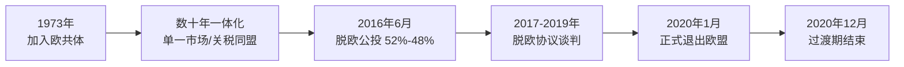

*该图展示英国从1973年加入欧共体到2020年完全脱离欧盟的关键时间节点。*

### usa_polarization_era (16.9s)

## Usa Polarization Era

美国政治极化时代指21世纪第二个十年前后，美国社会在经济、种族、文化和党派认同上的分裂持续加深，最终以国会大厦骚乱为标志性顶点的历史阶段。这一时期建立在两条此前已展开的脉络之上：反恐战争造成的对政府信任侵蚀，以及中国崛起带来的相对实力焦虑。2008年金融危机使美国家庭财富平均缩水近40%，失业率在2009年10月攀升至10%，公众对华尔街与联邦救助计划（问题资产救助计划，7000亿美元）的愤怒，催生了左翼的"占领华尔街"运动与右翼的"茶党"运动，两者虽诉求不同，却共同标志两党建制派权威的松动。

一个具体案例可以说明极化如何从经济议题扩展到身份认同：2016年总统大选中，希拉里·克林顿在人口普查局定义的"都市核心"县以压倒性优势获胜，而唐纳德·特朗普在农村与去工业化地区县以类似优势获胜——地理与教育程度的分裂第一次如此清晰地取代了传统的南北或阶级分野。皮尤研究中心的调查显示，1994年至2017年间，认为对方政党"对国家福祉构成威胁"的党员比例从约20%上升到超过40%。

COVID-19疫情（2020年初至2023年，美国死亡人数超过110万）本应是团结议题，却因口罩令、疫苗政策和病毒起源的党派化解读而进一步撕裂社会信任。2020年大选后，特朗普阵营对选举舞弊的无证据指控，最终导致2021年1月6日数千名支持者冲击国会大厦，试图阻止选举人票的认证——这是自1814年英军焚烧国会大厦以来，国会所在地首次遭到武力侵入，造成5人死亡，140余名警员受伤。

分析这段历史时应避免将极化简化为单一"总量增长"的曲线：它是经济焦虑（金融危机、中国竞争带来的制造业岗位流失）、信息生态变化（社交媒体算法放大对立叙事）与既有种族历史裂痕交织的结果。理解这一时期的关键，是识别每一次冲击（2008、2016、2020、2021）如何将已经存在的结构性分歧转化为具体的政治事件，而非假设存在某种自动累积的"极化力"。

### science_space_race_and_microprocessor (0.6s)

## Science Space Race And Microprocessor

**定义**

1957年10月4日，苏联发射了世界上第一颗人造卫星"斯普特尼克一号"（Sputnik 1），一枚仅重83.6公斤的金属球，绕地球轨道运行。这一事件震惊了美国社会——苏联竟在航天技术上抢先一步，由此引发了持续十余年的美苏太空竞赛。这场竞赛表面上是科学探索，实质上是冷战期间两大阵营争夺技术优势与意识形态威望的延伸战场。美国随即成立国家航空航天局（NASA，1958年），并投入巨额联邦预算追赶苏联。竞赛的高潮是1969年7月20日，阿波罗11号任务的宇航员尼尔·阿姆斯特朗成为首位踏上月球表面的人类，实现了肯尼迪总统1961年立下的"十年内送人上月球"的承诺。与此同时，太空竞赛对军用与民用电子工业提出了前所未有的计算与微型化需求，直接推动了另一项划时代突破：1971年，英特尔公司发布4004微处理器，首次将一台可编程计算机的运算核心集成到一枚单一芯片上。

**实例分析**

阿波罗登月计划的制导计算机（Apollo Guidance Computer）是理解这场技术竞赛如何转化为民用科技的关键案例。为了让飞船在太空中实时导航，NASA需要一台重量轻、可靠性极高的计算机，这一需求几乎全部消耗了美国当时集成电路的产能：据统计，阿波罗计划在1962至1965年间采购的集成电路约占全美产量的60%。这种由国家预算驱动的大规模采购，压低了集成电路的单位成本，加速了商业化进程。到1971年，英特尔工程师特德·霍夫（Ted Hoff）等人将原本分散在多块电路板上的运算单元、控制单元和存储器接口整合进一枚4004芯片，内含2300个晶体管，运算速度约每秒6万次操作。这枚芯片最初是为日本计算器公司Busicom设计，但其架构迅速被推广至个人计算机领域，成为后来PC产业的技术起点。

**问题解决应用**

分析太空竞赛的历史后果时，学生应识别三条并行的技术溢出路径：军事拨款如何转化为民用基础设施。太空竞赛催生的全球定位系统（GPS，始于1970年代美国国防部的"导航星"计划）如今支撑着全球物流、导航与金融交易的时间同步；通信卫星技术（如1962年的电星一号）奠定了跨洲电视转播与互联网骨干网络的基础；而阿波罗计划对微型化、高可靠性电子元件的迫切需求，则与英特尔4004芯片的诞生形成因果链条，共同开启了个人计算时代。理解这段历史的关键在于认识到：冷战对抗产生的政治压力与国家预算，往往比单纯的市场需求更能加速某些高风险、高成本技术的早期投资与规模化。

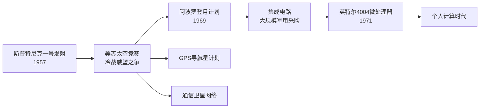
*该图展示太空竞赛如何通过国家预算与技术需求，同时催生微处理器革命与GPS、卫星通信等民用基础设施。*

### globalization_backlash_pattern (19.1s)

## Globalization Backlash Pattern

**定义**

"全球化反弹模式"指的并非某一单一事件,而是2008年至2020年间在中国、美国、英国三条历史脉络中同时出现的一组事件:2008年全球金融危机、2016年英国脱欧公投、以及与中国经济崛起部分相关的美国政治极化加剧。这三者在时间上重叠,但历史学的严谨要求我们把"同时发生"和"因果关系"分开处理——三条链条中的证据支持的是共时性(concurrency),而非单一因果链。把它们混为一谈,会把一个复杂的多国现象简化成一个不成立的单向叙事。

**具体案例**

2008年金融危机源于美国次贷市场的系统性风险,雷曼兄弟于当年9月倒闭,随后全球GDP在2009年出现二战后首次同步收缩,IMF数据显示全球实际GDP增速由2007年的5.7%骤降至2009年的负0.1%。这场危机重创了英国和美国的金融业与实体经济,英国失业率从危机前的5.2%升至2011年的8.1%左右。与此同时,中国凭借2001年加入世界贸易组织后积累的制造业优势,在这十年间对美贸易顺差持续扩大,2008年对美贸易顺差约为2680亿美元,到2018年升至约4190亿美元。经济学家戴维·奥托(David Autor)等人在"中国冲击"(China Shock)研究中指出,1999至2011年间美国因对华贸易竞争流失的制造业岗位约达200万至240万个,这一冲击集中于部分地区和选民群体,与后续美国政治极化(尤其是2016年总统选举中的选情分布)存在统计相关性。而在英国,2016年6月23日脱欧公投中,"脱欧"以51.9%对48.1%胜出,选民调查显示经济不安全感、对全球化和移民的不满是重要投票动因之一。

**辨析:相关不等于因果**

三条链条——金融危机、脱欧、美国极化——共享一个约十二年的时间窗口,并且都与"全球化的压力测试"有关,但驱动机制并不相同:金融危机源于金融监管与信贷扩张,脱欧源于英国国内对主权与移民的政治诉求,美国极化则涉及贸易冲击、文化认同、媒体生态等多重因素交织。历史研究方法要求我们列出每条链条各自的直接证据(如具体的失业率、贸易额、投票结果),再审慎评估其间是否存在传导机制(例如金融危机削弱了主流政党的公信力,间接为脱欧和民粹政治创造了空间),而不是仅凭时间重合就断言存在统一的因果链。

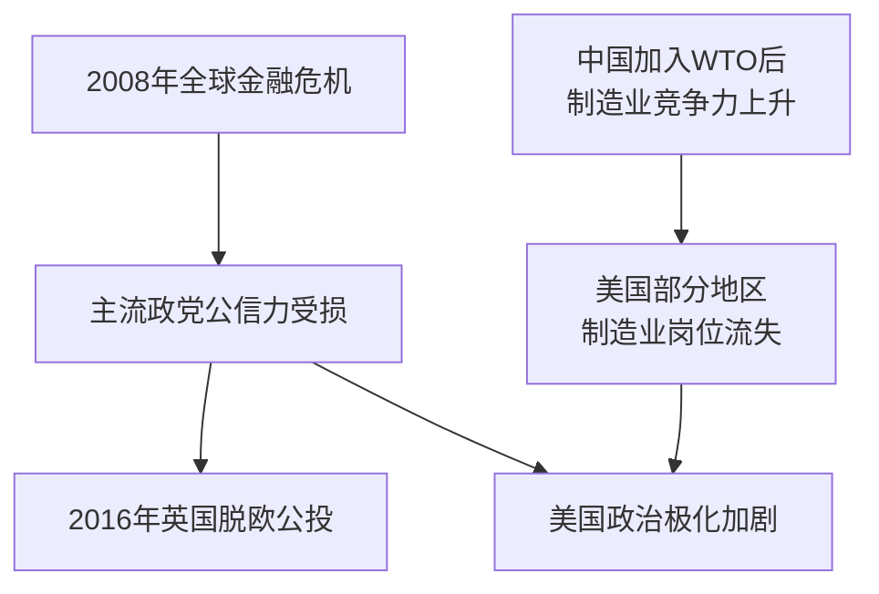
*该图展示三条链条(金融危机、中国经济崛起、政治后果)之间可能存在的间接联系,而非单一直接因果箭头。*

理解这一模式的关键,是学会在历史分析中区分"共时性证据"与"因果证据"——这是评估任何复杂社会现象时的核心方法论训练。

### science_personal_computer_and_internet (22.6s)

## Science Personal Computer And Internet

个人计算机与互联网的结合，是二十世纪下半叶最深刻的技术—社会转型之一。其核心含义是：计算与联网这两项原本只服务于政府、军队和大型企业的能力，在十余年间被压缩到个人可以负担的价格与体积，从而把信息处理、通信和交易的边际成本降到接近于零。这场转型分两步完成——先是"计算个人化"，再是"网络公共化"。1977年，苹果公司发布Apple II，配备彩色图形、扩展插槽和BASIC解释器，使非专业用户第一次能在家中或小企业里直接操作计算机；1981年IBM推出个人电脑（IBM PC），凭借开放架构和与微软MS-DOS操作系统的捆绑，迅速把个人计算机变成办公室的标准配置，并催生了此后数十年的"兼容机"产业生态。而联网能力的公共化则来自蒂姆·伯纳斯-李（Tim Berners-Lee）1989年在欧洲核子研究中心（CERN）提出的万维网构想——用超文本链接把分散在不同计算机上的文档连成一张可点击浏览的网，并把统一资源定位符（URL）、超文本传输协议（HTTP）和超文本标记语言（HTML）这三项基础规范于1991年免费公开发布，任何人都可以搭建网站或浏览网页而无需支付专利费用。

一个具体的应用场景可以说明两者结合后的效果：1990年代初，一家小型贸易公司只需购置几台IBM兼容机、安装办公软件，就能完成过去依赖大型机或纸质文书才能处理的账目与库存管理；一旦这些机器接入互联网并有了网页浏览器，该公司即可在全球范围内发布产品目录、接收电子邮件询价，而不再依赖传真、电报或实体展销会——这正是"信息、通信与商务成本坍缩"的直接体现。

从历史因果的角度看，个人计算机解决了"谁能计算"的问题，万维网的免费公开解决了"计算机之间如何互联互通"的问题；两者叠加，才为1990年代中期电子商务的爆发（如亚马逊1994年成立）、2000年代外包与离岸生产的兴起，以及此后数十年全球供应链和资本流动的加速提供了不可或缺的技术底座——它们是"全球化"这一经济现象得以在制度和政策之外真正落地的物质基础。

### science_internet_and_globalization_backlash (22.9s)

## Science Internet And Globalization Backlash

**定义**：互联网与个人计算机的普及，是理解1990年代以后全球化及其后座力的基础设施前提。1989年蒂姆·伯纳斯-李在欧洲核子研究中心提出万维网协议，1990年代中期网景浏览器与个人电脑价格的大幅下降，使跨国企业第一时间获得了实时协调全球供应链的能力——把设计放在美国、把制造放在中国、把物流数据放在共享网络上,变成了技术上可行、成本上低廉的选择。这条始于实验室的科学与工程链条,直接催生了中国在2001年加入世界贸易组织后迅速成为"世界工厂"的经济现实,也在二十年后催生了社交媒体驱动的政治极化与民粹反弹。

**具体例证**：中国制造业融入全球体系,依赖的不仅是廉价劳动力,更是能让美国企业总部与深圳工厂之间以分钟为单位交换设计图纸和订单数据的网络基础设施。同一套技术——社交媒体平台、算法推荐、智能手机——在2010年代催生了完全不同的政治后果:2016年英国脱欧公投与美国总统大选中,社交媒体上的虚假信息传播和身份认同动员,被多项事后研究(如剑桥分析事件调查)认定为影响选民情绪的重要因素。制造业外流导致的"铁锈地带"失业(据美国经济政策研究所估算,2001–2018年间中国贸易冲击造成约200万至240万个美国制造业岗位流失),与社交媒体放大的文化焦虑相结合,构成了英美两国民粹主义政党崛起的社会土壤。

**应用与推理**：把1989年科学链条上的互联网诞生,和2016年前后的政治后座力连接起来,可以帮助分析任何一场"技术扩散—经济重组—政治反弹"的历史序列:先问基础设施何时成熟、成本何时降到临界点,再问哪些群体从全球化红利中受益、哪些群体承受调整成本,最后追踪信息传播渠道如何把经济不满转化为政治动员。这种三段式追问,同样适用于分析19世纪铁路对西部拓殖与土地冲突的影响,或20世纪电视对越战舆论转向的作用。

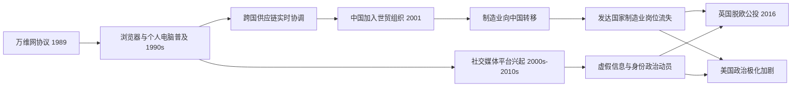
*该图展示互联网基础设施如何同时催生中国制造业融入全球经济与英美社交媒体驱动的政治后座力,两条路径共享同一科学技术起点。*

## Run complete

total: 416.3s
