# Concept-Book Run

domain: /home/papagame/projects/digital-duck/conceptbook-app/public/domains/Users/200years_7powers_ch16/input/graph.yaml
target: science_cross_cutting_synthesis_1945_2025
started: 2026-09-28T03:15:34

## Teaching order (31 concepts)

- usa_postwar_superpower_1945
- cold_war_bipolar_order
- usa_cold_war_containment
- china_civil_war_resumption_1945
- science_atomic_age_and_computing_dawn
- china_communist_consolidation
- science_dna_and_transistor
- uk_postwar_settlement_1945
- china_maoist_upheaval
- science_space_race_and_microprocessor
- usa_civil_rights_and_vietnam
- uk_decolonization_wave
- china_reform_and_opening
- usa_cold_war_endgame
- uk_suez_humiliation
- china_rise_as_power
- usa_war_on_terror
- science_personal_computer_and_internet
- uk_eec_membership
- usa_polarization_era
- uk_thatcher_restructuring
- uk_brexit_realignment
- russia_soviet_superpower_1945
- science_genomics_and_smartphones
- globalization_backlash_pattern
- russia_cold_war_buildup
- science_ai_and_mrna
- science_ai_as_new_great_power_axis
- science_internet_and_globalization_backlash
- science_space_race_as_cold_war_proxy
- science_cross_cutting_synthesis_1945_2025

### usa_postwar_superpower_1945 (2.2s)

## Usa Postwar Superpower 1945

1945年，美国是二战唯一一个在战争中变得更强而非被摧毁的主要大国。战争期间，美国本土从未遭受轰炸或地面作战，工业产能反而在战时动员中翻倍增长。1945年，美国工业产值占全球制造业总产出的近一半；黄金储备占世界已知黄金储备的约三分之二；美国还是当时唯一拥有核武器的国家。相比之下，战败国德国、日本满目疮痍,战胜国英国、法国、苏联也都是人员伤亡惨重、基础设施严重损毁、财政濒临破产。美国由此获得了历史上罕见的双重优势：既是军事最强国，又是经济唯一净受益者。这种独特地位使美国得以主导战后国际秩序的设计，而非仅仅参与其中。

美国将这种经济与军事优势转化为制度性权力的典型案例，是1944年的布雷顿森林会议。44个同盟国代表在美国新罕布什尔州布雷顿森林召开会议，确立以美元为中心、与黄金挂钩（每盎司黄金35美元）的固定汇率体系，并创立国际货币基金组织（IMF）与世界银行两大机构。由于当时只有美元具备黄金的可兑换信誉，美元事实上取代英镑成为全球储备货币。与此同时，美国主导筹建联合国，并在1945年旧金山会议上确立安理会五个常任理事国拥有否决权的机制——美国由此在军事、金融、外交三条轨道上同时锁定了战后领导地位。

将这一历史现象应用于分析问题时，可以提出这样的设问：为什么1945年的美国选择建立多边机构（如联合国、IMF），而不是像历史上其他崛起大国那样直接谋求领土扩张？答案在于成本收益的历史比较：一战后，美国选择孤立主义、拒绝加入国际联盟，结果未能阻止二战爆发，反而使自身安全受到威胁（如1941年珍珠港事件）。政策制定者由此吸取教训，认为通过制度化的国际合作来固化美国利益，比单纯的军事扩张更具持久性和低成本——布雷顿森林体系与联合国机制正是这种"以规则代替征服"战略选择的产物。

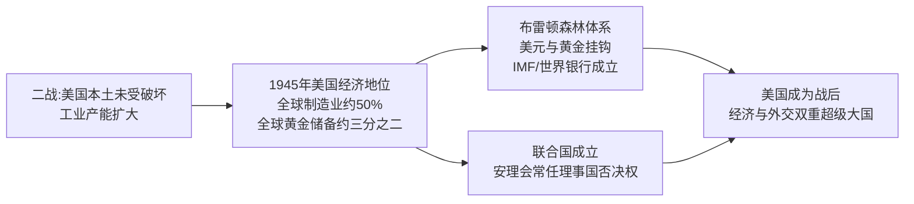
*该图展示美国如何将二战期间积累的经济优势，转化为布雷顿森林体系与联合国两大战后国际制度，从而确立超级大国地位。*

### cold_war_bipolar_order (3.6s)

## Cold War Bipolar Order

**定义**

冷战两极格局，指1945年后国际体系围绕两个对立的超级大国集团重组：以美国为首的西方阵营与以苏联为首的东方阵营。两者各自建立军事同盟、扶植附庸国，并竞相扩充核武库，形成一种既非战争亦非和平的长期对抗状态。1949年，美国与西欧十国等共同缔结《北大西洋公约》，成立北约（NATO）；作为回应，苏联于1955年与七个东欧国家签订《华沙条约》，成立华约组织。两大集团在军事、经济、意识形态上全面对峙，全球绝大多数国家被迫或主动选边站队，仅有少数国家（如南斯拉夫、印度）尝试组建不结盟运动。

**实例分析**

1949年8月，苏联成功试爆第一颗原子弹，打破了美国自1945年以来的核垄断，两极格局由此从政治对抗升级为核军备竞赛。到1962年古巴导弹危机爆发时，美国已部署约27000枚核弹头，苏联约3300枚；尽管数量悬殊，苏联在古巴部署中程导弹的举动仍将美国本土置于直接打击范围内，使双方在13天内逼近核战边缘。危机最终以苏联撤走导弹、美国秘密撤出土耳其的朱庇特导弹并承诺不入侵古巴而化解，这一结果表明：两极体系下，双方都清楚全面核战争意味着"相互确保摧毁"，因此存在克制的动机——但这种克制是通过代理人战争（如朝鲜战争、越南战争）而非直接冲突表现出来的。

**问题解决应用**

分析冷战两极格局时，历史学习者应当掌握一套判断方法：面对任一具体历史事件（如1948年柏林封锁、1956年匈牙利事件、1979年苏联入侵阿富汗），先确认涉事双方是否分属两大阵营或其附庸国；再考察该事件是否服从"避免直接军事对抗、通过代理或威慑手段竞争"的两极逻辑。以柏林封锁为例：苏联封锁西柏林陆路交通，美英并未选择武装护送车队（可能引发直接冲突），而是采用空运物资的方式维持西柏林生存，长达十一个月投送逾200万吨物资，最终迫使苏联于1949年5月解除封锁。这一案例说明，两极格局下的危机应对模式，往往体现为在避免直接军事碰撞前提下的资源与意志较量。

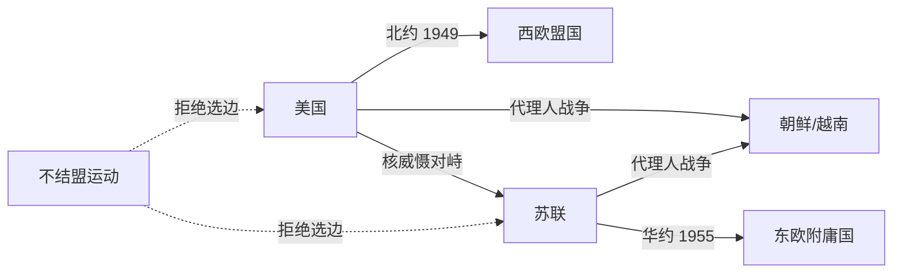
*该图展示冷战两极格局中美苏两大集团的同盟结构、核对峙关系及代理人战争路径，虚线表示不结盟国家与两大阵营的疏离关系。*

### usa_cold_war_containment (2.5s)

## Usa Cold War Containment

第二次世界大战结束仅两年，美国便完成了从"孤立主义"到"全球干预"的战略转向。1947年3月，杜鲁门在国会演说中宣布：凡是抵抗"武装的少数人或外部压力"的自由人民，美国都将给予支持——这就是"杜鲁门主义"，其直接诱因是英国宣布无力继续援助希腊和土耳其，防止两国被共产主义势力渗透。同年6月，国务卿马歇尔提出"欧洲复兴计划"（马歇尔计划），四年间向西欧16国注入约130亿美元（相当于当时美国GDP的5%左右），帮助重建工业与基础设施，同时将西欧经济体系牢固地绑定在美国主导的资本主义阵营。1949年4月，美国联合西欧十一国签署《北大西洋公约》，成立北约，确立"集体防御"原则——对任何一个成员国的攻击视为对全体成员的攻击。这三项举措共同构成了"遏制政策"的骨架：用经济援助防止贫困催生共产主义，用军事同盟防止苏联武力扩张。

遏制政策的第一次实战检验发生在朝鲜半岛。1950年6月，朝鲜人民军越过北纬38度线南下，美国迅速促成联合国安理会通过决议（当时苏联缺席抵制，未能行使否决权），组织"联合国军"介入。战争在三年间反复拉锯：联合国军曾一度推进至中朝边境鸭绿江畔，随后中国"人民志愿军"大规模介入，将战线重新推回38度线附近。战争造成美军阵亡约3.6万人，朝鲜半岛南北双方军民伤亡合计估计超过300万人。1953年7月签署的《朝鲜停战协定》并未产生和平条约，而只是划定了一条军事分界线，双方在法律上至今仍处于战争状态。

这场战争的历史意义在于：它证明了遏制政策不再只是经济与外交手段，而首次转化为美国在海外的直接军事介入，也确立了"有限战争"模式——即避免与苏联或中国爆发全面核战争，转而在局部地区以常规武力实现遏制目标。这一模式此后深刻影响了美国在越南等地区的军事决策。

*图示：从杜鲁门主义到马歇尔计划、北约成立，再到朝鲜战争爆发与停战的政策演进链条。*

问题演练：假设你是1950年的美国决策者，联合国军已推进至鸭绿江畔，请依据"遏制"而非"解放"或"击败"的政策定位，判断此时是否应继续北上、越过边境，并说明理由——答案应指出：继续北上违背了遏制政策"划定界线、避免全面战争"的核心逻辑，而这一误判正是导致中国介入、战争陷入僵局的关键转折点。

### china_civil_war_resumption_1945 (2.1s)

## China Civil War Resumption 1945

1945年8月15日，日本宣布无条件投降，八年抗战结束，中国摆脱了外国占领的直接威胁。然而，国民党与共产党在抗战期间维持的"统一战线"随即破裂，双方对日本投降后的政治版图与军事真空展开争夺，内战在数月内重新点燃。表面的和解姿态与实际的备战行动同步进行：1945年10月10日，蒋介石与毛泽东在重庆签署《双十协定》，承诺"和平建国"、召开政治协商会议；但协定墨迹未干，双方军队已在华北、东北加速调动。

一个具体案例最能说明这种"谈判与备战并行"的局面：东北（满洲）的争夺战。苏联红军在对日作战末期占领东北，随后将缴获的日本关东军约70万人的装备（包括大量步枪、火炮乃至部分坦克）移交或默许中共军队接收，使东北的中共部队迅速由约十万人扩充至近百万，并组建了日后决定内战走向的东北野战军。与此同时，美国以空运和海运方式，将超过50万国民党军队从西南大后方运往华北、东北和沿海城市，抢占日军受降区。到1946年初，国民党名义上拥有约430万军队（含美械装备的精锐部队），中共则约有120万正规军，但中共在东北获得的苏制与日制装备极大缩小了火力差距。美国特使乔治·马歇尔于1945年12月至1947年1月主持调停，促成短暂停火，但双方均未真正放弃军事解决的意图，1946年6月国民党大举进攻中原解放区，标志着全面内战正式爆发。

从这一案例可以练习历史分析的基本方法：不要孤立地看"协定签署"这一事件，而要同时追踪谈判文本、兵力调动数据与外部大国（苏、美）的资源投入这三条线索。当学生分析类似的"战后权力真空"案例（如二战后朝鲜半岛的分治、印度独立时期的教派冲突）时，应当同样地问：谁控制了投降方的武器与领土？外部势力提供了哪些实质性的军事或经济支持？和平协议是否伴随着对等的兵力监督机制？只有把这些具体证据放在一起比较，才能理解为什么1945年的表面和解会在不到一年内彻底崩溃。

### science_atomic_age_and_computing_dawn (2.0s)

## Science Atomic Age And Computing Dawn

1945年是科学史上的一个分水岭。这一年，三种此前互不相关的技术能力几乎同时成熟，共同定义了战后时代的起点：核物理、数字计算与生物医学。

**核物理**：1945年7月16日，美国在新墨西哥州阿拉莫戈多试爆首枚原子弹（"三位一体"试验），随后8月分别投于广岛与长崎，两地合计造成约21万人在当年年底前死亡。这一事件的历史意义不仅在于武器本身，而在于它证明了纯理论物理研究——从爱因斯坦1905年的质能关系到费米、奥本海默等人主持的曼哈顿计划——能够在短短几年内转化为决定战争胜负、进而重塑国际秩序的力量。核物理从此从学院象牙塔进入国家战略核心。

**数字计算**：同年，宾夕法尼亚大学建成的ENIAC（电子数字积分计算机）投入使用，它每秒可完成约5000次加法运算，用于计算炮弹弹道和氢弹相关的数值模拟。ENIAC证明了"可编程"计算机——通过重新设置线路和开关执行不同任务——在实用规模上是可行的，为此后数十年计算机产业的爆发奠定了工程基础。

**生物医学**：与此同时，青霉素在二战期间由英美两国实现工业化量产，年产量从1943年的约2100万剂跃升至1945年的超过65亿剂，感染性疾病的死亡率因此大幅下降，外科手术与战场救治的安全边际被彻底改写。

这三项突破的共同之处在于：它们都始于基础研究，却在国家动员（尤其是战争压力）下被迅速工程化、规模化。历史应用问题在于——理解这一"研究到应用"的加速机制为何在1945年前后集中爆发：答案是二战创造了前所未有的政府资金投入与跨学科协作（如曼哈顿计划汇聚了物理学家、化学家、工程师）,这种模式此后延续为冷战时期美苏两国的科技竞赛范式，直接影响了后续几十年各国科技政策的走向。

### china_communist_consolidation (2.3s)

## China Communist Consolidation

**定义**

1945年日本投降后，国共两党争夺中国统治权的内战全面爆发。中国共产党在毛泽东领导下，凭借土地改革赢得农村广大贫农支持、解放军（原八路军、新四军改编）灵活的运动战战术，以及国民党政府因恶性通货膨胀、官僚腐败而丧失民心，逐步扭转战局。1948-49年的辽沈、淮海、平津三大战役中，国民党军队几乎全军覆没。1949年10月1日，毛泽东在北京天安门宣布中华人民共和国成立；蒋介石率残部退守台湾，两岸分治格局自此形成，延续至今。新政权随即推行土地改革、镇压反革命运动，并与苏联结盟，建立起高度集中的政治经济体制，完成对大陆的统一巩固。

**实例分析**

1950年6月朝鲜战争爆发，美国迅速介入并使第七舰队进驻台湾海峡，同时联合国军越过三八线逼近中朝边境。中国将此视为对新生政权及东北工业基地的直接威胁，于同年10月以"抗美援朝、保家卫国"名义出兵，彭德怀指挥的中国人民志愿军与以美国为首的联合国军血战两年半。战争造成中方伤亡约36万人（一说更高），美方伤亡约3.6万人阵亡、逾10万人受伤，双方最终于1953年7月在板门店签署停战协定，边界大致恢复至战前的三八线。这场战争是中华人民共和国成立后与美国主导的战后国际秩序的首次正面较量，其结果证明新政权具备与头号军事强国正面抗衡的能力。

**问题解决应用**

理解这一段历史，关键在于把内战胜负原因与朝鲜战争决策动机联系起来分析：国民党的失败并非单纯军事技术劣势，而是经济崩溃（1948年金圆券改革失败、恶性通胀使城市中产阶层破产）与政治失信共同作用的结果；而中国出兵朝鲜，则是新政权基于安全边界考量（唯恐东北工业区及新生政权本身受到威胁）与巩固国内政治合法性（通过对外胜利凝聚民族主义情绪）的双重决策。分析类似历史情境时，应同时考察物质基础（经济、军事资源）与政治合法性（民心向背、意识形态动员）两条线索，而非孤立看待战场胜负。

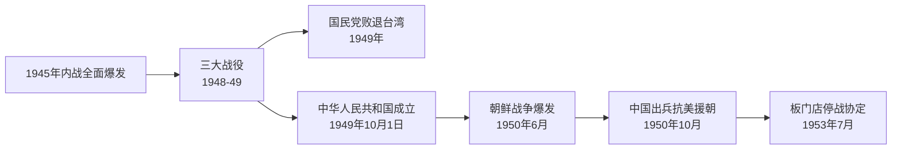
*该图展示了从国共内战结束、新中国成立，到朝鲜战争爆发及停战的关键历史节点顺序。*

### science_dna_and_transistor (1.5s)

## Science Dna And Transistor

1947年到1953年的六年间，两项奠基性发现分别开启了信息技术与生命科学的时代。1947年12月，贝尔实验室的巴丁、布拉顿与肖克利发明了晶体管——一种用半导体材料（锗，后来是硅）制成的固态开关与放大器。晶体管的体积仅有真空管的几十分之一，几乎不发热、几乎不耗电，且几乎不会像真空管那样烧毁。这一发明为随后数十年的集成电路、个人计算机乃至今天的智能手机奠定了物理基础——没有晶体管，就没有可大规模量产、可持续微型化的电子计算。三位发明者因此获得1956年诺贝尔物理学奖。

几乎同时，1953年2月，剑桥大学的沃森与克里克在《自然》杂志上发表了脱氧核糖核酸（DNA）的双螺旋结构模型。他们利用富兰克林拍摄的X射线衍射照片（著名的"照片51号"），推断出DNA由两条反向平行的核苷酸链缠绕而成，通过碱基对（腺嘌呤与胸腺嘧啶、鸟嘌呤与胞嘧啶）互补配对连接。这一结构立刻解释了遗传信息如何被稳定复制与传递——双链解开后，每条单链都可作为模板合成新的互补链，这正是细胞分裂时遗传物质得以精确复制的物理机制。

将这两项发现并列，能看清一个历史规律：技术突破往往先于产业爆发数十年发生，且常常出现在同一历史窗口内、彼此独立的领域中。晶体管在发明后用了近二十年才催生个人电脑产业；DNA结构解析后又过了近三十年，基因测序与生物技术产业才真正成形（1990年代人类基因组计划启动）。对历史分析而言，这提示我们判断一项技术发明的长期影响时，不能只看发明当年的直接应用，而要追踪其后续数十年在产业链、教育体系与国家科研投入中的扩散路径——正是这种滞后的、多代人的扩散，而非发明本身的瞬间冲击，塑造了二十世纪下半叶美国在信息产业与生物医药产业的双重领先地位。

### uk_postwar_settlement_1945 (2.0s)

## Uk Postwar Settlement 1945

1945年7月,英国大选结果震惊了许多观察者:率领英国打赢战争的丘吉尔及其保守党遭遇惨败,工党在艾德礼(Clement Attlee)领导下以393席对213席的压倒性优势上台执政。选民的逻辑并不矛盾——他们感激丘吉尔的战时领导,但认为重建和平时期的英国需要不同的政策取向。这一转折的核心矛盾是:英国在军事上是战胜国,但在财政上几乎破产。战争使英国对外负债从1939年的约7.6亿英镑膨胀至1945年的33亿英镑,黄金与外汇储备几近枯竭,出口贸易萎缩到战前的三分之一。与此同时,英国仍统治着地球上人口最多、面积最广的殖民帝国,从印度、马来亚到非洲的大片领土。

工党政府的应对方式,是在财政拮据的条件下推行大规模社会立法。1942年贝弗里奇报告(Beveridge Report)提出"从摇篮到坟墓"的社会保障构想,工党在1945-1948年间将其逐步落地:1946年《国民保险法》建立失业、疾病、养老保险体系;1946年《国民卫生服务法》创立国家医疗服务体系(NHS),1948年7月正式启动,向全体国民提供免费医疗;同时推动煤矿、铁路、电力、钢铁等基础产业国有化。这套福利国家框架之所以能在经济困境中推进,关键在于美国1946年提供的37.5亿美元贷款,以及1948年起马歇尔计划注入的援助资金,为重建提供了外部资本支持。

这一时期的深层张力在于:福利国家的建设成本与殖民帝国的维持成本相互挤压同一笔紧缩的国库。1947年印度独立,标志着"日不落帝国"开始收缩——伦敦已无力像战前那样同时支撑本土福利承诺与全球殖民统治网络。历史学家常将这一矛盾视为战后二十年英国"帝国终结"与"福利国家建立"两条线索交织并行的起点:前者是被迫的收缩,后者是主动的选择,但两者共享同一个原因——战争耗尽了英国充当全球帝国中心所需的财政资本。

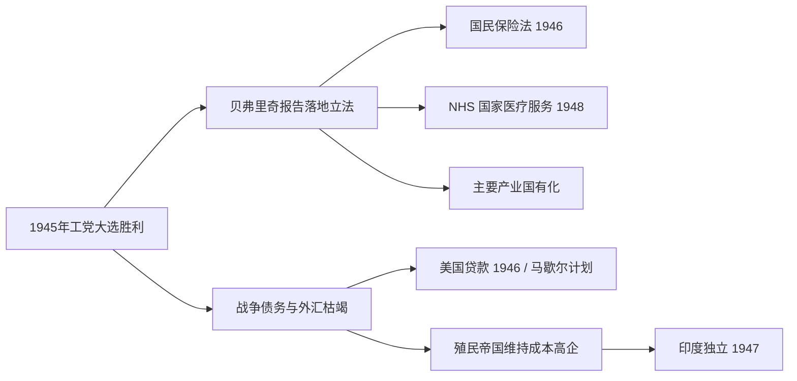
*该图展示1945年工党执政后,财政困境如何同时推动福利国家立法与殖民帝国收缩这两条并行的历史线索。*

### china_maoist_upheaval (2.2s)

## China Maoist Upheaval

1949年中华人民共和国建立后，毛泽东领导下的中国共产党在完成土地改革与社会主义改造之后，试图通过两场自上而下发动的群众运动，加速实现"超英赶美"的现代化目标并巩固自己的政治权威。这两场运动——1958年至1962年的"大跃进"与1966年至1976年的"文化大革命"——均为内部政策决策所致，并未受到外敌入侵或国际战争的直接触发，却给中国社会造成了极为惨重的代价。

大跃进的核心政策是"人民公社"与"土法炼钢"：农村被要求在缺乏专业设备与技术的条件下建造简易高炉炼钢，同时农业统计数字被层层浮夸虚报，中央据此征收远超实际产量的粮食。结果是农村存粮被抽空，加之1959至1961年部分地区遭遇自然灾害，导致了人类历史上死亡人数最多的饥荒之一。据人口统计学者及中国官方事后披露的数据估算，非正常死亡人数在1500万至4500万之间，具体数字因统计口径不同而存在争议，但学界普遍认同这是一场规模空前的人祸。

大跃进失败后，毛泽东在党内威望受损，刘少奇、邓小平等人转向务实的经济调整政策。为重新夺回政治主导权，毛泽东于1966年发动文化大革命，号召红卫兵"破四旧"、批斗"走资派"与知识分子。此后十年间，全国教育系统一度瘫痪，大学停止招生长达数年；知识分子、干部与普通民众遭受批斗、下放或迫害，官方后来承认因此非正常死亡人数达数十万至逾百万，社会秩序与传统文化遗产也遭到严重破坏。

从问题分析的角度看，这两场运动揭示了一个关键的历史因果链：当决策权高度集中且缺乏独立的信息反馈与制度制衡时，地方官员为迎合上级意志而虚报政绩，中央又依据失真信息作出进一步的激进决策，二者相互强化，最终酿成大规模灾难。这一机制的破坏程度，可通过之后邓小平在1978年推行改革开放时反复引用的教训——"实事求是"——来理解：正是大跃进与文革中信息失真与个人崇拜的双重代价，促使中共此后转向集体领导与经济优先的路线。

### science_space_race_and_microprocessor (0.8s)

## Science Space Race And Microprocessor

**定义**

1957年10月4日，苏联发射了世界上第一颗人造卫星"斯普特尼克一号"（Sputnik 1），一枚仅重83.6公斤的金属球，绕地球轨道运行。这一事件震惊了美国社会——苏联竟在航天技术上抢先一步，由此引发了持续十余年的美苏太空竞赛。这场竞赛表面上是科学探索，实质上是冷战期间两大阵营争夺技术优势与意识形态威望的延伸战场。美国随即成立国家航空航天局（NASA，1958年），并投入巨额联邦预算追赶苏联。竞赛的高潮是1969年7月20日，阿波罗11号任务的宇航员尼尔·阿姆斯特朗成为首位踏上月球表面的人类，实现了肯尼迪总统1961年立下的"十年内送人上月球"的承诺。与此同时，太空竞赛对军用与民用电子工业提出了前所未有的计算与微型化需求，直接推动了另一项划时代突破：1971年，英特尔公司发布4004微处理器，首次将一台可编程计算机的运算核心集成到一枚单一芯片上。

**实例分析**

阿波罗登月计划的制导计算机（Apollo Guidance Computer）是理解这场技术竞赛如何转化为民用科技的关键案例。为了让飞船在太空中实时导航，NASA需要一台重量轻、可靠性极高的计算机，这一需求几乎全部消耗了美国当时集成电路的产能：据统计，阿波罗计划在1962至1965年间采购的集成电路约占全美产量的60%。这种由国家预算驱动的大规模采购，压低了集成电路的单位成本，加速了商业化进程。到1971年，英特尔工程师特德·霍夫（Ted Hoff）等人将原本分散在多块电路板上的运算单元、控制单元和存储器接口整合进一枚4004芯片，内含2300个晶体管，运算速度约每秒6万次操作。这枚芯片最初是为日本计算器公司Busicom设计，但其架构迅速被推广至个人计算机领域，成为后来PC产业的技术起点。

**问题解决应用**

分析太空竞赛的历史后果时，学生应识别三条并行的技术溢出路径：军事拨款如何转化为民用基础设施。太空竞赛催生的全球定位系统（GPS，始于1970年代美国国防部的"导航星"计划）如今支撑着全球物流、导航与金融交易的时间同步；通信卫星技术（如1962年的电星一号）奠定了跨洲电视转播与互联网骨干网络的基础；而阿波罗计划对微型化、高可靠性电子元件的迫切需求，则与英特尔4004芯片的诞生形成因果链条，共同开启了个人计算时代。理解这段历史的关键在于认识到：冷战对抗产生的政治压力与国家预算，往往比单纯的市场需求更能加速某些高风险、高成本技术的早期投资与规模化。

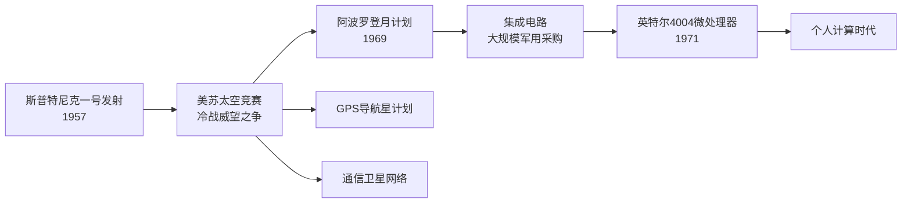
*该图展示太空竞赛如何通过国家预算与技术需求，同时催生微处理器革命与GPS、卫星通信等民用基础设施。*

### usa_civil_rights_and_vietnam (2.3s)

## Usa Civil Rights And Vietnam

**定义**：1955年至1968年间，民权运动通过非暴力抗争、司法诉讼和立法游说，逐步瓦解了美国南方“隔离但平等”的种族隔离体系；与此同时，1961年至1975年,越南战争从有限的军事顾问介入演变为一场耗时漫长、代价高昂的冷战热战，并在国内引发深刻分裂。这两场看似独立的历史进程实际上相互交织：越战消耗的联邦资源与政治资本,直接削弱了约翰逊政府“伟大社会”改革的推进力度,而民权运动培养出的抗议策略与道德语言,又被反战运动直接借用。

**具体例证**：1954年布朗诉托皮卡教育局案推翻“隔离但平等”原则后,马丁·路德·金于1955-56年领导蒙哥马利公交抵制运动,持续381天,最终迫使公交系统废除隔离座位。此后运动持续施压,促成1964年《民权法案》(禁止公共设施与就业中的种族歧视)与1965年《选举权法案》(废除人头税、识字测试等投票壁垒)相继通过。与此同时,越战规模从1961年约3000名顾问,升至1968年逾50万美军;same一年,春节攻势(Tet Offensive)造成美军逾1400人阵亡,并击碎了政府“即将取胜”的公开说辞,国内反战情绪随之激化,直接冲击约翰逊的连任前景,促使其于1968年3月宣布不再寻求连任。

**综合分析应用**：理解这两场运动的关键在于识别财政与政治资源的此消彼长关系——约翰逊1964年提出“对贫困宣战”与民权立法本可获得更充裕的联邦拨款,但1965年后越战军费急剧攀升(至1968年度军费逾800亿美元),挤压了国内福利与教育项目的预算空间,这一取舍是理解1960年代末期社会矛盾激化(如1968年金遇刺后爆发的多城骚乱)的核心线索。在分析类似的历史情境时,应追问:一国对外军事承诺的规模变化,如何通过预算分配、征兵制度(越战征兵尤其冲击少数族裔与低收入青年,加深了种族与阶级不满)、以及政治领导人的注意力转移,反过来影响国内改革议程的推进速度与深度。

### uk_decolonization_wave (2.2s)

## Uk Decolonization Wave

第二次世界大战使英国从债权国变为负债国,战争耗费了英国四分之一的国民财富,1945年英国对美国及英联邦国家的外债高达33.5亿英镑。这种财政重压,加上殖民地民族独立运动的高涨,使得维持"日不落帝国"在军事和经济上都难以为继。1947年8月,英国将其在南亚最大、最重要的殖民地——印度——分割为印度与巴基斯坦两个独立国家,结束了近两百年的殖民统治。这一进程仓促且代价惨重:英国最后一任印度总督蒙巴顿勋爵将撤离时间表从原定的1948年6月提前到1947年8月,划界委员会仅用五周时间划定边界,随后爆发的教派冲突与人口迁徙造成约100万至200万人死亡,1400多万人流离失所,成为20世纪规模最大的强制迁徙事件之一。

印度独立开启了此后二十年的连锁反应。1957年,加纳成为首个获得独立的英属非洲殖民地,随后尼日利亚(1960年)、肯尼亚(1963年)、赞比亚(1964年)等国相继脱离英国统治。加勒比地区同样加速:牙买加与特立尼达和多巴哥于1962年独立。到1960年,英国首相哈罗德·麦克米伦在南非议会发表著名的"变革之风"演说,公开承认非洲民族意识觉醒是不可逆转的历史潮流,标志着英国政府正式接受帝国收缩的既定政策,而非被动应付零星危机。仅从1945年到1965年这二十年间,英国治下约七亿人口的殖民地人口中,超过五亿人获得了independence地位,英联邦成员国数量从战前的个位数增长到二十余个。

**问题解决应用**:分析英国选择"有序撤退"而非武力维持帝国的原因,需要权衡三类证据——军费负担(如1956年苏伊士运河危机后,英国被迫在美国压力下从埃及撤军,暴露出其已无力单独维持海外军事存在)、殖民地本土精英的谈判筹码(如印度国大党长期的非暴力不合作运动积累的政治合法性)、以及国际格局变化(冷战期间美苏均反对旧式殖民主义,新独立的联合国成员国投票权也向反殖民方向倾斜)。这提示我们评估历史决策时,应同时考察国内经济约束、殖民地反抗力量的组织程度、以及国际体系的结构性压力,而非归因于单一因素。

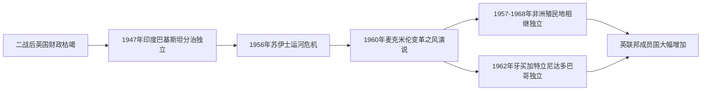

*该图展示英国从1945年财政危机到1960年代非洲、加勒比殖民地大规模独立的关键节点链条。*

### china_reform_and_opening (2.4s)

## China Reform And Opening

1976年毛泽东去世，四人帮随即被逮捕，结束了长达十年的"文化大革命"。经过两年的权力过渡，邓小平在1978年12月的中共十一届三中全会上确立了实际领导地位，正式提出把工作重心从"以阶级斗争为纲"转向"以经济建设为中心"，中国由此进入改革开放时代。这场转折并非推翻社会主义制度，而是保留中国共产党的政治领导，同时在经济领域引入市场机制——邓小平称之为"建设有中国特色的社会主义"，其实用主义口号"不管黑猫白猫，抓到老鼠就是好猫"概括了这一路线：政策的评判标准是效果，而非意识形态的纯粹性。

改革首先从农村开始。1978年安徽凤阳县小岗村的农民私下签订协议，将集体土地分包到户耕种，收获后除上缴国家和集体的部分外，剩余归农民自己支配，这就是"家庭联产承包责任制"。这一做法迅速被中央认可并在全国推广，粮食产量在随后几年大幅提升。与此同时，1980年，深圳、珠海、汕头、厦门被设立为"经济特区"，允许外资进入、实行税收优惠和更灵活的经营政策，作为对外开放的试验田。深圳从一个边陲渔村在二十年内成长为人口超千万的现代化城市，成为改革成效最直观的例证。

1992年邓小平"南方谈话"进一步扫清了姓"社"姓"资"的思想障碍，确立了建立"社会主义市场经济体制"的目标，改革从沿海试点扩展到全国性的国有企业改革、外贸体制改革与资本市场建设（1990年上海、深圳证券交易所相继成立）。经过近十年的谈判，中国于2001年12月正式加入世界贸易组织（WTO），承诺大幅降低关税、开放市场准入、遵守国际贸易规则，以换取稳定进入全球市场的机会。入世后，中国迅速成为"世界工厂"：GDP从2001年约1.3万亿美元增长到2010年前后超过6万亿美元，对外贸易总额跻身世界前列，数亿农村人口通过进城务工和产业转移脱离贫困，联合国数据显示中国是过去四十年全球减贫贡献最大的单一国家。

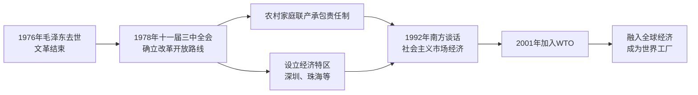
*该图展示从文革结束到中国加入WTO、深度融入全球经济的改革开放关键节点。*

将改革开放置于问题解决的视角来看，其核心在于邓小平团队如何在保持政治稳定的前提下重启经济增长：他们没有采取苏联式的一次性"休克疗法"，而是选择"摸着石头过河"的渐进策略——先在小岗村、深圳等局部区域试验，验证有效后再逐步推广至全国，把制度变革的风险控制在可承受范围内，这也是理解此后中国历次经济改革路径的关键线索。

### usa_cold_war_endgame (1.2s)

## Usa Cold War Endgame

冷战的终局始于一场刻意升级的军备竞赛,并在意想不到的谈判桌上迅速收场。1981年上任的里根总统提出"星球大战"计划——正式名称为战略防御倡议(Strategic Defense Initiative),意图用天基反导系统抵消苏联的核威慑力。与此同时,美国国防预算在1981至1985年间增长约35%,苏联为维持军事对等被迫将占国民生产总值近15-17%的资源投入军工复合体,而其民用经济已陷入长期停滞,年增长率跌至1%左右。1985年戈尔巴乔夫就任苏共总书记后推行"公开性"(glasnost)与"改革"(perestroika),试图挽救体制却加速了其瓦解。里根与戈尔巴乔夫先后在日内瓦(1985)、雷克雅未克(1986)和华盛顿(1987)举行峰会,促成《中导条约》签署,首次实现美苏核武器类别的实质性削减。

这一进程的历史转折点是1989年11月9日柏林墙的倒塌。东欧各国在同年相继发生政权更迭——波兰的团结工会、匈牙利开放边境、捷克斯洛伐克的"天鹅绒革命"——形成连锁反应,苏联未按以往方式军事干预,标志着莫斯科对东欧的控制已名存实亡。两年后,1991年12月25日,戈尔巴乔夫辞去苏联总统职务,苏联正式解体为15个独立国家,持续逾40年的两极对抗宣告终结。

在问题解决应用层面,历史学家常用"内部因素—外部因素"框架分析苏联解体:内部因素包括计划经济效率低下、民族矛盾积累、意识形态合法性流失;外部因素则是美国军备竞赛施加的经济压力与冷战阵营的信息渗透。练习性思考题可以是:如果没有里根的军备升级,戈尔巴乔夫的改革是否仍会导致同样的结局?通过比较东欧各国转型路径的差异(如波兰的渐进谈判与罗马尼亚的暴力政变),学生可以练习区分结构性原因(体制性经济危机)与偶然性因素(个别事件的触发)在历史因果链中的不同作用。

*该图展示从里根军备竞赛到苏联解体、美国成为唯一超级大国的因果链条。*

这一终局也重塑了美国的全球角色:从冷战时期的两极对抗领导者,转变为"单极时刻"下唯一具备全球军事与经济投射能力的国家,为其在1990年代海湾战争、北约东扩等一系列决策奠定了历史前提。

### uk_suez_humiliation (2.0s)

## Uk Suez Humiliation

1956年的苏伊士运河危机，是英国从"独立大国"降格为"依附美国的地区强国"的分水岭事件。1956年7月26日，埃及总统纳赛尔宣布将苏伊士运河公司收归国有，理由是英美撤回了资助阿斯旺大坝建设的贷款承诺。运河由英法资本共同持股，且是英国通往中东石油产区与远东殖民地的战略生命线——当时英国进口石油的三分之二经此运河运输。伦敦与巴黎认为，纳赛尔的举动不仅是经济挑战，更是对欧洲殖民秩序的公然挑衅，于是与以色列秘密达成《色佛尔协议》：以色列先出兵西奈半岛，英法随后以"隔离交战双方"为名出兵占领运河区。

1956年10月29日，以色列军队入侵西奈；10月31日，英法战机开始轰炸埃及机场；11月5日，英法伞兵在塞得港登陆。军事行动本身进展顺利，埃及军队溃败。但政治后果却是灾难性的。美国总统艾森豪威尔对未经磋商的行动极为愤怒，认为这将把阿拉伯世界推向苏联怀抱，并担心殃及美国在中东的石油利益与冷战布局。华盛顿采取了两项决定性施压手段：一是拒绝国际货币基金组织向英镑提供紧急贷款支持，任由英镑在国际外汇市场遭受抛售压力；二是在联合国安理会（因英法行使否决权而受阻后转至联大）联合苏联共同谴责这次入侵，形成美苏罕见的共同阵线。英国财政大臣麦克米伦警告首相艾登，若不停火，英镑储备将迅速耗尽。11月6日，在开战仅一周后，英国单方面宣布停火，法国被迫跟随，联合国紧急部队随后进驻运河区监督撤军。

这次事件的核心教训在于：军事上的胜利与政治外交上的失败可以同时发生，而后者足以否决前者。英国拥有远征埃及并取胜的兵力，却没有独立于美国货币体系而维持这场行动的财政能力——这暴露出"大国地位"实际上早已让位于对美元与IMF体系的依赖。艾登首相于1957年1月因健康及政治压力辞职，成为危机的直接政治牺牲品。此后，英国外交政策转向明确接受"美国优先"的现实：既不再谋求独立于华盛顿的中东干预，也开始加速从苏伊士以东的殖民存在中收缩，为随后十年的[[uk_decolonization_wave]]（非殖民化浪潮）提供了心理与战略上的转折点。正如时任观察家所言，苏伊士危机让英国人第一次真切意识到，二战后头衔上的"三大国"之一，实际权力已不复当年。

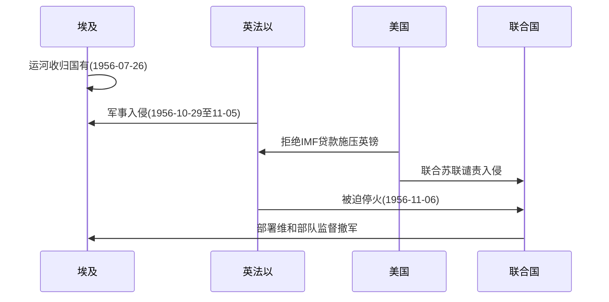
*该图展示苏伊士危机中军事行动与美国财政外交施压如何共同促成英法仓促撤军的过程。*

### china_rise_as_power (1.9s)

## China Rise As Power

**定义**：中国崛起为大国，指中国自二十一世纪初以来，凭借持续的经济增长、日益扩大的对外投资网络与集中化的政治领导体制，从地区性经济体转变为具有全球影响力的大国这一进程。三个标志性事件勾勒出这一轨迹：2008年北京奥运会向世界展示了改革开放三十年积累的建设能力与国家组织能力；2013年启动的"一带一路"倡议，通过基础设施贷款与建设，将中国的经济影响力延伸至亚洲、非洲、拉丁美洲上百个国家；2012年习近平就任中共中央总书记后，通过反腐运动、党内机构改革以及2018年修宪废除国家主席任期限制，实现了权力的进一步集中。这一进程与此前的改革开放阶段构成因果链条：正是市场化改革积累的经济实力，才为对外投资与国际影响力的扩张提供了物质基础。

**具体案例**：以"一带一路"为例，截至2019年,中国已与超过130个国家签署合作协议，对外提供的相关贷款与投资规模累计超过一万亿美元，涵盖巴基斯坦瓜达尔港、肯尼亚蒙内铁路、希腊比雷埃夫斯港等项目。这些项目一方面帮助受援国改善了长期缺乏的基础设施，另一方面也使部分国家（如斯里兰卡，因无力偿还港口贷款于2017年将汉班托塔港租让给中国99年）陷入所谓"债务陷阱"争议，成为中国崛起过程中软实力与地缘政治风险并存的典型例证。

**问题解决应用**：分析一国崛起需要区分"能力积累"与"能力转化"两个环节——奥运会展示的是国内建设能力，一带一路检验的是能否将资本与工业产能转化为跨国影响力，而修宪则反映决策层试图以政治稳定性保障长期战略的连续性。练习：请对比一带一路项目与二战后美国"马歇尔计划"在资金来源、附加条件（如民主化要求与否）及受援国主权让渡程度上的异同，并说明这些差异如何影响两国崛起过程中他国的接受度与警惕程度。

### usa_war_on_terror (2.0s)

## Usa War On Terror

**定义**：2001年9月11日，基地组织劫持四架民航客机,分别撞击纽约世贸中心双塔与华盛顿五角大楼,造成近3000人死亡,是美国本土遭受的最严重恐怖袭击。乔治·W·布什政府随即宣布发动"反恐战争",其法律基础是国会几乎全票通过的《使用军事力量授权法》(2001年9月18日,参议院98票、众议院420票赞成)。这场战争分为两条主线:2001年10月开始的阿富汗战争,目标是推翻庇护基地组织的塔利班政权;2003年3月开始的伊拉克战争,以萨达姆·侯赛因政权拥有大规模杀伤性武器为由(该情报后被证实有误)发动入侵。两场战争合计延续二十年,成为美国历史上耗时最长的军事冲突。

**具体案例分析**:阿富汗战争初期进展迅速——塔利班政权在两个月内(2001年11月)即告瓦解,但美军随后陷入长期治安战与反叛乱作战,直至2021年8月仓促撤军、喀布尔政权一夕崩溃,塔利班重新掌权,战争才画上句号。伊拉克战争则在2003年5月宣布"主要战斗结束"后爆发大规模逊尼派叛乱与教派冲突,美军于2007年增兵("surge")约3万人以稳定局势,最终于2011年12月完成撤军。据布朗大学"战争成本项目"估算,两场战争合计造成超过90万人直接死亡(含平民、军人及反叛武装),美国联邦财政直接及后续医疗、退伍军人支出总计逾8万亿美元。

**问题解决应用**:分析"反恐战争"应聚焦三个层面的因果关系——法律授权如何使总统在缺乏国会正式宣战的情况下发动长期战争;军事上"斩首行动"式的政权更迭为何难以转化为稳定的政治秩序(阿富汗与伊拉克均在推翻政权后陷入权力真空与叛乱);以及财政与人力成本的持续累积如何反过来限制美国后续的对外政策选择,包括奥巴马政府的"撤军疲劳"与后续对中东政策的收缩。将这三条线索并置比较,才能理解2021年阿富汗撤军的仓促决策并非孤立事件,而是二十年战争成本积累后的必然结果。

### science_personal_computer_and_internet (3.3s)

## Science Personal Computer And Internet

1976年，史蒂夫·乔布斯与史蒂夫·沃兹尼亚克在车库里组装出第一台苹果电脑，1977年推出的Apple II成为首批面向普通家庭和学校的量产个人电脑；1981年IBM推出IBM PC，凭借开放式架构和第三方软件生态，迅速把"个人电脑"从爱好者玩具变成办公室标准设备。到1980年代末，个人电脑的价格已降至普通中产家庭可以承受的区间，计算能力第一次从政府实验室和大公司的机房，扩散到千百万个人的书桌上。

如果说个人电脑解决了"计算"的普及问题，那么下一步要解决的是"连接"问题。1989年，供职于欧洲核子研究中心（CERN）的英国计算机科学家蒂姆·伯纳斯-李提出了万维网的构想，用超文本链接把分散在不同电脑上的文件连成一张可以自由跳转的信息网络；1991年，他将这套系统免费公开发布，任何人都可以在此基础上架设网站、共享内容，而无需支付专利费用。这一"开源公开"的决定是历史的关键转折点：万维网因此没有被某一家公司或国家垄断，而是像电力或公路一样成为全球共享的基础设施。

个人电脑与万维网的结合，产生了历史书里常被忽略却极为关键的经济效应：信息、通信与交易的成本被大幅压低。以往需要邮寄数周的文件，现在几秒钟就能传输；以往只有大公司才能负担的数据库和排版系统，现在个人也能使用。这为2000年代之后的经济全球化提供了技术前提——企业可以把生产环节分散到世界各地并实时协调，个人可以远程完成原本必须坐在办公室里才能做的工作。

在具体应用层面，理解这段历史有助于分析后续现象：例如，1990年代末的"网络泡沫"（dot-com bubble）正是资本市场对万维网商业潜力的过度反应和随后修正；而2000年代之后制造业外包、离岸客服中心的兴起，也直接建立在"信息传输接近零成本"这一新现实之上。学生在分析全球化或产业外移案例时，应当把"个人电脑+互联网"视为使这些经济现象在技术上成为可能的先决条件，而不仅仅是同时期的巧合。

### uk_eec_membership (0.8s)

## Uk Eec Membership

1973年1月1日，英国正式加入欧洲经济共同体（European Economic Community，简称EEC），结束了长达十余年的反复申请与被拒历程，也标志着大英帝国解体后英国对自身经济与战略定位的一次根本性调整。这一决定与十多年前的苏伊士危机屈辱一脉相承：1956年苏伊士运河事件已经证明，英国无法再以传统帝国方式单独行动，其全球影响力必须依附于更大的联盟框架。EEC成员资格正是这种依附关系在经济领域的延续。

英国并非一开始就选择欧洲。二战后，英国首相哈罗德·麦克米伦一度更看重英联邦贸易体系和与美国的"特殊关系"，对欧洲大陆的经济一体化持观望态度。但英联邦贸易份额持续萎缩、英国经济增长率长期落后于法国和联邦德国的现实，迫使伦敦重新评估。1961年和1967年，英国两次正式申请加入EEC，却均被法国总统戴高乐否决。戴高乐的理由直白而尖锐：他认为英国经济结构与欧洲大陆格格不入，且英国与美国的紧密关系会使EEC沦为"美国的特洛伊木马"，稀释欧洲的独立战略自主性。这两次否决本身就是历史证据——它们说明战后欧洲一体化从一开始就是政治权力博弈，而非单纯的经济技术安排。

转折点出现在1969年戴高乐辞职后。继任的乔治·蓬皮杜对英国态度趋于温和，加上英国经济持续疲软（1970年代初通胀高企、"英国病"论调盛行），双方利益出现交汇。1971年，英国首相爱德华·希思与蓬皮杜达成协议，英国于1973年与丹麦、爱尔兰一同加入EEC，形成"入盟三国"。

这一决定的历史后果具有长期性：它使英国经济与欧洲大陆市场深度捆绑，但也埋下了国内政治分歧的种子——工党内部长期存在疑欧派，1975年英国即举行全民公投以确认是否留在共同体（结果以67%支持留欧）。这场公投本身证明，加入EEC从未获得英国社会的完全共识，这种张力最终在四十多年后的英国脱欧公投（2016年）中再次爆发。

*该图展示英国从苏伊士危机到最终加入欧洲经济共同体的历史脉络，凸显两次被否决与最终入盟之间的因果链条。*

### usa_polarization_era (1.8s)

## Usa Polarization Era

**定义**：美国政治极化时代指2008年金融危机之后，美国社会在经济、文化与政治认同上日益分裂、两党对立不断加深的历史阶段。这一进程由多重因素交织而成：2008年金融危机使中产阶级财富大幅缩水（危机高峰期美国家庭净资产蒸发约19.2万亿美元），社会对"体制是否公平"产生深刻怀疑；与此同时，中国经济持续崛起，2010年超越日本成为世界第二大经济体，制造业外流冲击美国"铁锈地带"就业，加剧了民众对全球化的不满；2019年末暴发的新冠疫情进一步撕裂社会，围绕封锁、疫苗与防疫政策的分歧沿党派界线迅速固化；这一系列张力最终在2021年1月6日的国会大厦骚乱事件中集中爆发——时任总统特朗普的支持者冲击国会，试图阻止总统选举结果的认证，导致五人死亡，成为美国内战以来国会最严重的一次暴力冲击。

**具体案例**：民调机构皮尤研究中心的数据显示，2004年时两党选民在政策立场上的重叠区间还相当可观，但到2017年，民主党与共和党选民在几乎所有议题上的立场分布已几乎不再重叠，形成两条几乎不相交的分布曲线。这种"情感极化"（对另一党选民本身产生反感，而不仅是政策分歧）成为该时期最显著的特征，直接体现在2020年大选后近三分之一共和党选民仍相信"选举被窃取"的调查结果中。

**分析应用**：理解这一时期的关键在于区分"政策极化"与"情感极化"——前者指两党在具体议题（如税收、移民）上的立场分化，后者指选民将政治身份等同于道德阵营归属，从而拒绝与对立阵营妥协。运用这一区分可以解释为何金融危机、中国崛起、疫情与国会骚乱表面上互不相关，却能共同强化同一趋势：每一次冲击都进一步侵蚀了民众对政府机构、主流媒体与选举制度的共同信任基础，使得基于共享事实的两党协商变得日益困难。

### uk_thatcher_restructuring (2.0s)

## Uk Thatcher Restructuring

1979年5月,玛格丽特·撒切尔当选英国首相,面对的是一个深陷"英国病"的经济体:1970年代通货膨胀率一度突破20%,国有企业连年亏损靠财政补贴维持,工会力量强大到能通过罢工瘫痪全国供电与运输。撒切尔政府的核心政策是打破二战后建立的"混合经济"共识——国家不再是主要生产者和雇主,而应退回到制定规则、维护竞争的角色。她的手段有三条主线:大规模私有化国有企业(电信、燃气、水务、英国航空、英国钢铁等陆续出售给私人股东)、放松金融和劳动力市场管制,以及正面削弱工会的谈判权力。

私有化的逻辑并不复杂:国有企业缺乏竞争压力和破产风险,管理层没有动力控制成本或提升服务;把所有权转移给私人股东、引入市场竞争或至少引入价格管制下的准市场机制,理论上能倒逼效率提升。以英国电信为例,1984年政府出售51%股份,是当时全球规模最大的股票发行之一,吸引了超过200万普通投资者认购,这也开创了"人民资本主义"的政治叙事——把持股范围从机构投资者扩展到普通民众。

真正的对抗发生在煤炭行业。1984年3月,全国煤炭局宣布关闭20座亏损矿井、裁员2万人,全国矿工工会在阿瑟·斯卡吉尔带领下发起大罢工,但没有举行全体成员投票,这一程序瑕疵后来成为政府和部分矿工分裂的关键点。撒切尔政府此前已通过大量囤煤、改造发电厂使用石油、并动用全国统一调度的警力来应对罢工引发的纠察冲突,做了远比1970年代政府更周密的准备。罢工持续近一年,到1985年3月工会在未达成任何让步的情况下宣告结束,煤矿工人数量此后从近20万锐减至不足1万(至1994年私有化完成时)。

这场胜利让撒切尔得以推动更广泛的劳动立法,包括限制同情罢工、要求罢工前进行无记名投票,英国工会会员总数从1979年的1330万降至1990年代初的约1000万以下。私有化收入连同北海石油税收为政府提供了减税空间,基本所得税率从33%降至25%,但代价是传统工业地区(威尔士、英格兰北部、苏格兰)长期高失业率,社会不平等程度显著上升——基尼系数在1980年代经历了战后最快的上升。

*(本节聚焦国内经济结构转型;英国此前已通过加入欧洲经济共同体获得欧洲市场准入,为出口型服务业和外资流入创造了外部条件。)*

### uk_brexit_realignment (3.3s)

## Uk Brexit Realignment

1973年，英国加入欧洲经济共同体（欧共体，后演变为欧盟），结束了自身在战后长期游离于欧洲一体化进程之外的姿态。这一决定的前提，是撒切尔式改革之前英国经济持续相对衰退——制造业竞争力下滑、"英国病"式的劳资冲突频发，让加入欧洲统一市场被视为提振贸易与投资的出路。半个世纪后，2016年6月23日，英国举行"是否留在欧盟"的全民公投，结果以51.9%对48.1%的些微多数支持"脱欧"（Leave）。经过近四年的谈判与国内政治拉锯，英国于2020年1月31日正式退出欧盟，2020年12月31日过渡期结束，彻底脱离欧盟单一市场与关税同盟。这标志着一次罕见的历史逆转：一个曾主动选择融入区域一体化的大国，又主动选择退出。

脱欧公投的地域与阶层分裂极具说明性。伦敦、苏格兰、北爱尔兰整体投票支持"留欧"，而英格兰中部与北部的老工业地区、威尔士则多数支持"脱欧"。这种分裂与撒切尔改革遗留的经济地理格局高度重合：那些在1980年代因煤矿、钢铁、造船业关闭而遭受长期冲击的地区，正是"脱欧"票仓的核心。换言之，脱欧公投在很大程度上是对全球化与自由市场改革所造成的地区不平等的一次迟到的政治清算——许多选民将"脱欧"视为夺回对移民政策、贸易规则与国家主权的控制权（"Take Back Control"是官方脱欧阵营的核心口号）。

脱欧的经济代价是可衡量的。英国预算责任办公室（OBR）估计，脱欧将使英国长期生产率较留在欧盟的情形低约4%；英镑在公投结果公布当夜重挫超过8%，创下1985年以来最大单日跌幅；与欧盟的贸易因新增关税壁垒与通关手续大幅增加而放缓，2021至2022年英国对欧盟出口增速显著落后于同期对非欧盟国家的出口。北爱尔兰问题尤为棘手：为避免在爱尔兰岛上重设硬边界，英国被迫接受"北爱尔兰协议"，使北爱尔兰事实上仍留在欧盟单一市场规则之下，造成英国本土与北爱尔兰之间的贸易摩擦，这一安排至今仍是英国—欧盟关系中最具争议的遗留问题。

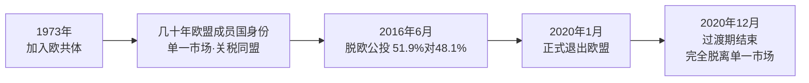
*该图展示英国从1973年加入欧洲一体化，到2016年公投逆转，最终于2020年完成脱欧的时间脉络。*

从问题解决的角度看，脱欧案例训练学生识别"逆转型历史事件"的分析框架：先确认最初决定的动因（撒切尔时代前的经济衰退推动融入欧洲），再考察融入后的实际收益分配（地区与阶层不均），最后解释逆转决定的触发条件（长期不满积累+短期政治动员）。这一框架同样适用于分析其他"加入—退出"型国际关系决策。

### russia_soviet_superpower_1945 (1.1s)

## Russia Soviet Superpower 1945

1945年,苏联以战胜国身份走出第二次世界大战,成为与美国并列的两大全球超级大国之一。这一地位的取得,建立在极其惨烈的代价之上:苏联在战争中损失约2600万至2700万人口,是所有参战国中伤亡最惨重的国家,超过美、英、法三国伤亡总和的十倍以上。然而正是这场"卫国战争"的胜利,使苏联红军得以一路推进至柏林,并在中欧、东欧留下了庞大的驻军和政治控制网络。到1945年5月战争结束时,苏军实际占领了波兰、罗马尼亚、保加利亚、匈牙利、捷克斯洛伐克东部以及德国东部——这片区域后来被称为"东方阵营"。

军事占领迅速转化为政治重塑。1945年2月的雅尔塔会议上,美、英、苏三国领导人罗斯福、丘吉尔、斯大林原则上同意战后欧洲划分"势力范围",并承诺东欧国家将举行自由选举。但战争结束后,斯大林并未兑现这一承诺:苏联通过扶植本国共产党、操纵选举、镇压反对派等手段,在1945年至1948年间陆续将波兰、匈牙利、罗马尼亚、保加利亚、捷克斯洛伐克转变为苏联主导的一党制政权。1946年3月,英国前首相丘吉尔在美国富尔顿发表演说,称"一幅铁幕已经从波罗的海的斯德丁降落到亚得里亚海的里雅斯特",这一说法后来成为冷战东西方对峙的标志性描述。

这一转变的核心逻辑,是苏联将战时盟友关系视为暂时的策略联合,而非长期的价值共识。西方国家原本期待战后与苏联共同治理欧洲秩序,但苏联的安全观建立在"缓冲地带"之上——鉴于历史上两次遭受西方(拿破仑、纳粹德国)经陆路入侵的教训,斯大林认定唯有直接控制东欧政权,才能确保苏联本土安全。这种安全考量与西方民主国家所主张的"自由选举权利"直接冲突,双方分歧在1945年后迅速由外交摩擦升级为系统性对抗,为1947年杜鲁门主义、马歇尔计划以及冷战格局的正式形成埋下伏笔。

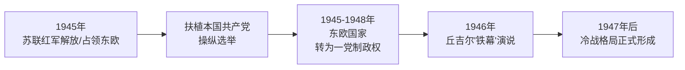
*该图展示苏联如何将1945年的军事占领逐步转化为对东欧的长期政治控制,并最终引发冷战对峙。*

### science_genomics_and_smartphones (0.7s)

## Science Genomics And Smartphones

2000年至2012年间，两条原本独立发展的技术路线开始交汇：生物信息技术与个人数字技术。2003年4月，人类基因组计划宣布完成人类DNA的完整测序——这项耗时13年、耗资约27亿美元的国际合作项目，将人类约31亿个碱基对的序列首次完整地呈现出来。几乎同一时期，2007年苹果公司推出iPhone,将联网计算机装进了每个人的口袋，使数据采集、存储与传输的成本急剧下降。2012年，詹妮弗·杜德纳与埃玛纽埃尔·沙尔庞捷发表论文，证明CRISPR-Cas9系统可以像"分子剪刀"一样精确切割并编辑DNA序列，且成本远低于此前的基因编辑技术。这三项突破分别独立发生，但共同奠定了一个前提：生物学开始像信息技术一样,变得可编程、可存储、可大规模处理。

这种汇流并非巧合，而是彼此的成本结构相互强化的结果。基因测序成本从2003年的约1亿美元一个基因组，到2012年降至约1万美元以下,这一降幅得益于计算能力提升带来的数据处理效率——测序仪产生的海量数据需要强大的计算和存储能力才能分析,而这正是同期个人计算与云计算基础设施成熟带来的红利。反过来，生物数据(如新冠疫情期间的病毒基因序列)一旦被数字化，就能通过互联网瞬时全球共享，这是纸质实验记录时代不可能实现的速度。

这一汇流的实际后果在后续十年逐步显现。2020年，Moderna和BioNTech仅用数天时间设计出新冠病毒mRNA疫苗序列,正是依赖于:数字化的病毒基因组数据(测序技术)、可编程合成的mRNA分子技术(基因编辑相关技术积累),以及大规模临床数据的数字化管理。同样,智能手机普及带来的位置数据与生物特征数据,也为后续的数字监控基础设施提供了原始材料。分析这段历史时，关键在于识别因果链条：基因组测序降低了生物数据的获取门槛，个人计算设备降低了数据处理与传播门槛,而基因编辑工具降低了生物系统的改造门槛——三者叠加，才使得后来数字与生物深度融合的技术形态(如AI辅助药物研发)成为可能，而非任何单一发明所能单独促成。

### globalization_backlash_pattern (0.8s)

## Globalization Backlash Pattern

**定义**：全球化反弹模式指的是，在同一段历史时期内，不同国家各自因不同的直接原因，出现了针对全球化——自由贸易、跨境资本流动、外包生产——的政治和社会反弹。这并非某一单一事件引发了所有反弹，而是几条独立的历史链条在大致相同的时间窗口（约2008至2020年）内相继显现，值得放在一起观察其共时性。

**具体案例**：2008年,美国次贷危机引发全球金融危机，雷曼兄弟破产，全球贸易量在2009年萎缩约12%，多国失业率飙升——英国失业率在2011年达到8.4%的高位。这场危机动摇了公众对金融自由化和全球资本流动的信任。几年后，2016年6月,英国举行脱欧公投,以51.9%对48.1%的结果通过,其中一个重要论述是"夺回控制权"，针对欧盟内部的人员与资本自由流动。与此同时，美国国内出现了另一条独立的链条：自2001年中国加入世界贸易组织后,美国制造业岗位持续外流,经济学界称为"中国冲击"（China Shock）——据经济学家戴维·奥托等人研究，1999至2011年间，美国因对华贸易竞争直接损失约98万个制造业岗位，波及社区连带损失可能超过200万个岗位。这一进程与2008年危机后的经济焦虑相叠加，成为2016年美国大选中贸易保护主义议题升温、政治极化加剧的背景因素之一。

**应用与辨析**：面对这类跨国、跨领域的共时现象，历史分析的关键练习是区分"相关"与"因果"。金融危机、脱欧公投、美国政治极化三者发生在重叠的时间窗口内，且都与全球化议题相关，但它们各自有独立的触发机制——金融监管缺陷、英国国内政治博弈、中美贸易结构变化——不能简单地把其中一件事当作另外两件事的原因。正确的做法是：先分别追溯每条链条的具体证据（数据、事件、政策文本），再检验它们之间是否存在实际的传导路径（例如，是否有证据显示金融危机直接改变了英国选民的脱欧倾向），而不是仅凭时间上的巧合就断言单一因果关系。这种"先分链条、后查关联"的方法，是处理复杂历史现象时避免过度简化的核心技能。

### russia_cold_war_buildup (0.8s)

## Russia Cold War Buildup

第二次世界大战结束后，苏联迅速将战时积累的工业与科研能力转化为与美国抗衡的军事技术实力，这一进程集中体现在三个标志性事件上：1949年8月29日苏联在哈萨克斯坦塞米巴拉金斯克试验场成功试爆第一颗原子弹（代号"RDS-1"，仿制美国"胖子"弹设计），打破了美国自1945年以来对核武器的独家垄断；1955年5月14日苏联联合七个东欧社会主义国家签署《华沙条约》，组建统一军事指挥体系的华沙条约组织，与1949年成立的北约正式形成两大军事集团对峙的格局；1957年10月4日苏联用R-7洲际弹道导弹改装的火箭将人类第一颗人造卫星"斯普特尼克一号"送入近地轨道，证明其已具备将核弹头投送至美国本土的运载能力。这三件事并非孤立的科技或外交成就，而是苏联为回应美国"遏制政策"与马歇尔计划所构筑的经济政治联盟，系统性建立起与之匹敌的军事技术地位的连续步骤。

以斯普特尼克危机为例可以说明这种"技术突破转化为地缘政治冲击"的连锁效应：卫星发射成功后，美国国内舆论一片震惊，认为苏联在导弹与航天技术上已超越美国，直接推动美国国会在1958年通过《国防教育法》，大幅增加科学教育经费，同年成立国家航空航天局（NASA），并加速"民兵"洲际导弹项目研发。这表明一项技术成果可以迅速改变对手对力量对比的认知，进而引发对方在教育、科研、军备领域的连锁反应——这正是冷战"技术竞赛"逻辑的核心机制。

在分析类似历史情境时，一种有效的问题解决方法是：先识别触发事件（原子弹试爆、卫星发射），再追溯其对既有联盟体系的冲击（北约与华沙条约的对峙定型），最后考察对手在教育、财政、军事预算上的具体反应指标（如国防教育法拨款额、导弹试验次数），用可核实的数据串联"行动—认知—反应"这一历史链条，而非停留在笼统的"苏联变强大了"的印象式判断。

### science_ai_and_mrna (0.8s)

## Science Ai And Mrna

**定义**

2016年至2023年间，两项技术分别沿着不同的路径抵达了人类此前认为遥不可及的门槛：人工智能开始在特定任务上超越人类专家，生物医学则借助计算能力将疫苗研发周期从常规的数年压缩到数月。这两者看似不相关，实则共享同一底层逻辑——大规模数据与算力的结合，使原本依赖人工试错的过程被系统化、加速化。2016年，DeepMind开发的AlphaGo以4比1击败世界围棋冠军李世石，围棋的可能局面数远超国际象棋，此前普遍认为计算机需要数十年才能达到人类顶尖水平，AlphaGo的胜利提前证明了深度学习与强化学习结合的潜力。2020至2021年，辉瑞-拜恩泰科与莫德纳公司在约90天内完成了信使核糖核酸（mRNA）疫苗从设计到量产的全过程，而传统疫苗研发通常需要5到10年。mRNA技术的核心突破在于：只需获得病毒刺突蛋白的基因序列，即可直接合成能指导人体细胞生产该蛋白、从而激发免疫反应的mRNA分子，无需像传统疫苗那样培养病毒或蛋白质。2022年，OpenAI发布的ChatGPT在两个月内积累超过一亿用户，成为历史上用户增长最快的消费级应用，标志着大语言模型从实验室走向大众日常使用。

**应用实例**

以新冠疫苗为例：中国科学家在2020年1月11日公开了新冠病毒的基因组序列，莫德纳公司仅用两天时间便完成了疫苗候选mRNA序列的设计，随后进入实验室与临床阶段。这个过程之所以能被压缩，是因为mRNA平台本质上是一种「可编程」技术——一旦平台技术成熟，针对新病原体只需替换序列信息，如同软件更新一样，而不必重新搭建整套生产体系。

**问题解决与分析**

到2023年，人工智能与生物医学的竞速已上升为国家战略层面的较量。美国与中国将人工智能视为决定未来经济与军事优势的核心技术，双方在芯片出口管制、人才争夺、专利数量上全面竞争——据统计，中国在2022年的人工智能相关专利申请量已超过美国。同时，mRNA技术的应用正从传染病疫苗扩展到癌症个体化疫苗与遗传病治疗领域。这一时期提出的历史问题是：当技术变革周期从「代际」（十年以上）压缩至「季度」，各国的监管体系、教育体系与地缘政治博弈能否同步调整？新冠疫苗审批流程的紧急压缩，以及各国围绕人工智能立法的激烈辩论，正是这一问题在现实中的具体体现。

### science_ai_as_new_great_power_axis (0.7s)

## Science Ai As New Great Power Axis

当一项科学突破在诞生的同一时刻就被两个大国当作国力较量的筹码,而不是像大多数技术那样先经过几十年民用扩散才卷入地缘政治,这种现象在近现代历史上极为罕见。据资料显示,2022至2023年的生成式人工智能浪潮,是继核武器之后第二次出现"科学突破"与"大国竞争轴心"在时间线上完全重合的案例:2022年11月OpenAI发布ChatGPT,2023年3月GPT-4问世,几乎同一时间段内,美国正在经历深刻的国内政治极化,而中国正处于经济与科技实力持续上升的轨迹——三条原本独立的历史脉络(科学、美国内政、中国崛起)在此刻交汇于人工智能这一个节点上。

历史上唯一可比的先例是核武器。1942至1945年的"曼哈顿计划"是纯粹的科学工程,但1945年8月广岛与长崎原子弹爆炸之后,核技术立刻从物理学实验室问题转变为美苏对抗的核心议题——1949年苏联试爆首枚原子弹,冷战军备竞赛随即展开。核物理从此不再只是科学史的一章,而成为理解20世纪下半叶大国关系的关键变量。人工智能在2022至2023年间重复了这一模式:美国于2022年10月出台对华先进芯片出口管制,同年8月国会通过《芯片与科学法案》,拨款527亿美元扶持本土半导体产业;中国则将人工智能列为"新一代人工智能发展规划"(2017年提出,目标2030年成为世界领先者)的战略核心,并在美国限制芯片出口后加速自主大模型研发,百度、阿里、字节等公司在2023年内密集发布对标GPT的产品。

这一案例给我们提供了一种解读方法:当数据中的"科学"链条与某国"内政"或"崛起"链条在同一年份反复共现,这本身就是证据,提示我们该技术已经跨越了纯科学的边界,成为大国战略博弈的显性维度。运用这一识别方法,可以对后续可能出现的类似交汇点(例如量子计算、生物工程)做出更敏锐的历史判断——不必等待官方宣言,数据共现的时间结构本身已经说明问题。

### science_internet_and_globalization_backlash (0.8s)

## Science Internet And Globalization Backlash

**定义**　1989年蒂姆·伯纳斯-李在CERN提出万维网协议，1991年NSFNET解除商业使用限制，1995年网景公司上市引爆互联网商业化浪潮，2007年iPhone发布则将网络接入从桌面延伸到口袋。这一连串技术突破的核心是：将信息传输成本降至近乎为零，并把计算能力嵌入到普通人的日常设备中。这不是一次孤立的技术事件，而是一套跨越近二十年的基础设施演化——它同时具备两种截然不同的社会功能：一是让跨国供应链的实时协调成为可能，二是让个人在全球范围内即时发布和接收信息成为可能。

**具体例证**　1990年代末，戴尔、耐克等美国公司依靠互联网和企业资源规划系统，将设计留在本土、把生产外包到中国东南沿海，这是中国2001年加入世界贸易组织后制造业出口从2000年的2492亿美元跃升至2010年的1.58万亿美元的技术前提。与此同时，同一套基础设施在2010年代催生了脸书、推特等社交媒体平台，把原本分散、迟缓的政治情绪聚合成实时、可病毒式传播的舆论洪流。2016年英国脱欧公投期间，"脱欧"阵营通过社交媒体精准投放的政治广告触达超过400万选民；同年美国大选中，脸书内部研究显示虚假新闻的分享量一度超过主流媒体报道。

**问题解决应用**　把这条科学链条与国家链条对照分析，可以避免把2010年代的民粹主义浪潮误判为孤立的政治事件：同一套1989–2007年建成的网络基础设施，前二十年主要服务于全球化的经济整合（外包、离岸生产、跨国资本流动），后十年则被重新用于放大国内的身份政治与经济焦虑——尤其是那些在制造业外流中利益受损、却在传统媒体时代缺乏发声渠道的群体。理解这一因果链条，有助于回答一个常见问题："为什么全球化红利与全球化反弹几乎发生在同一批国家、同一代人身上？"答案不在于互联网本身变了，而在于承载全球化的基础设施，被同一批用户以不同方式重新利用。

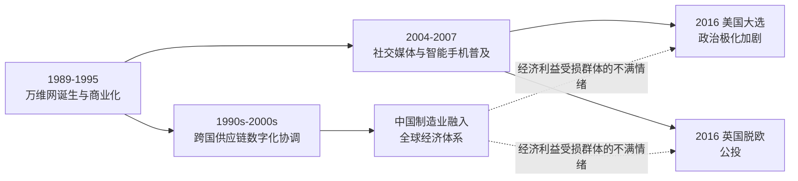

*该图展示同一套互联网基础设施如何在1990年代推动全球化经济整合，又在2010年代反过来加剧美国政治极化与英国脱欧等全球化反弹现象。*

### science_space_race_as_cold_war_proxy (0.7s)

## Science Space Race As Cold War Proxy

太空竞赛是冷战时期美苏对抗中最典型的案例：一场表面上的科学竞赛，实质上是两个超级大国争夺意识形态和军事威望的代理战场。1957年10月4日，苏联发射人类第一颗人造卫星"斯普特尼克一号"(Sputnik 1)，其技术核心——能将卫星送入轨道的洲际弹道导弹——同时证明了苏联具备打击美国本土的能力。这一事件在美国引发被称为"斯普特尼克危机"的举国震动，直接催生了1958年美国国家航空航天局(NASA)的成立，以及同年《国防教育法》对科学与工程教育的大规模拨款。科学突破与军事威慑、公众心理在此完全重合，无法分离。

这场竞赛的转折点是1961年4月12日苏联宇航员尤里·加加林成为首位进入太空的人类，再次令美国陷入落后的舆论危机。肯尼迪总统随即在1961年5月向国会提出"十年内送人登月"的目标，这并非单纯的科学规划，而是一次公开的政治承诺——用一个可验证、可计时的科学成就来重新确立美国的全球领导地位。到1969年7月20日，阿波罗11号宇航员尼尔·阿姆斯特朗踏上月球表面，美国以一次性的、不可逆的技术优势结束了这场竞赛：苏联始终未能实现载人登月。

将两国投入的资源加以对比，可以看出这场竞赛的国家战略性质：NASA的阿波罗计划总耗资约254亿美元(以1960年代币值计算)，占当时美国联邦预算的显著比例，在1966年一度达到NASA历史最高的联邦预算占比4.4%。如此规模的持续投入，若不是出于对国家安全与国际声望的迫切考量，很难在民主体制下获得国会长期支持。

在分析冷战格局时，太空竞赛提供了一个可直接检验的分析框架：判断某项"科学成就"是否具有地缘政治意义，可以追问三个问题——它是否被两国同时、公开地追求？它的技术能力是否可转化为军事能力？其结果是否被双方政府用于国内外的宣传叙事？斯普特尼克与阿波罗计划在这三项检验中全部成立，这正是它们被同时记录进"科学史"与"美苏对抗史"两条叙事线索的根本原因。

### science_cross_cutting_synthesis_1945_2025 (24.9s)

## Science Cross Cutting Synthesis 1945 2025

**定义**

1945年之后的八十年里，科学与技术不再只是七大强国兴衰的背景条件，而是决定其相对地位的主动变量。这一时期可以清晰地划分为三次交叠的技术浪潮，每一次都重新分配了经济与安全权力：第一波是计算与互联网革命（约1945—1995年），从ENIAC到个人电脑再到万维网，它决定了全球化时代谁能主导跨国生产链与金融网络；第二波是基因组学革命（约1990年至今），以1990—2003年的人类基因组计划为标志，催生了现代生物医药产业，重塑了公共卫生能力与农业生产力的国家分布；第三波是人工智能（约2010年至今，尤其2017年Transformer架构问世后加速），它同时具备经济生产力工具和军事安全工具的双重属性，因而成为下一章历史的"未定支付节点"——谁掌握了最先进的人工智能能力，谁就可能在经济与安全两个维度上同时占据优势，而这一结果尚未确定。

**实例分析**

计算革命的国家分布并不均匀：美国凭借贝尔实验室、DARPA资助的阿帕网（1969年）和硅谷的风险投资生态，在半导体与软件领域建立了持续优势；日本在1980年代一度在存储芯片制造上逼近美国，但未能在软件与互联网服务层建立同等地位；苏联/俄罗斯在军用计算与航天计算上曾具竞争力，却因体制原因未能孵化出民用信息产业，这也是苏联在冷战末期经济活力落后于西方的重要因素之一。基因组学同样呈现集中效应：人类基因组计划由美、英主导（英国桑格研究所贡献约三分之一测序工作），而21世纪初中国通过深圳华大基因迅速切入测序产业链下游，展示了后发国家如何借助已开放的科学成果实现产业追赶。

**问题解决应用**

如果要评估某国在人工智能竞赛中的相对位置，可采用与历史学家分析计算革命和基因组学革命时相同的方法：不看单一指标，而看三项互补能力是否同时具备——基础研究产出（顶级论文与专利数量）、产业转化能力（是否有企业能将模型规模化部署为产品）、以及国家资源动员能力（芯片制造、能源供给、数据获取是否受政策保障）。以此框架审视，美国在前两项领先，中国在算力基建与部署规模上迅速追赶，而欧盟、俄罗斯、日本目前均未形成完整闭环——这正是为什么人工智能被称为"开放的支付节点"：历史模式表明，只有同时具备这三项能力的国家，才能像美国在计算革命中那样，把技术优势转化为持续的经济与安全优势。

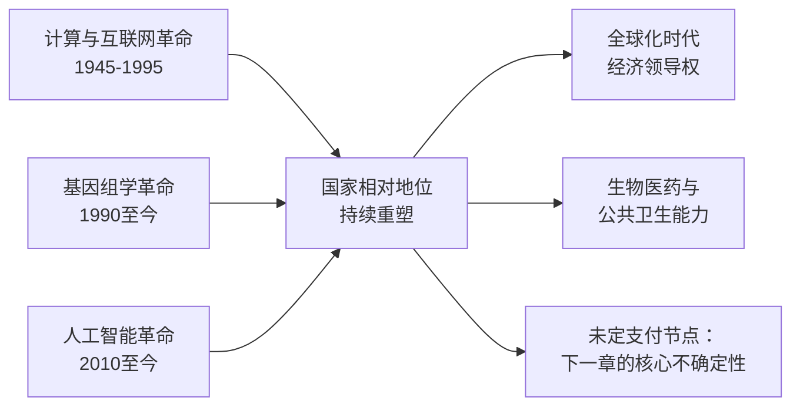

*该图展示三次技术浪潮如何交叠作用于七大强国的相对地位，其中人工智能的最终归属仍是开放变量。*

## Run complete

total: 137.2s
