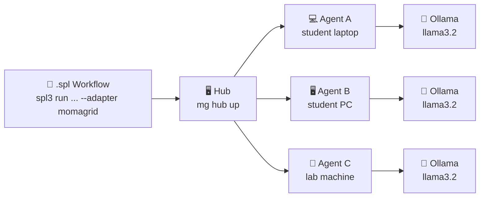

# School Momagrid — 1-Hour Setup Cheatsheet

> **Two commands to build your own AI inference network.**
> One machine runs the Hub. Every other machine joins as an Agent (spoke).
> Then anyone on the grid can run SPL workflows — no API keys, no cloud fees.

---

## Before You Start (every machine)

**1. Install Ollama** — https://ollama.com/download

```bash
ollama pull llama3.2        # ~2 GB — do this on good WiFi
ollama run llama3.2         # verify it works, then Ctrl-D to exit
```

**2. Install `mg`** (Momagrid CLI)

```bash
git clone https://github.com/digital-duck/momagrid.git
cd momagrid
go build -o mg .
ln -s $(pwd)/mg ~/.local/bin/mg   # add to PATH
mg --version                       # verify
```

---

## Step 1 — Hub Machine (one machine, usually the teacher's)

```bash
mg hub up
```

The Hub starts on port **9000**. Note the IP address shown — agents need it.

```
Hub started at http://192.168.x.x:9000   ← share this with the class
```

Check it's running:

```bash
mg status          # Hub: ok   Agents: 0
```

---

## Step 2 — Agent Machines (every student's machine)

Replace `192.168.x.x` with the Hub IP the teacher shared:

```bash
mg join http://192.168.x.x:9000
```

That's it. The machine is now a spoke in the grid.

**Verify from the Hub machine:**

```bash
mg agents
```

```
NAME          TIER    STATUS    TPS
--------------------------------
alice-laptop  GOLD    ONLINE    0.0
bob-pc        SILVER  ONLINE    0.0
...
```

---

## Step 3 — Run Your First SPL Workflow

Install the SPL Python runtime (any machine on the grid):

```bash
git clone https://github.com/digital-duck/SPL.py.git
cd SPL.py
pip install -e .
```

Run a recipe against the grid:

```bash
export MOMAGRID_HUB_URL=http://192.168.x.x:9000

spl3 run cookbook/05_self_refine/self_refine.spl \
     --adapter momagrid -m llama3.2 \
     --param topic="Why is the sky blue?"
```

Watch tasks appear on the Hub and get routed to agents:

```bash
mg tasks          # see live task dispatch
mg agents         # see which agent picked it up
```

---

## Quick Reference

| Command | What it does |
|---|---|
| `mg hub up` | Start the Hub (port 9000) |
| `mg join <url>` | Join this machine as an agent |
| `mg status` | Hub health + agent count |
| `mg agents` | List all connected agents |
| `mg tasks` | List recent tasks (id, state, agent) |
| `mg hub down` | Shut down the Hub |
| `ollama list` | Show models available on this machine |

---

## How It Works



- The Hub routes each `GENERATE` task to the first available agent.
- Agents run inference locally with Ollama — **data never leaves the school network**.
- More agents = faster parallel workflows. Add a machine anytime with `mg join`.

---

## Troubleshooting

| Symptom | Fix |
|---|---|
| `mg join` times out | Check Hub IP and that port 9000 is not blocked by firewall |
| Agent shows OFFLINE | Run `ollama serve` first, then `mg join` again |
| Tasks stuck PENDING | No agents online — run `mg agents` to confirm |
| Model not found | Run `ollama pull llama3.2` on the agent machine |

---

*SPL + Momagrid — Declare Once, Run Anywhere, on hardware you own.*
