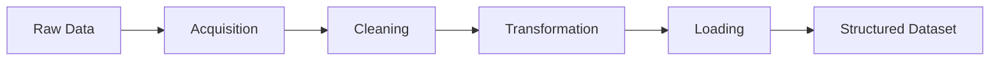
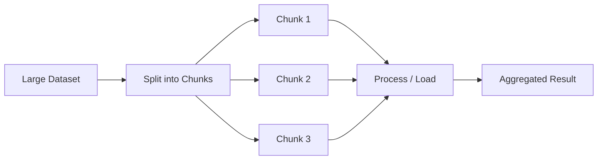
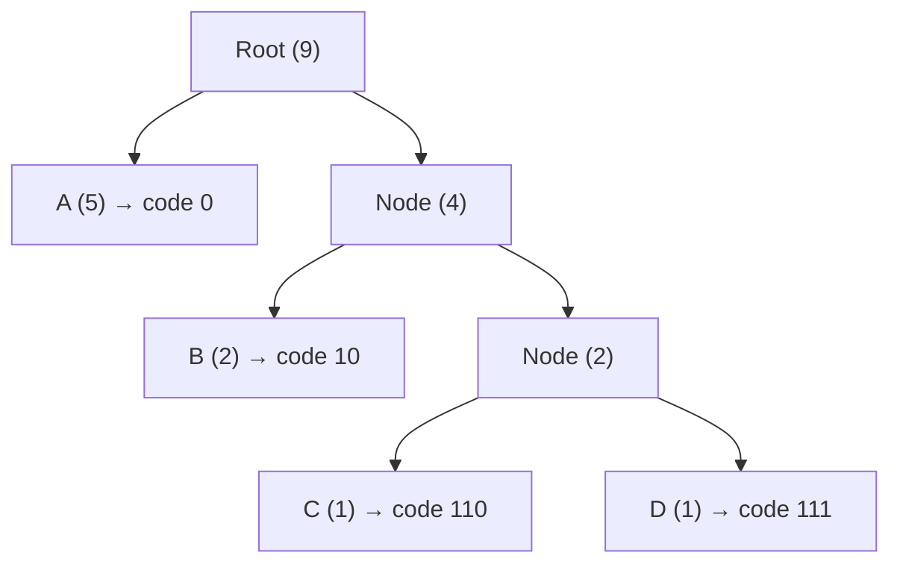
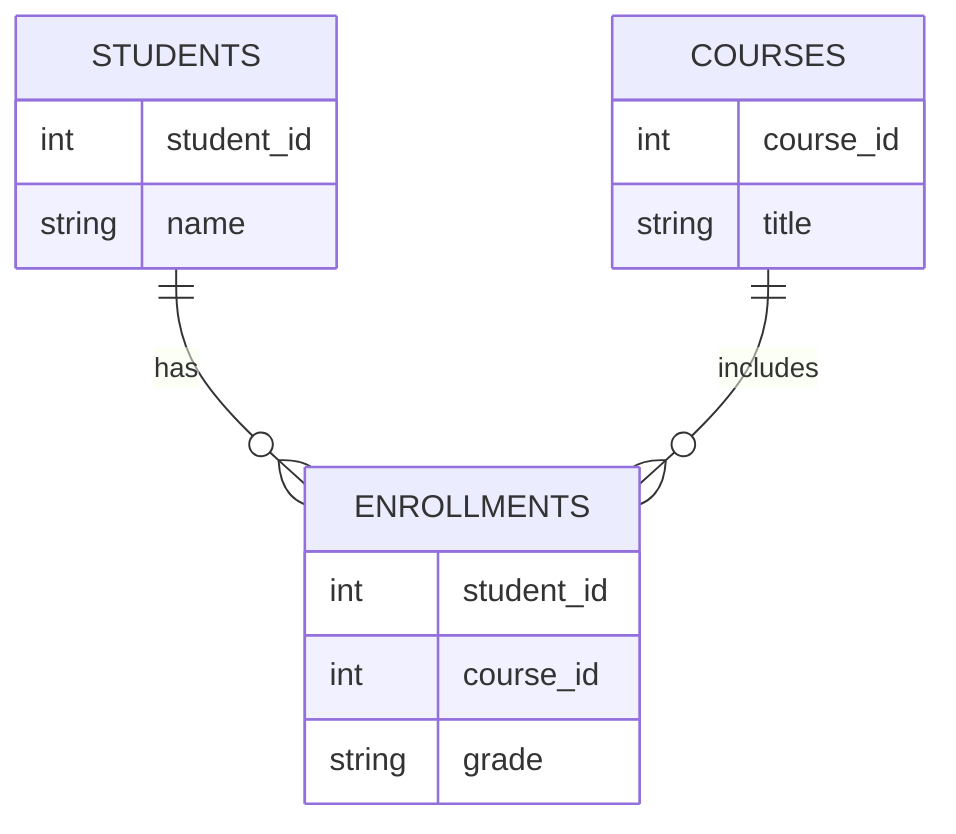
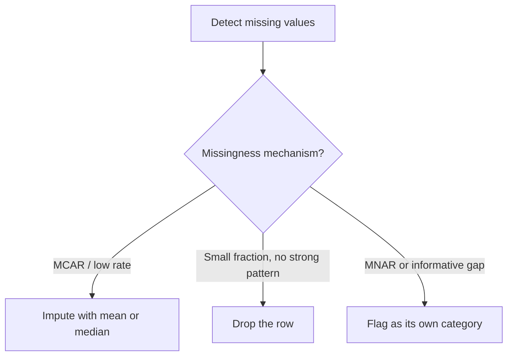
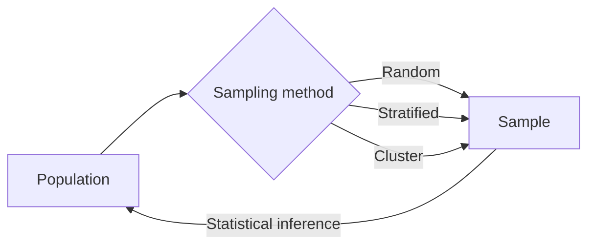

# Concept-Book Run

domain: /home/papagame/projects/digital-duck/cb-data-science/public/domains/data_science_ch02/input/graph.yaml
target: large_dataset_management
started: 2026-09-27T16:39:51

## Teaching order (14 concepts)

- big_data
- regular_expressions
- string_manipulation
- parsing_and_extraction
- data_processing
- data_storage
- cloud_computing
- data_chunking
- data_compression
- data_indexing
- dbms
- missing_data
- sampling
- large_dataset_management

### big_data (14.4s)

## Big Data

**Definition.** Big data refers to datasets so large, fast-moving, or structurally varied that conventional tools — a single database server, a spreadsheet, or an in-memory analysis script — cannot store, process, or query them within a useful time frame. The concept is commonly described through three defining characteristics, the "3 Vs": *volume* (data measured in terabytes to exabytes), *velocity* (data arriving continuously, such as sensor streams or clickstreams), and *variety* (structured tables, unstructured text, images, and log files coexisting in the same system). A dataset doesn't need to be enormous to qualify as "big data" — it only needs to exceed what a single machine can handle efficiently, which is why the threshold shifts as hardware improves.

**Worked example.** Consider a ride-sharing company recording every GPS ping from every active driver, once per second. With 500,000 drivers reporting continuously, that's roughly 43 billion location records per day. A traditional relational database, designed for transactional lookups (find one customer's order), grinds to a halt trying to ingest and query data at this rate. The company instead distributes the data across a cluster of machines using a framework like Apache Spark or Hadoop, which splits both storage and computation into parallel chunks. To find the average speed of drivers in a city during rush hour, the system doesn't scan one giant table — it distributes the query across hundreds of nodes, each handling a fraction of the data, then combines partial results.

**Problem-solving application.** When you encounter a large-scale data problem, the diagnostic question is: which "V" is the bottleneck? If it's volume, the fix is horizontal scaling — partitioning data across many machines (a technique called sharding) rather than buying one bigger server. If it's velocity, you need a stream-processing pipeline (e.g., Kafka + Spark Streaming) instead of periodic batch jobs. If it's variety, you need a flexible storage layer — a data lake that accepts raw JSON, images, and CSVs side by side — rather than forcing everything into rigid database schemas upfront. Correctly identifying the dominant constraint determines the entire system architecture, which is why "how big is the data" is really shorthand for "which processing strategy will actually work here."

### regular_expressions (14.0s)

## Regular Expressions

A regular expression (regex) is a formal language for describing patterns in text using a small alphabet of literal characters and metacharacters. Formally, regexes are equivalent to finite automata: any regular expression can be compiled into a deterministic or nondeterministic finite-state machine (DFA/NFA) that accepts exactly the strings matching the pattern. This equivalence is why regex engines run in linear or near-linear time on the input string — they are not searching blindly but stepping through states.

The core building blocks are concatenation (`ab` matches "a" followed by "b"), alternation (`a|b` matches "a" or "b"), and repetition operators: `*` (zero or more), `+` (one or more), `?` (zero or one), and `{m,n}` (between $m$ and $n$ repetitions). Character classes like `[0-9]` or `\d` match any single character from a set. Anchors `^` and `$` pin a match to the start or end of a line. Grouping with parentheses `(...)` both scopes an alternation and captures a substring for later reuse.

**Worked example.** Suppose you need to validate a simplified US phone number like `555-123-4567`. The pattern `^\d{3}-\d{3}-\d{4}$` breaks down as: `^` and `$` anchor the whole string, each `\d{3}` or `\d{4}` requires exactly that many digits, and the literal hyphens must appear in place. Testing `"555-123-4567"` against this pattern succeeds; testing `"555-123-456"` fails because the final group needs four digits, not three — the engine's internal state machine has no transition that accepts a string ending there.

**Problem-solving application.** Consider extracting all dollar amounts from a block of invoice text. The pattern `\$\d+(\.\d{2})?` matches a dollar sign, one or more digits, and an optional group of a decimal point followed by exactly two digits — capturing both `$500` and `$500.00` but rejecting malformed entries like `$5.0`. In Python:

```python
import re
text = "Total: $1200.50, Tax: $84, Fee: $5.0"
matches = re.findall(r'\$\d+(?:\.\d{2})?', text)
# matches = ['$1200.50', '$84']
```

Notice `$5.0` is correctly excluded, since `\d{2}` demands two decimal digits. This illustrates the central skill of regex problem-solving: translating an informal rule ("a dollar amount has optional cents, always two digits") into a precise, testable pattern, then verifying it against both valid and invalid cases — the same rigor used to prove an automaton accepts exactly the intended language, no more and no less.

### string_manipulation (16.0s)

## String Manipulation

A string is an ordered sequence of characters, and two operations account for most real-world text processing: **slicing**, which extracts a contiguous subsequence using index positions, and **splitting**, which divides a string into a list of substrings based on a delimiter. Both rely on the same underlying fact — strings are indexed from 0, and negative indices count backward from the end.

Slicing uses the syntax `s[start:stop:step]`, where `start` is inclusive and `stop` is exclusive. For the string `s = "concept-book"`, `s[0:7]` returns `"concept"`, and `s[-4:]` returns `"book"` by counting four characters from the end. The `step` parameter lets you skip characters or reverse a string entirely: `s[::-1]` reverses `s`. Because `stop` is exclusive, the length of a slice is always `stop - start` (when step is 1), a detail that prevents off-by-one errors once internalized.

Splitting solves a different problem: breaking a string into meaningful units. `"2026-09-27".split("-")` returns `["2026", "09", "27"]`, converting a flat string into structured fields you can index or convert to integers. `split()` with no argument splits on any whitespace and collapses repeated spaces, which is why it's the default choice for tokenizing sentences. The inverse operation, `"-".join(["2026", "09", "27"])`, reconstructs the original string, and mastering this split/join pair is essential for parsing CSV rows, log lines, or file paths.

**Worked example.** Suppose you receive a log line `"2026-09-27 14:32:01 ERROR disk full"` and need the date and the severity level. First split on whitespace with a limit: `parts = line.split(" ", maxsplit=2)` gives `["2026-09-27", "14:32:01", "ERROR disk full"]`. Then slice the first element to pull out just the year: `parts[0][:4]` yields `"2026"`. Combining split (to isolate fields) with slice (to extract sub-parts of a field) is the standard pattern for parsing semi-structured text without regular expressions.

**Problem-solving application.** Given a filename `"report_final_v3.spl"`, extract the version number as an integer. One robust approach: split on underscores to get `["report", "final", "v3.spl"]`, split the last element on `"."` to get `["v3", "spl"]`, then slice off the leading `"v"` from `"v3"` and convert with `int()`. Chaining split and slice operations like this — rather than writing a single complex expression — keeps each transformation legible and testable.

### parsing_and_extraction (13.2s)

## Parsing And Extraction

Parsing and extraction is the process of converting raw, unstructured or semi-structured text into discrete, usable values. The two workhorse techniques are **string operations** (splitting and slicing) and **regular expressions** (regex), a formal pattern language for matching sequences of characters. Splitting divides a string into a list using a delimiter; slicing pulls out a fixed-position substring by index; regex matches variable-length, rule-based patterns — dates, emails, numbers embedded in prose — that fixed-position slicing cannot handle reliably.

**Worked example.** Suppose a log line reads:

```
2026-09-27 14:03:11 ERROR user_id=4471 failed_login attempts=3
```

To get the date and time with slicing/splitting:

```python
line = "2026-09-27 14:03:11 ERROR user_id=4471 failed_login attempts=3"
date, time, level, *rest = line.split(" ")
# date = "2026-09-27", time = "14:03:11", level = "ERROR"
```

Splitting works because fields are separated by a consistent delimiter (whitespace). But `user_id=4471` is not a separate token by position — it's a key-value pair embedded inside `rest`. Regex extracts it directly:

```python
import re
match = re.search(r"user_id=(\d+)", line)
user_id = match.group(1)  # "4471"
```

Here `\d+` means "one or more digits," and the parentheses define a **capture group** — the specific substring returned by `.group(1)`. This is the essential idea behind regex: the pattern encodes a *rule* (digits, letters, repetition, optional pieces) rather than a fixed position, so it generalizes across inputs of different lengths and shapes.

**Problem-solving application.** Given a large text file with mixed-format entries, the practical workflow is: (1) identify what varies and what's constant across records, (2) use `split()` when structure is delimiter-based and uniform, (3) fall back to regex when fields are variable-length, optional, or embedded in free text, and (4) validate extracted values (e.g., cast `"4471"` to `int`, check that a date string matches `YYYY-MM-DD` before trusting it downstream). A common failure mode is applying `split()` to data that looks regular but has an inconsistent delimiter (e.g., some rows use commas, others tabs) — testing on a sample of edge-case rows before running extraction at scale avoids silent data corruption.

### data_processing (335.0s)

## Data Processing

Data processing is the pipeline that converts raw, often messy data into a structured form suitable for analysis or modeling. Raw data collected from sensors, surveys, logs, or APIs typically contains missing values, duplicates, inconsistent formats, and outliers. The pipeline follows four stages: **acquisition** (collecting data from its source), **cleaning** (handling missing or erroneous values, removing duplicates, correcting types), **transformation** (reshaping, rescaling, or recoding values into a usable format), and **loading** (storing the result in a format ready for downstream use, such as a dataframe or database table). This four-stage pipeline is the core organizing idea of data processing: every messy-data problem can be located within one of these four stages, which tells you what kind of fix is appropriate.

**Worked example.** Suppose a table of student exam scores has rows with missing scores (`NaN`) and scores recorded on inconsistent scales (some out of 100, some out of 4.0). This is a cleaning-and-transformation problem. In the cleaning stage, missing values are handled by replacing `NaN` with the column median rather than the mean, since exam scores are often skewed by a few very low outliers. In the transformation stage, the 4.0-scale scores are converted to the 100-point scale via a linear rescaling: $s_{100} = \frac{s_{4.0}}{4.0} \times 100$. Once every score sits on a common scale with no missing entries, the table is ready to load into a model or summary statistic.

**Problem-solving application.** Consider a dataset where 15% of entries in a "temperature" column are missing, and the missing entries are concentrated among readings from older sensors. A student might be tempted to simply drop those rows, but the missingness here is not random with respect to the data itself — dropping them would bias the analysis toward newer sensors, and the resulting cleaned data would misrepresent the population. The better pipeline choice is to compute the replacement value separately for each sensor group rather than using one global fill value. This illustrates the core skill of data processing: not just mechanically applying cleaning rules, but diagnosing *why* data is missing and choosing a fix that keeps the cleaned dataset representative of the original.


*The four-stage data processing pipeline from raw input to analysis-ready output.*

### data_storage (16.1s)

## Data Storage

Once a program has processed data — cleaned it, transformed it, or derived new features — that work is lost the moment the program exits, unless the results are written to a persistent file. **Data storage** is the practice of saving structured data to disk in a format that a future program (or a different tool entirely) can reliably read back. The most common vehicle for this in data analysis is the **DataFrame**, a table-like structure with labeled rows and columns, and the most common serialization format is **CSV (Comma-Separated Values)**: a plain-text file where each line is a row and each field is separated by a comma.

CSV's appeal is its simplicity and universality — it opens in Excel, Google Sheets, a text editor, or any programming language, with no proprietary software required. Its cost is that it discards information a DataFrame normally tracks, such as column data types (everything becomes text on disk) and index structure. For most workflows this tradeoff is acceptable; when it isn't, richer binary formats like Parquet or Feather preserve types and compress better, at the expense of being human-unreadable.

**Worked example.** Suppose a pandas DataFrame `sales_df` holds cleaned transaction records after removing duplicates and filling missing values:

```python
import pandas as pd

# sales_df has columns: date, region, revenue
sales_df.to_csv("cleaned_sales.csv", index=False)

# Later, in another session or another script:
reloaded = pd.read_csv("cleaned_sales.csv")
```

The `index=False` argument prevents pandas from writing an extra unnamed column for the row index — a common source of clutter in re-loaded files. On the read side, `read_csv` automatically infers types (integers, floats, strings), though dates typically need an explicit `parse_dates=["date"]` argument, since CSV has no native date type.

**Problem-solving application.** In practice, choosing a storage strategy means asking three questions: *Who will read this file next?* (a colleague using Excel favors CSV; a downstream Python pipeline processing millions of rows favors Parquet for speed and type safety). *How often will it be read versus written?* (data read many times benefits from a compressed columnar format). *Does the schema need to survive the round trip?* (CSV loses dtype and index metadata, so pipelines that depend on exact types should validate or re-cast columns after reloading, or switch formats entirely).

### cloud_computing (15.0s)

## Cloud Computing

Cloud computing is a model for delivering computing resources — servers, storage, databases, networking, and software — over the internet, where users pay for access rather than owning and maintaining the underlying hardware. Instead of a company buying and racking its own servers, it rents capacity from a provider such as Amazon Web Services, Microsoft Azure, or Google Cloud, and that capacity can be scaled up or down within minutes. This shift matters because it converts a large upfront capital expense (buying machines) into a smaller, ongoing operating expense (paying for usage), and it lets small teams access computing power that would otherwise require a data center.

Cloud services are typically organized into three layers. Infrastructure as a Service (IaaS) rents raw computing building blocks — virtual machines, storage volumes, networks — and the customer manages the operating system and applications on top. Platform as a Service (PaaS) goes further, providing a managed environment (like a database or a runtime for deploying code) so developers don't have to configure servers at all. Software as a Service (SaaS) delivers a complete application over the internet, such as Gmail or Salesforce, where the user only interacts with the finished product.

Consider a startup building a photo-sharing app. On launch day, traffic is light, so the app runs on a single small virtual server (IaaS) costing a few dollars a day. When the app goes viral and traffic spikes 100-fold overnight, the cloud provider's auto-scaling feature detects rising CPU load and automatically launches additional server instances behind a load balancer, then removes them once traffic subsides. A company that had bought physical servers sized for viral-level traffic would have wasted money every ordinary day; a company that under-provisioned would have crashed during the spike. Elastic, pay-per-use scaling solves both problems simultaneously.

In problem-solving terms, evaluating a cloud architecture means analyzing trade-offs: latency (how close is the server to the user?), cost (reserved capacity vs. on-demand pricing), and reliability (what happens if one server, or one entire data center, fails?). A well-designed cloud system distributes data across multiple physical locations and uses redundancy so that no single point of failure takes the whole service down — a discipline directly relevant to designing any large-scale, internet-facing system.

### data_chunking (14.3s)

## Data Chunking

Data chunking is the practice of dividing a large dataset or data stream into smaller, fixed- or variable-size units — called chunks — so that no single operation must hold, transmit, or process the entire dataset at once. This is a practical systems concept: the "correctness" of a chunking scheme is judged by whether it respects memory limits, preserves data integrity across boundaries, and keeps processing efficient, not by a mathematical proof.

Consider a 50 GB CSV file that must be loaded into a machine with 8 GB of RAM. Reading the whole file with `pandas.read_csv()` will exhaust memory and crash the process. Instead, you read it in chunks:

```python
import pandas as pd

total_rows = 0
for chunk in pd.read_csv("large_file.csv", chunksize=100_000):
    total_rows += len(chunk)
    # process chunk, e.g., filter, aggregate, write to database
    chunk.to_sql("staging_table", con=engine, if_exists="append")

print(total_rows)
```

Each chunk (100,000 rows here) is loaded, transformed, and released before the next one arrives, so peak memory usage stays bounded regardless of the file's total size.

Chunk size is a genuine engineering trade-off, not an arbitrary knob. Small chunks minimize memory footprint but increase overhead (more I/O calls, more function-call and network round-trip costs). Large chunks reduce overhead but risk memory pressure and longer recovery time if one chunk fails mid-process. A common problem-solving heuristic: pick a chunk size such that one chunk comfortably fits within a target fraction (e.g., 10–20%) of available RAM, then benchmark and adjust based on measured throughput.

Chunking also matters when boundaries carry meaning. If you split a text corpus for a search index, cutting mid-sentence can destroy semantic units; a common fix is to chunk by paragraph or sentence with a small **overlap** (e.g., the last 50 words of chunk $n$ repeated at the start of chunk $n+1$) so that context spanning a boundary is not lost. In distributed systems, chunking additionally enables parallelism: independent chunks can be processed on separate workers simultaneously, which is why frameworks like Hadoop, Spark, and cloud object storage (e.g., splitting files into 64–128 MB blocks) chunk data by default — chunk boundaries double as units of parallel work distribution.



*A large dataset is split into chunks, processed independently (in sequence or in parallel), and combined into a final result.*

### data_compression (14.1s)

## Data Compression

Data compression reduces the number of bits needed to represent information. **Lossless compression** guarantees exact reconstruction of the original data (required for text, code, and executables), while **lossy compression** discards perceptually less important information to achieve much higher reduction (used for images, audio, and video, e.g., JPEG or MP3). The theoretical floor for lossless compression is set by Claude Shannon's source coding theorem: for a source emitting symbols with probabilities $p_i$, the minimum average number of bits per symbol is the entropy

$$H = -\sum_i p_i \log_2 p_i.$$

No lossless code can do better than $H$ bits per symbol on average; a good compressor tries to get close to it.

**Huffman coding**, a classic lossless algorithm, achieves near-entropy performance by assigning shorter binary codes to more frequent symbols. It builds a binary tree bottom-up: repeatedly take the two least-frequent nodes (symbols or merged groups), combine them into a new node whose frequency is their sum, and repeat until one root remains. The path from root to each leaf, reading left = 0 and right = 1, gives that symbol's code — no code is a prefix of another, so a decoder can read a bit stream unambiguously without delimiters.

**Worked example.** Suppose a message uses symbols A (frequency 5), B (2), C (1), D (1). Merge C and D first (sum 2), then merge that pair with B (sum 4), then merge with A (sum 9). Reading tree paths gives codes: A = 0 (1 bit), B = 10, C = 110, D = 111. The average code length is $(5\cdot1 + 2\cdot2 + 1\cdot3 + 1\cdot3)/9 \approx 1.67$ bits/symbol, versus 2 bits/symbol for a fixed-length code — a real, computable saving.


*Huffman tree construction: merging the two lowest-frequency nodes at each step yields shorter codes for frequent symbols.*

**Problem-solving application:** given a frequency table, build the Huffman tree, derive codes, and compute the compression ratio versus fixed-length encoding — a standard exercise in evaluating whether a compression scheme approaches the entropy bound $H$.

### data_indexing (17.7s)

## Data Indexing

A database index is an auxiliary data structure that maps values of one or more columns to the physical location of the corresponding rows, so that the database engine can locate matching records without scanning every row in a table. Without an index, a query like "find the customer with `id = 4821`" requires a full table scan — an $O(n)$ operation where $n$ is the number of rows. With an index built on a balanced search structure, the same lookup drops to $O(\log n)$. This distinction is not cosmetic: for a table with $10^8$ rows, it is the difference between comparing roughly 100 million rows versus about 27.

Most production databases (PostgreSQL, MySQL, Oracle) implement indexes using a **B-tree** (or its variant, the B+tree), a self-balancing tree where each node holds multiple keys and pointers, and all leaves sit at the same depth. A B-tree of order $m$ guarantees that every internal node has between $\lceil m/2 \rceil$ and $m$ children, which bounds the tree's height at $O(\log_m n)$ — crucially, this base-$m$ logarithm (rather than base-2, as in a binary tree) means the tree stays shallow even for huge tables, minimizing the number of slow disk reads needed per lookup. For exact-match lookups on non-range queries (e.g., hash-map-style key retrieval), some engines instead use a **hash index**, giving expected $O(1)$ lookup but no support for range queries like `WHERE age BETWEEN 20 AND 30`, since a hash function destroys ordering.

Consider a table `orders(order_id, customer_id, order_date, total)` with 50 million rows. A query filtering `WHERE customer_id = 4821` without an index forces a sequential scan of all 50 million rows. Creating `CREATE INDEX idx_customer ON orders(customer_id)` builds a B+tree keyed on `customer_id`; the query planner then traverses roughly $\log_{100}(50{,}000{,}000) \approx 4$ node accesses to locate matching rows.

The tradeoff is write cost: every `INSERT` or `UPDATE` must also update the index, at $O(\log n)$ per index — so tables with many indexes suffer slower writes. The practical design problem is therefore not "index everything" but choosing indexes that match the actual query workload: index columns used in `WHERE`, `JOIN`, and `ORDER BY` clauses, and consider composite indexes when queries filter on multiple columns together, since a composite index's column order determines which query patterns it can serve efficiently.

### dbms (14.7s)

## Dbms

A database management system (DBMS) is software that sits between raw data files and the applications that need them, providing controlled, efficient, and concurrent access to structured data. Rather than letting programs read and write flat files directly — which invites duplication, corruption, and inconsistent updates — a DBMS enforces a schema, manages transactions, and answers queries expressed in a declarative language such as SQL. The relational model, the dominant paradigm since the 1970s, organizes data into tables (relations) of rows (tuples) and columns (attributes), with keys establishing both identity and relationships between tables.

**Worked example.** Consider a university tracking students and enrollments. A naive design might store a student's course list as a comma-separated text field: `"CS101, MATH201, PHYS150"`. This violates *first normal form*, which requires every attribute to hold a single, atomic value. The relational fix splits the data into two tables: `Students(student_id, name)` and `Enrollments(student_id, course_id, grade)`, linked by the shared key `student_id`. Now a query like "list all students enrolled in CS101" is a simple join:

```sql
SELECT s.name
FROM Students s
JOIN Enrollments e ON s.student_id = e.student_id
WHERE e.course_id = 'CS101';
```

This structure also prevents *update anomalies*: changing a student's name requires editing exactly one row, not searching through scattered text fields.

**Problem-solving application.** The deeper discipline here is normalization — a sequence of design rules (1NF, 2NF, 3NF, and beyond) that eliminate redundancy by ensuring every non-key attribute depends on "the key, the whole key, and nothing but the key." A common exercise: given a table `Orders(order_id, customer_name, customer_address, product, price)`, notice that `customer_address` depends only on `customer_name`, not on the full key. This is a 2NF violation, and the fix is to extract a separate `Customers` table. Beyond schema design, DBMSs guarantee **ACID** properties for transactions — Atomicity, Consistency, Isolation, Durability — which is why a bank transfer either fully completes or fully fails, never leaving money in limbo. Choosing between a relational DBMS and a NoSQL alternative (document, key-value, or graph stores) is itself a problem-solving decision, driven by whether the data is highly structured and relationship-heavy (favoring relational) or schema-flexible and horizontally scalable (favoring NoSQL).


*Entity-relationship diagram showing how normalization separates students, courses, and enrollments into linked tables to avoid redundancy.*

### missing_data (13.2s)

## Missing Data

Real-world datasets are almost never complete. **Missing data** refers to values absent from a dataset due to collection errors, sensor failure, data corruption, or nonresponse (e.g., a survey participant skipping a question). How you handle missingness can silently distort every downstream statistic or model, so the first step is always diagnosis, not repair.

Statisticians classify missingness into three mechanisms. Data is **Missing Completely at Random (MCAR)** if the probability of a value being missing is unrelated to any observed or unobserved variable — like a lab technician randomly dropping test tubes. It is **Missing at Random (MAR)** if the missingness depends on *other observed* variables — for example, older survey respondents are less likely to report income, but conditional on age, the missingness is random. It is **Missing Not at Random (MNAR)** if the missingness depends on the missing value itself — such as people with very high incomes being less likely to disclose them. This taxonomy matters because it determines whether a fix will introduce bias: imputing under an MCAR or MAR assumption is defensible, but imputing MNAR data can systematically distort the true distribution.

**Worked example**: Suppose a clinical dataset of 1,000 patients has blood pressure missing for 50 records. If missingness correlates with age (older patients skip the measurement more often, but age is recorded), this is MAR. A reasonable fix is to impute blood pressure using a regression on age and other observed covariates, rather than a single global mean, which would ignore the age-dependent pattern and bias estimates for older patients.

**Problem-solving application**: Given a new dataset, first quantify missingness per column (percentage missing), then test whether missingness correlates with other observed features (e.g., via group comparisons or a logistic regression predicting "is missing"). Use this evidence to choose a strategy: mean/median imputation for MCAR features with low missing rates, model-based imputation for MAR, and explicit "missing" flag categories or domain-specific handling for suspected MNAR, since no imputation can fully recover information that is missing precisely because of its own value.


*Decision flow for choosing a missing-data strategy based on the underlying mechanism.*

### sampling (15.4s)

## Sampling

Sampling is the process of selecting a subset — a **sample** — from a larger group of interest, called the **population**, in order to draw conclusions about that population without examining every member of it. Sampling matters because measuring an entire population is often impossible (testing every unit off a production line would destroy the product) or impractical (surveying every voter in a country before an election). The central mathematical concern is not just *how* to pick the subset, but how to pick it so that conclusions drawn from it can be trusted to generalize.

Three sampling designs recur constantly. **Simple random sampling** gives every member of the population an equal chance of selection, typically via a random number generator indexing a numbered list of the population. **Stratified sampling** first divides the population into homogeneous subgroups (strata) — say, by grade level or income bracket — then randomly samples within each stratum, guaranteeing representation across groups that a pure random draw might miss by chance. **Cluster sampling** divides the population into naturally occurring groups (clusters, such as classrooms or city blocks), randomly selects whole clusters, and samples everyone within them — useful when a full population list doesn't exist but a list of clusters does.

**Worked example.** A school district with 4,000 students wants to estimate the proportion who eat breakfast daily. Suppose the true (unknown) population proportion is $p = 0.55$. If a simple random sample of $n = 200$ students is drawn, the sample proportion $\hat{p}$ is a random variable with standard error $\text{SE}(\hat{p}) = \sqrt{\frac{p(1-p)}{n}} = \sqrt{\frac{0.55 \times 0.45}{200}} \approx 0.035$. This tells us that even with unbiased sampling, $\hat{p}$ will typically land within about $2 \times 0.035 \approx 7$ percentage points of 0.55 in roughly 95% of samples — quantifying the unavoidable *sampling error* introduced by measuring a subset rather than the whole.

**Problem-solving application.** If the district instead stratifies by grade (elementary, middle, high school) before sampling within each stratum, the standard error shrinks whenever breakfast habits differ systematically by grade — stratification removes between-group variance from the error term, tightening the estimate for the same sample size. Choosing a sampling design is therefore a direct trade-off between cost, feasibility, and the precision of the inference it permits.


*A sample is drawn as a subset of the population via a random, stratified, or cluster method, and statistical inference projects findings from the sample back onto the population.*

### large_dataset_management (15.5s)

## Large Dataset Management

Modern datasets routinely exceed the capacity of a single machine's memory or even its disk, forcing a shift from "load it all and compute" to a coordinated pipeline: **compression** shrinks data on disk and in transit, **storage solutions** (distributed file systems, object stores) hold it durably across many machines, **indexing** enables fast lookup without scanning everything, **chunking** breaks data into processable units, **DBMS** organize and query it, and **cloud computing** supplies elastic resources on demand. No single technique solves the scale problem alone — they compose.

Consider a dataset of 50 TB of genomic sequencing reads. Stored raw, it would take days to transfer and cost a fortune to keep on fast disks. Applying compression (e.g., gzip or a domain-specific codec) might reduce it to 12 TB. Because no single server holds 12 TB affordably with redundancy, the data is partitioned into **chunks** — say, 128 MB blocks — and distributed across a cluster using a system like HDFS or Amazon S3, where each chunk is replicated three times for fault tolerance. To find all reads matching a genetic marker without scanning 12 TB, an **index** (a B-tree or inverted index mapping markers to chunk locations) narrows the search to a handful of chunks. A **DBMS** built on top (e.g., a NoSQL store or a query engine like Spark SQL) lets analysts express "find reads from chromosome 7 with mutation X" declaratively, and the underlying engine uses the index and chunk metadata to skip 99% of the data. Finally, **cloud computing** allows the lab to rent 200 compute nodes for the four hours needed to run this query, rather than owning that hardware permanently.

The problem-solving skill here is matching technique to bottleneck. If the constraint is network bandwidth, prioritize compression. If it's query latency, prioritize indexing. If it's fault tolerance, prioritize replication and chunk placement strategy. If it's cost, prioritize cloud elasticity — scale compute up only during the query window, then release it. A common student mistake is treating these as interchangeable "big data tools" rather than diagnosing which specific constraint (storage cost, I/O throughput, query speed, availability) a given dataset is hitting, then choosing accordingly.


*The pipeline transforming a raw large dataset into a queryable, scalable system: each stage addresses a distinct bottleneck (size, distribution, retrieval speed, and elastic compute).*

## Run complete

total: 553.4s
