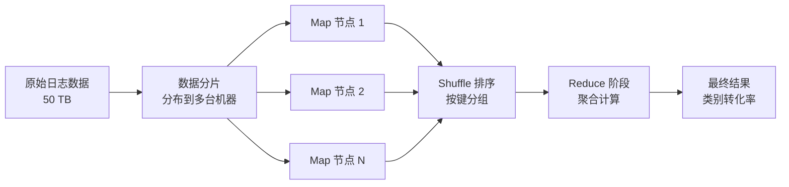
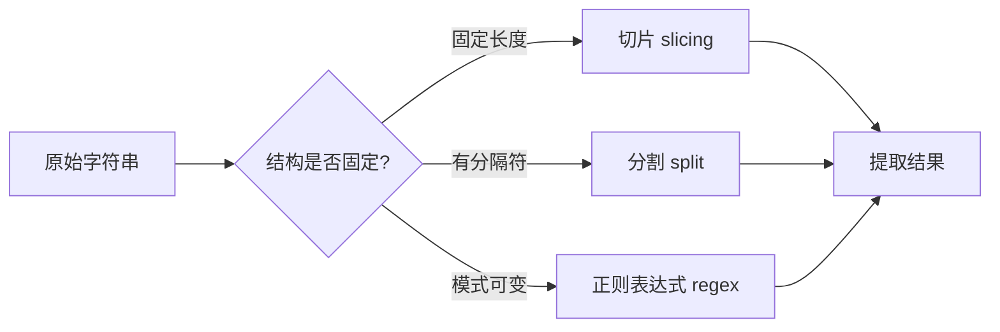
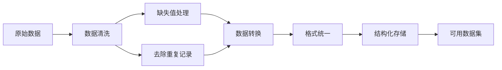
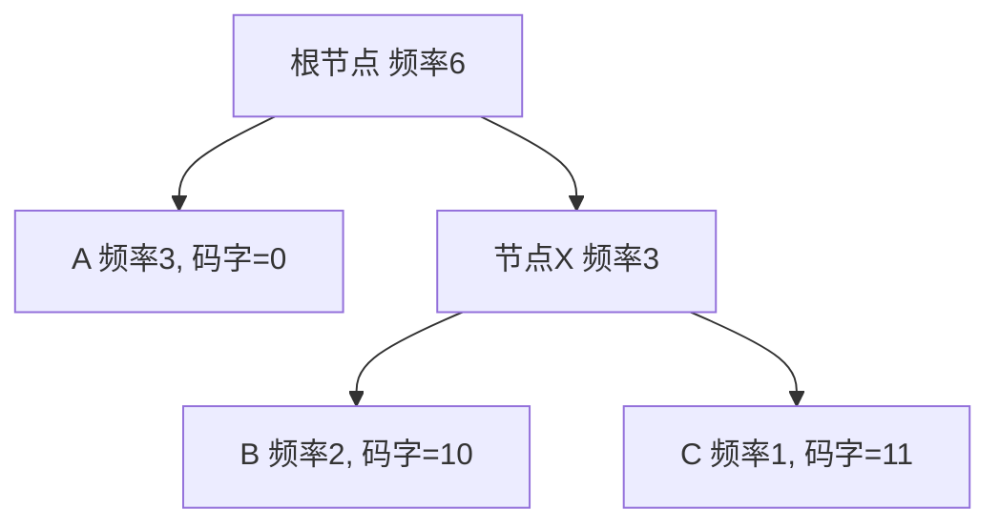
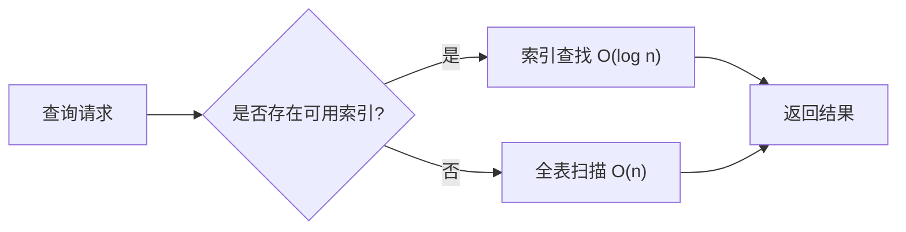
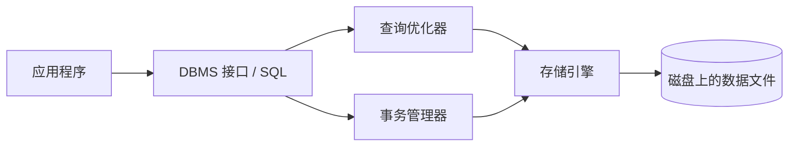
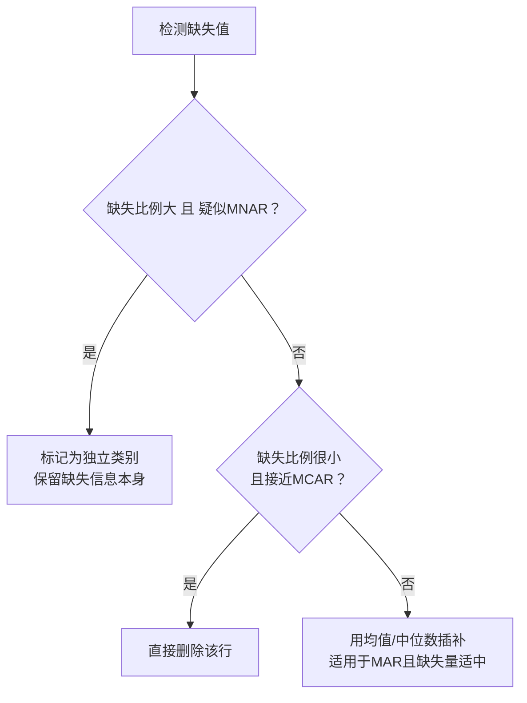
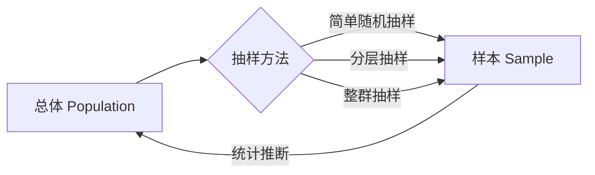

# Concept-Book Run

domain: /home/papagame/projects/digital-duck/cb-data-science/public/domains/data_science_ch02/input/graph.yaml
target: large_dataset_management
started: 2026-09-28T00:40:25

## Teaching order (14 concepts)

- big_data
- regular_expressions
- string_manipulation
- parsing_and_extraction
- data_processing
- data_storage
- cloud_computing
- data_chunking
- data_compression
- data_indexing
- dbms
- missing_data
- sampling
- large_dataset_management

### big_data (18.8s)

## Big Data

**定义**：大数据是指规模庞大、结构复杂、增长速度极快，以至于传统数据库和处理工具（如单机关系型数据库、Excel）无法在合理时间内存储、管理或分析的数据集合。业界常用"5V"来刻画其本质特征：Volume（体量，通常指 TB 至 PB 级别）、Velocity（速度，数据实时或近实时产生）、Variety（多样性，包含结构化表格、非结构化文本、图像、日志等）、Veracity（真实性，数据存在噪声与不确定性）、Value（价值，需从海量原始数据中提炼出有用信息）。判断一个数据集"是不是大数据"的关键不在于绝对字节数，而在于：单台机器的内存和计算能力是否足以在可接受时间内完成处理。

**应用场景**：以某电商平台为例，其每天产生的用户点击流日志约 50 TB，包含用户 ID、时间戳、商品 ID、页面停留时长等字段。若要计算"过去 30 天内每个商品类别的平均转化率"，传统做法是把所有数据读入内存后用一个 SQL 查询完成——但 50 TB × 30 天远超任何单机内存容量。工程团队采用的解决方案是 **MapReduce 范式**：将任务拆分为 Map 阶段（在数千台机器上并行读取本地数据分片，输出 `(商品类别, (点击, 转化)) ` 键值对）和 Reduce 阶段（按类别聚合所有 Map 输出，计算最终转化率）。这种"分而治之"的思路使得处理时间从理论上单机需要的数周，缩短到数百台机器并行后的几十分钟。

**解决问题的关键判断**：面对一个新的数据分析任务，判断是否需要"大数据"方案，可以用一个简单的经验法则——若数据集大小超过可用内存的 10 倍以上，或查询延迟要求（如实时推荐）无法容忍全量扫描，就应考虑分布式存储（如 HDFS）与分布式计算框架（如 Spark、Hadoop）。反之，若数据集在数 GB 量级、可一次性载入 Pandas DataFrame 完成分析，则引入大数据基础设施反而增加不必要的运维复杂度与延迟开销。这种"先估算规模、再选工具"的思维方式，是解决实际数据问题的第一步。


*该图展示了 MapReduce 处理大规模数据的整体流程：数据先被拆分并行处理（Map），再按键归并聚合（Reduce），最终得到统计结果。*

### regular_expressions (17.7s)

## Regular Expressions（正则表达式）

**定义**

正则表达式（regular expression，简称 regex）是一种用特定符号序列描述文本模式的语言，用于在字符串中进行匹配、查找、替换或提取操作。它本质上是一套微型的模式匹配语法：字母和数字按字面匹配自身，而一组"元字符"（metacharacters）则表达更抽象的规则，例如：`.` 匹配任意单个字符，`*` 表示前一个元素重复零次或多次，`+` 表示重复一次或多次，`\d` 匹配任意数字，`[abc]` 匹配方括号内任一字符，`^` 和 `$` 分别锚定字符串的开头和结尾。正则表达式的理论基础是形式语言中的"正则语言"（regular language），它恰好是有限状态自动机（finite automaton）所能识别的语言类别——这也是为什么几乎所有编程语言的正则表达式引擎在底层都会将模式编译为一台状态机。

**实例演示**

假设要从一段文本中提取所有邮箱地址。用 Python 的 `re` 模块：

```python
import re

text = "联系方式：alice@example.com 或 bob.smith@company.org"
pattern = r'[\w.]+@[\w.]+\.\w+'
matches = re.findall(pattern, text)
print(matches)  # ['alice@example.com', 'bob.smith@company.org']
```

这里 `[\w.]+` 表示"由字母、数字、下划线或点组成，且至少出现一次"，`@` 按字面匹配，`\w+` 匹配域名主体，`\.\w+` 匹配顶级域名（如 `.com`）。

**问题求解应用**

正则表达式最常见的实际用途是数据清洗与校验。例如验证用户输入的手机号是否符合"11位数字，以1开头"的格式：`^1\d{10}$`；从日志文件中批量提取所有形如 `ERROR: ...` 的行；或者用 `re.sub()` 将文本中所有连续空白字符替换为单个空格，实现文本标准化。掌握正则表达式的关键在于练习"分解模式"的思维：先明确要匹配内容的结构特征（固定字符、可变字符、重复次数、边界条件），再逐段用相应元字符表达，最后用真实数据反复测试和调整，因为正则表达式极易因边界情况（如空字符串、特殊符号）而出现意料之外的匹配结果。

### string_manipulation (15.0s)

## String Manipulation

字符串（string）是由字符组成的有序序列。字符串操作中最基础也最常用的两类技术是**切片（slicing）**——按索引范围提取子串，以及**分割（splitting）**——按照某个分隔符将字符串拆分成多个部分。掌握这两者是处理文本数据、解析用户输入、清洗数据集的前提。

在大多数编程语言中，字符串是**可索引的**：每个字符都有一个从 $0$ 开始的位置编号。切片操作通常写作 `s[start:end]`，其含义是取出从索引 `start`（含）到 `end`（不含）之间的字符子序列，即数学上表示为区间 $[\text{start}, \text{end})$。例如，若 $s = \texttt{"digital"}$，则 $s[0:3]$ 返回 `"dig"`——注意结果长度为 $\text{end} - \text{start} = 3$，而不是 $4$。这种"左闭右开"的约定是理解切片时最容易出错、也最需要牢记的规则。

分割操作则是切片的逆过程之一：给定一个分隔符（如空格、逗号），将字符串拆分为一个子串列表。例如 `"2026-09-27".split("-")` 返回 `["2026", "09", "27"]`。分割后常需要对每个片段做去除首尾空白（trim）等清洗处理。

**工程实践示例**：假设我们要从日志行 `"2026-09-27 12:03:11 ERROR disk full"` 中提取时间戳与日志级别。

```python
line = "2026-09-27 12:03:11 ERROR disk full"
parts = line.split(" ")          # 分割：按空格拆分
date, time, level = parts[0], parts[1], parts[2]
message = " ".join(parts[3:])    # 切片：取剩余部分并重新拼接
year = date[0:4]                 # 切片：提取年份子串
```

这里体现了分割与切片的典型协作方式：先用 `split` 把结构化文本拆成字段，再用切片进一步提取字段内部的子结构（如年份），最后用切片 `parts[3:]` 取出"从第 4 个元素到末尾"的所有剩余片段。

**常见陷阱**：切片索引越界不会报错，而是自动截断到字符串边界（例如 $s[0:100]$ 在 $s$ 只有 7 个字符时仍返回整个字符串），这与许多语言中数组越界会抛出异常的行为不同，务必在设计解析逻辑时加以验证。

### parsing_and_extraction (18.6s)

## Parsing And Extraction

**定义**

解析与提取（Parsing and Extraction）指的是从非结构化或半结构化的数据（如字符串、日志文件、网页文本）中，系统性地识别并取出所需信息的过程。核心技术包括三类：**切片（slicing）**——按位置截取子串；**分割（splitting）**——依据分隔符将字符串拆分为若干片段；以及**正则表达式（regular expressions, regex）**——用一套形式化的模式语言描述字符串的结构规律，从而匹配、定位或替换符合规律的文本。这三种技术并非互斥，而是按数据结构化程度递进使用：结构固定时用切片，分隔符明确时用分割，模式复杂多变时用正则。

**基本原理与形式化表示**

正则表达式本质上是一种描述**正规语言（regular language）**的代数系统，由有限状态自动机（finite automaton）在计算上等价实现。一个正则表达式 $r$ 可以递归定义为：单个字符 $a$、空串 $\varepsilon$、拼接 $r_1 r_2$、选择 $r_1 \mid r_2$，以及闭包 $r^*$（表示重复零次或多次）。例如日期格式 `YYYY-MM-DD` 可写作：
$$
\text{[0-9]}^{4}-\text{[0-9]}^{2}-\text{[0-9]}^{2}
$$
其中 `[0-9]` 表示字符类（选择的简写），指数记法表示固定次数的拼接。这一形式化背景解释了为什么正则表达式匹配的时间复杂度可以做到与输入长度 $n$ 成线性关系 $O(n)$（基于 Thompson 构造的 NFA 算法），而某些引擎（如支持回溯的 PCRE）在病态模式下会退化为指数级 $O(2^n)$——这正是实践中需警惕"灾难性回溯（catastrophic backtracking）"的理论根源。

**问题求解应用**

给定日志行：
```python
log = "2026-09-27 14:03:11 ERROR user=42 msg='connection timeout'"
```
若仅需日期与时间，可用切片：`log[:19]`。若需按空格分割出字段：`log.split(" ", 3)` 得到前缀信息与消息体。若需精确提取 `user=` 后的数字，则正则更可靠：
```python
import re
m = re.search(r"user=(\d+)", log)
user_id = m.group(1)  # "42"
```
括号构成的**捕获组（capture group）**是正则超越简单分割的关键：它允许在匹配整体模式的同时，精确锚定并返回内部子结构，即使字段顺序或周边文本发生变化也不受影响。


*该图展示根据数据结构规律性选择切片、分割或正则表达式的决策路径。*

### data_processing (15.4s)

## Data Processing

数据处理是指对原始数据进行清洗、转换，使其成为结构化、可用格式的系统性过程。原始数据往往存在缺失值、重复记录、格式不一致或明显错误，若不加处理直接用于分析，会导致结论失真——这一原则常被概括为"垃圾进，垃圾出"（garbage in, garbage out）。数据处理通常包含四个核心步骤：**采集**（collection）、**清洗**（cleaning）、**转换**（transformation）与**结构化存储**（structuring）。

以一个具体场景为例：某电商平台收集用户订单数据，原始记录中电话号码格式混乱（有的带国家区号，有的不带）、部分订单缺少省份字段、同一用户因重复提交产生了重复订单。数据处理流程需要：首先识别并删除重复记录；其次对缺失的省份字段，可根据用户历史地址进行填补，或统一标记为"未知"以便后续单独处理；再次将电话号码统一转换为标准格式（如统一加上"+86"前缀）；最后将处理后的数据按照"用户ID、订单号、金额、省份、时间戳"的结构存入数据库表中，供后续查询与分析使用。

在问题解决层面，数据处理的关键在于**建立可重复、可追溯的处理规则**，而非临时性的手工修补。例如，面对缺失值问题，需要先判断缺失机制：如果数据是完全随机缺失，可直接删除该行不会引入偏差；但如果缺失与某个变量相关（例如高收入用户更倾向于不填写收入字段），删除会导致样本偏倚，此时更合理的做法是用回归模型或该字段的中位数进行填补，并记录填补方法以便复现。此外，转换步骤中的单位统一（如温度换算为摄氏度、日期统一为 ISO 8601 格式 `YYYY-MM-DD`）也是保证跨数据源可比较性的关键环节。掌握这一流程，是后续进行数据分析、建立机器学习模型或数据库设计的前提基础。



*该图展示了数据处理的典型流程：从原始数据出发，经过清洗（含缺失值处理与去重）、转换（含格式统一），最终得到结构化的可用数据集。*

### data_storage (16.1s)

## Data Storage

数据存储指将处理后的数据以结构化、可复用的格式持久化保存,以便后续分析、共享或建模使用。在数据分析流程中,原始数据经过清洗、转换、特征工程等步骤后,若不加以保存,每次分析都需要重新执行整个处理流程,浪费计算资源与时间。因此,选择合适的存储格式并正确保存数据,是数据分析工作流中承上启下的关键环节。

常见的存储格式包括 CSV(逗号分隔值)、JSON、Parquet 和数据库表。CSV 格式简单、通用性强,几乎所有数据分析工具都能读取,适合中小规模的表格数据;但它不保存数据类型信息,且不支持嵌套结构。Parquet 是一种列式存储格式,压缩率高、读取速度快,适合大规模数据集与分布式计算场景。选择格式时需权衡:文件大小、读写速度、跨平台兼容性,以及是否需要保留数据类型(如日期、分类变量)。

**实例演示**:假设我们用 pandas 处理了一份销售数据,清洗后得到一个 DataFrame,现在需要保存以便下次直接调用:

```python
import pandas as pd

# 假设 df 是清洗后的销售数据
df = pd.DataFrame({
    "日期": pd.to_datetime(["2026-01-01", "2026-01-02"]),
    "销售额": [1200.5, 980.0],
    "地区": ["华东", "华南"]
})

# 保存为 CSV,不保存索引列
df.to_csv("sales_clean.csv", index=False)

# 读取时需重新指定日期列类型
df_loaded = pd.read_csv("sales_clean.csv", parse_dates=["日期"])
```

注意 `index=False` 避免多余的索引列被写入文件;而读取 CSV 时,日期列会被还原为字符串,需要通过 `parse_dates` 参数显式转换,这正是 CSV 格式"不保存数据类型"这一局限的体现。

**问题解决应用**:在实际项目中,若数据集包含大量分类变量或需要长期归档且频繁读取,应优先选用 Parquet(`df.to_parquet("sales.parquet")`),因为它能原生保留数据类型并大幅缩短读取时间;若仅是临时导出给非技术人员用 Excel 打开查看,CSV 则是更合适的选择。判断存储格式的原则是:先明确"谁在什么场景下会再次使用这份数据",再反推所需的格式特性。

### cloud_computing (17.1s)

## Cloud Computing（云计算）

云计算是指通过互联网按需交付计算资源——包括存储、处理能力、数据库和软件应用——而无需用户自行采购和维护物理硬件的模式。其核心特征可以归纳为三点：按需自助服务（用户可自行申请资源，无需人工审批）、弹性伸缩（资源可根据负载自动增减）、按使用量计费（用户只为实际消耗的资源付费，而非固定资产投入）。云计算通常分为三种服务模型：IaaS（基础设施即服务，如虚拟机、网络）、PaaS（平台即服务，提供开发运行环境）、SaaS（软件即服务，如在线邮箱、协同文档）。

**实例分析**：设想一家初创电商公司在“双十一”促销期间，网站访问量可能是平时的50倍。如果采用自建服务器的传统模式，公司必须提前采购足以应对峰值流量的硬件，但这些设备在平日会大量闲置，造成资源浪费。而采用云计算（如AWS、阿里云或Azure），公司可以配置自动伸缩规则：当每秒请求数超过某阈值时，系统自动增加虚拟服务器实例；促销结束后，多余实例自动释放，公司只需为实际使用的计算时长付费。这正是云计算相较于本地部署的关键优势——将固定资本支出（CapEx）转化为可变运营支出（OpEx）。

**问题解决应用**：在实际架构设计中，工程师需要根据业务场景选择合适的服务模型与部署策略。例如，一个中小企业若只想快速上线一套客户关系管理系统而不涉及底层运维，应选择SaaS（如Salesforce）；若企业需要自主部署定制化机器学习训练环境，则更适合IaaS，以获得对操作系统和计算资源的完全控制权。此外，云计算还引入了新的工程权衡：延迟与成本的平衡（数据中心地理位置的选择）、单一云厂商锁定风险（vendor lock-in，可通过多云或混合云策略缓解）、以及数据安全与合规性问题（如医疗、金融行业需满足特定地域的数据存储法规）。理解这些权衡，是将云计算从抽象概念转化为可落地系统设计能力的关键一步。

### data_chunking (19.0s)

## Data Chunking（数据分块）

**定义**

数据分块（Data Chunking）是指将大规模数据集切分成若干较小、可独立处理的片段（chunk）的技术。当数据量超出内存容量、网络传输限制或单次计算能力时，直接整体加载或处理往往不可行；分块使得系统可以逐块读取、逐块计算、逐块存储，从而将原本受限于硬件资源的任务变为可扩展、可并行、可容错的流程。分块大小的选择本质上是一种权衡：块太大会重现"内存不足"的问题；块太小则会因频繁的读写、网络往返或函数调用开销而降低整体吞吐率。

**实例演示**

设想处理一份 50GB 的用户日志文件，而运行环境只有 8GB 可用内存。若尝试用 `read()` 一次性读入整个文件，程序会因内存溢出而崩溃。分块方案则是按固定字节数或按行数迭代读取：

```python
CHUNK_SIZE = 100_000  # 每块行数

def process_in_chunks(filepath):
    with open(filepath) as f:
        chunk = []
        for line in f:
            chunk.append(line)
            if len(chunk) == CHUNK_SIZE:
                analyze(chunk)   # 处理一个块
                chunk = []       # 释放内存,开始下一块
        if chunk:
            analyze(chunk)       # 处理剩余数据
```

每次循环只在内存中保留一个块的数据，处理完立即释放，内存占用被稳定控制在可预测范围内，而不随文件总大小增长。

**问题解决中的应用**

在实际数据工程中，分块策略需要结合具体约束来设计。例如，在向大语言模型（LLM）提交长文档做摘要时，若文档超过模型的上下文窗口限制（如 8000 token），必须先分块，再对每块结果做二次汇总（即"map-reduce"式处理）。此时分块边界的选择很关键：简单按字符数切分可能把一个完整句子甚至一个语义单元硬生生截断，导致上下文丢失；更好的做法是按段落或语义边界分块，并在相邻块之间保留少量重叠（overlap），以保证跨块的上下文连续性。

在分布式系统中（如 MapReduce、Spark），分块还决定了并行度：每个块可分配给不同的计算节点独立处理，最终再合并结果。这时分块大小需要与集群的节点数、网络带宽、任务调度开销共同权衡，才能使整体处理时间最小化。可以说，选择合适的分块粒度，是在"内存/带宽约束"与"处理效率"之间寻找最优平衡点的核心工程决策。

### data_compression (17.4s)

## Data Compression

数据压缩是指在保留信息完整性（无损）或可接受失真范围内（有损）的前提下，减少数据表示所需比特数的技术。无损压缩要求解压后与原始数据逐位一致，适用于文本、程序代码；有损压缩允许丢弃人眼或人耳不敏感的部分信息，换取更高压缩比，常用于图像（JPEG）、音频（MP3）。二者的共同数学基础是信息论：一个符号出现概率为 $p_i$ 时，其携带的信息量为 $-\log_2 p_i$ 比特，信源的平均信息量（熵）为
$$H = -\sum_i p_i \log_2 p_i$$
熵给出了无损压缩下平均码长的理论下界。

**Huffman 编码的构造**：Huffman 编码是一种前缀码（prefix-free code，即没有一个码字是另一个码字的前缀），可保证唯一可译且平均码长逼近熵下界。算法：将各符号按频率作为叶节点放入优先队列，每次取出频率最小的两个节点合并为新节点（频率相加），重复直至只剩一个根节点；沿树从根到叶，左右分支分别记为 0/1，即得各符号码字。

**示例**：字符串 "AAABBC" 中 A 频率 3，B 频率 2，C 频率 1。合并 B、C（频率 3）得节点 X，再合并 A、X（频率 6）得根节点。对应码字：A=0，B=10，C=11。原始按定长编码需 $6 \times 2 = 12$ 比特（每字符 2 位），Huffman 编码仅需 $3(1)+2(2)+1(2)=9$ 比特，压缩比约为 75%。


*Huffman 树构造示意：频率越低的符号离根越远，码字越长。*

**问题求解应用**：给定一批文件大小分布，可先估算熵 $H$，判断理论压缩极限；再实际运行 Huffman 编码统计实现压缩比，比较是否接近该极限。若差距较大，说明符号间存在未利用的相关性（如相邻字符依赖），此时应考虑更高阶模型（如算术编码或 LZ77 系列）以逼近熵界，这是评估任何无损压缩算法效率的标准做法。

### data_indexing (16.9s)

## Data Indexing

**定义**

数据索引（data indexing）是一种为数据库或存储系统建立辅助数据结构的技术，目的是在不必逐行扫描全部数据的前提下，快速定位到满足查询条件的记录。索引的核心思想类似于一本书末尾的索引页：与其从头到尾翻阅整本书寻找某个关键词，不如先查索引页，直接跳转到对应页码。最常见的索引结构是 **B树（B-tree）** 及其变体 **B+树**，它们把数据按键值（key）组织成一棵平衡的多叉搜索树，使得查找、插入、删除操作的时间复杂度均为 $O(\log_b n)$，其中 $n$ 是记录总数，$b$ 是树的分支因子（通常是几百甚至上千，因为每个磁盘页可以容纳大量键值）。相比之下，没有索引的全表扫描时间复杂度是 $O(n)$。对于等值查询（例如按用户 ID 查找），也常使用**哈希索引（hash index）**，其平均查找复杂度是 $O(1)$，但不支持范围查询。

**复杂度对比与权衡**

假设一张表有 $n = 10^7$ 行数据。全表扫描需要检查约 $10^7$ 次；而使用 $B$ 树索引（分支因子 $b=200$），查找复杂度约为 $\log_{200}(10^7) \approx 3$ 次磁盘访问——差异是数量级的。但索引并非免费：每次插入或更新记录时，索引结构也要同步维护，插入代价从 $O(1)$（无索引）上升到 $O(\log_b n)$（有索引），并且索引本身占用额外存储空间。因此索引设计的本质是一种**空间与查询速度换插入/更新速度**的权衡：读多写少的场景（如报表系统）适合建大量索引；写多读少的场景（如日志系统）应谨慎加索引。

**问题求解应用**

给定查询 `SELECT * FROM orders WHERE customer_id = 42 AND order_date > '2026-01-01'`，如何选择索引策略？分析：`customer_id` 是等值条件，`order_date` 是范围条件。应建立**复合索引 (customer_id, order_date)**，让 B+树先按 `customer_id` 分组排序，再在组内按 `order_date` 有序排列，这样一次索引扫描即可同时满足两个条件，避免了对每个 `customer_id` 匹配结果再逐一比较日期的开销。这体现了索引设计的关键原则：**索引列的顺序应把等值条件放在前，范围条件放在后**，以最大化利用树的有序性。



*该图对比了有索引与无索引两种路径下查询请求的处理方式及其时间复杂度差异。*

### dbms (16.4s)

## Dbms

**数据库管理系统**（Database Management System，DBMS）是用于组织、存储、检索和维护大规模结构化数据的软件系统。它在应用程序与底层数据存储之间提供了一层抽象：应用程序无需直接操作磁盘上的文件格式，而是通过统一的接口（通常是 SQL）来定义数据结构、插入和查询数据，并保证多个用户或程序同时访问数据时的正确性。DBMS 的核心职责可以归纳为四点：数据定义（定义表结构与约束）、数据操纵（增删改查）、事务管理（保证一组操作要么全部成功要么全部失败，即"原子性"）、以及并发控制（防止多个用户同时写入同一数据时产生冲突）。

以一个学生成绩管理系统为例。若不使用 DBMS，程序员可能会把成绩数据存成一个纯文本文件，每次查询"某学生某学期的所有成绩"都要遍历整个文件，效率低且容易因格式错误导致数据损坏。使用关系型 DBMS（如 PostgreSQL 或 MySQL）后，我们先定义表结构：

```sql
CREATE TABLE students (
    id INT PRIMARY KEY,
    name VARCHAR(50)
);

CREATE TABLE grades (
    student_id INT REFERENCES students(id),
    course VARCHAR(50),
    score INT
);
```

`REFERENCES` 建立了**外键约束**，确保 `grades` 表中的 `student_id` 必须对应 `students` 表中真实存在的学生，这就是关系数据库的**参照完整性**。查询某学生所有课程成绩只需一条 SQL 语句：

```sql
SELECT course, score FROM grades WHERE student_id = 1;
```

DBMS 内部的**查询优化器**会自动选择索引扫描而非全表扫描，把查询时间从 $O(n)$ 降到接近 $O(\log n)$（借助 B+ 树索引）。

在实际问题求解中，DBMS 还要处理并发场景：如果教务系统和学生系统同时修改同一条成绩记录，DBMS 通过**事务**（transaction）配合锁机制或多版本并发控制（MVCC），保证遵循 ACID 特性——原子性（Atomicity）、一致性（Consistency）、隔离性（Isolation）、持久性（Durability）——从而避免出现"脏读"或数据丢失。理解这四个特性，是设计任何依赖数据库的可靠系统（如银行转账、订单处理）的基础。



*该图展示应用程序通过 DBMS 的 SQL 接口发出请求，经查询优化器和事务管理器协调后，由存储引擎读写磁盘数据。*

### missing_data (16.3s)

## Missing Data

现实世界的数据集几乎从不完美。**缺失数据（missing data）** 指数据集中本应存在却缺失的观测值，其成因包括采集错误、传感器故障、数据损坏，或调查对象拒绝作答（无响应）。处理缺失数据的第一步，也是最关键的一步，是判断缺失的**机制**，因为不同机制决定了不同处理策略是否会引入系统性偏差：

- **完全随机缺失（MCAR, Missing Completely At Random）**：数据缺失与任何变量（观测到的或未观测到的）都无关，纯属偶然，例如实验室仪器随机掉线导致个别读数丢失。
- **随机缺失（MAR, Missing At Random）**：缺失概率可以由其他已观测变量解释，例如男性比女性更少填写体重字段，但在同一性别内部缺失是随机的。
- **非随机缺失（MNAR, Missing Not At Random）**：缺失概率与缺失值本身相关，例如高收入人群更倾向于不填写收入栏——缺失的原因正是那个未知的值。

**实例演练**：设想一份包含 1000 名患者的临床数据集，其中"血压"字段有 50 条记录缺失。若这些缺失只发生在数据录入系统崩溃的那一天（与患者状况无关），属于 MCAR，可以安全删除或插补；若缺失更多出现在老年患者中（可通过"年龄"这一已观测变量解释），属于 MAR；若血压极端异常的患者因不适而中途退出测量，则属于 MNAR——此时任何忽略缺失机制的插补都会低估真实的血压分布方差。

**问题解决应用**：面对缺失数据，分析者需按以下决策流程操作——首先检测缺失值的位置与比例，然后依据缺失机制与缺失比例选择策略：



*该流程图展示了检测到缺失值后，如何依据缺失机制与缺失比例在三种策略——插补、删除、标记为独立类别——之间做出选择。*

正确诊断缺失机制远比套用某种插补公式重要：对 MNAR 数据盲目插补均值，会掩盖数据本身携带的信息，从而扭曲后续统计推断与模型预测的结论。

### sampling (18.2s)

## Sampling（抽样）

**定义**：抽样是从更大的总体（population）中选取一个子集（样本，sample）来代表并分析该总体信息的过程。由于普查（对总体中每个个体逐一测量）往往成本过高、耗时过长，甚至在物理上不可行（例如检测每一颗生产出的灯泡的寿命就会毁掉全部产品），统计推断（statistical inference）依赖于从样本计算出的统计量（statistic）去估计总体参数（parameter）。常见的抽样方法包括：简单随机抽样（simple random sampling，每个个体被抽中的概率相等）、分层抽样（stratified sampling，先按某特征将总体分成若干层，再在每层内随机抽样，以保证各子群体都被充分代表）、以及整群抽样（cluster sampling，先随机抽取若干"群"，再对群内个体全部调查，常用于地理上分散的总体）。抽样方法的选择直接决定了样本是否具有代表性，进而决定推断结论是否可靠。

**核心概念——抽样分布**：如果我们从总体中反复抽取容量为 $n$ 的样本，并每次计算样本均值 $\bar{x}$，这些 $\bar{x}$ 的分布称为均值的抽样分布（sampling distribution of the mean）。根据中心极限定理（Central Limit Theorem），当 $n$ 足够大时，无论总体分布形态如何，$\bar{x}$ 近似服从正态分布：
$$
\bar{x} \sim N\left(\mu, \frac{\sigma^2}{n}\right)
$$
其中 $\mu$ 为总体均值，$\sigma$ 为总体标准差。样本均值的标准差（标准误，standard error）为 $\dfrac{\sigma}{\sqrt{n}}$，它随样本量 $n$ 增大而减小——这正是"样本越大、估计越精确"的数学根据。

**应用实例**：某高校想估计全体学生的平均每日睡眠时长。若总体标准差 $\sigma = 1.2$ 小时，随机抽取 $n = 36$ 名学生，则标准误为 $\dfrac{1.2}{\sqrt{36}} = 0.2$ 小时。若样本均值为 $\bar{x} = 6.8$ 小时，可构造 95% 置信区间：
$$
\bar{x} \pm 1.96 \times \text{SE} = 6.8 \pm 0.392 \approx (6.41,\ 7.19)\ \text{小时}
$$
这说明我们有 95% 的信心认为全校学生的真实平均睡眠时长落在该区间内——这正是从"部分"推断"整体"的统计推断核心逻辑。


*该图展示抽样的基本流程：从总体出发，经由不同抽样方法选出样本（样本是总体的子集），再通过统计推断将结论反推回总体。*

### large_dataset_management (18.4s)

## Large Dataset Management

**定义**：大数据集管理是指综合运用压缩、存储方案、索引、分块（chunking）、数据库管理系统（DBMS）与云计算等技术，解决数据规模超出单机内存或磁盘处理能力时所面临的存取、传输与计算难题。其核心矛盾是：数据量的增长速度远超单机硬件性能提升的速度，因此必须通过系统性的工程组合而非单一技术来应对——压缩降低存储与传输成本，分块使超大文件可被分批加载，索引加快查询定位，DBMS 提供结构化管理与并发控制，云计算则提供弹性可扩展的存储与算力。

**实例演示**：假设某气象研究机构需要处理十年间全球逐小时气温记录，原始 CSV 文件大小达 2TB，远超普通工作站内存（如 32GB）。直接用 pandas 读取会导致内存溢出。解决方案分四步：首先用 Parquet 格式替代 CSV 进行列式压缩存储，体积可缩小到原来的 1/5；其次按年份和地理区域对数据分块（chunking），每块控制在几百 MB 以内；再次在数据库中为时间戳和地理坐标建立索引，使查询"2020 年 7 月北美地区气温"无需扫描全部数据；最后将处理后的数据托管在云对象存储（如 S3）中，配合云端弹性计算资源按需并行处理。这样，原本无法在单机完成的任务被拆解为可管理、可并行、成本可控的流程。

**应用与问题解决**：在实际项目中，选择技术组合需要权衡查询模式与成本。若查询以"读取整行记录"为主，行式存储更合适；若以"聚合某几列"为主，列式压缩（如 Parquet、ORC）效率更高。分块大小的选择也需权衡：块太小会增加元数据开销和调度次数，块太大则失去并行处理的优势，工程实践中常取 64MB–256MB 作为经验区间。索引虽加快查询，但会增加写入开销与存储占用，因此需要在读多写少的场景中优先使用。云计算的引入进一步将"存储成本"与"计算成本"解耦，使团队可以按需扩缩容，而非一次性采购昂贵硬件。


*该图展示大数据集从原始形态到可高效查询分析所需经历的技术处理链条。*

## Run complete

total: 271.3s
